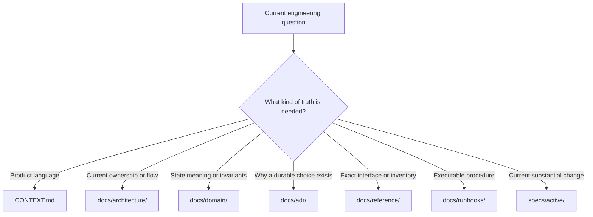

# Wordflow repository operating guide

LDaCA Wordflow is a text-analysis application with a FastAPI backend, a React
and Tauri client, and two supporting Rust/Python packages. This file contains
only cross-repository rules. Read the nearest package `AGENTS.md` before
changing that package.

## Repository map

- `backend/`: FastAPI service and the integrated workspace domain
- `frontend/`: React 19, Vite, TypeScript, and the Tauri desktop shell
- `polars-text/`: Polars expression plugins for text analysis
- `polars-source-utils/`: serialized Polars-plan source-path utilities
- `ldaca-analytics-sample-data/`: canonical remote sample-data repository
- `docs/`: current engineering knowledge and operational procedures
- `specs/`: active and archived change records

Package manifests, CI workflows, and build scripts are authoritative when a
document conflicts with executable configuration.

## Context routing

Start with [the documentation index](docs/index.md), then read only the context
needed for the task:

- Domain vocabulary and relationships: [CONTEXT.md](CONTEXT.md)
- Current system structure: [docs/architecture/](docs/architecture/)
- Product invariants and state semantics: [docs/domain/](docs/domain/)
- Durable design decisions: [docs/adr/](docs/adr/)
- Exact interfaces and inventories: [docs/reference/](docs/reference/)
- Executable procedures: [docs/runbooks/](docs/runbooks/)
- Historical shipped changes: [docs/releases/](docs/releases/)
- Substantial active changes: [specs/active/](specs/active/)

`CONTEXT.md` is the domain glossary, not an instruction file or task log.
Architecture documents describe the current system. Archived specs and release
records are historical evidence and must not be treated as current truth.

## Shared engineering rules

- Use `Data Block` for the product concept. Use `Node` only when discussing its
  backend or API representation.
- Preserve lazy Polars execution. Collect only at an explicit I/O, artifact, or
  response-serialization boundary.
- Keep changes scoped to the request. Preserve unrelated staged and unstaged
  work.
- Do not edit generated or vendored files directly; change their source or
  generator.
- Keep implementation comments accurate when behavior, ownership, callers, or
  side effects change. Use the [comment audit runbook](docs/runbooks/comment-audit.md)
  for broad comment work.
- Do not add secrets, credentials, access tokens, or real user data to the
  repository.

## Documentation lifecycle

Update durable documentation in the same change when code alters architecture,
domain invariants, public interfaces, settings, workflows, packaging, or
operations. Put information in exactly one canonical place:

- `docs/architecture/`: what owns what now
- `docs/domain/`: what states and relationships mean
- `docs/adr/`: why a hard-to-reverse decision was made
- `docs/reference/`: exact, source-verifiable facts
- `docs/runbooks/`: commands and operational sequences
- `specs/active/<issue>-<slug>/`: `spec.md`, `plan.md`, and `tasks.md` for a
  substantial in-flight change

When a substantial change finishes, update the durable docs first and then
move the complete change folder to `specs/archive/`. Do not create forwarding
stubs or duplicate an explanation across document classes.

Run `pnpm docs:links` after changing engineering Markdown. Follow
[the issue-tracker guide](docs/agents/issue-tracker.md) when a change is
coordinated through GitHub Issues.

### Mermaid diagrams

Use Mermaid when ownership, hierarchy, sequence, state transitions, or data
flow are materially clearer as a graph than as prose. Each diagram must answer
the question owned by its page and stay at that page's abstraction level; link
to a deeper page instead of expanding one diagram to cover the whole system.

- Keep exact inventories, commands, and nuanced invariants in prose or tables.
  A diagram explains their relationships and is not a second source of truth.
- Prefer small GitHub-compatible `flowchart`, `sequenceDiagram`, and
  `stateDiagram-v2` diagrams without custom themes, initialization directives,
  icons, or renderer-specific extensions.
- Treat semicolons as Mermaid statement separators rather than label
  punctuation. Use plain conjunctions or commas inside messages and notes.
- Do not add a diagram for decoration or duplicate an adjacent paragraph
  node-for-sentence. Remove a diagram when prose or a short list is clearer.
- Update a diagram in the same change whenever its represented contract changes.
- After editing Mermaid, run `pnpm docs:links` and inspect the rendered Markdown
  to confirm labels, direction, and grouping remain legible.

## Agent skills

Reusable personal workflows such as `grill-me`, `grill-with-docs`, `grilling`,
and `domain-modeling` are installed globally under `~/.agents/skills`. They are
not vendored or registered in this repository's project skill lock. Project
skills under `.agents/skills` are repository-specific and remain separately
managed.

## Baseline workflow

1. Read the nearest `AGENTS.md`, relevant durable docs, and any active spec.
2. Confirm the current behavior in source, tests, manifests, and workflows.
3. State assumptions and define concrete verification before a multi-step edit.
4. Make the smallest complete change and remove only the obsolete material it
   directly supersedes.
5. Run the nearest package checks plus `pnpm docs:links` when Markdown changed.

Do not set `PYTHONPATH` for normal development. Run Python commands through
`uv` from the affected package directory. Use `pnpm -C frontend ...` for
frontend commands from the repository root.

## Definition of done

- The requested behavior or documentation is complete and source-verified.
- Focused tests pass, followed by every package-required check in the nearest
  `AGENTS.md`.
- Public interfaces, durable docs, active specs, and implementation comments
  agree with the resulting system.
- Internal Markdown links pass `pnpm docs:links`.
- `git diff --check` passes, and unrelated work remains untouched.
- Any check that could not run or any pre-existing failure is reported clearly.
