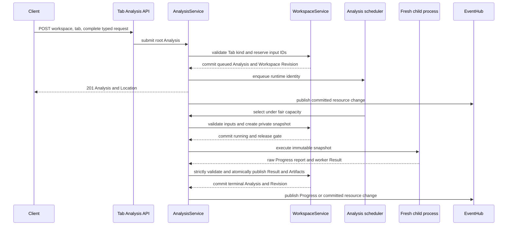
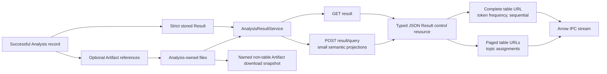
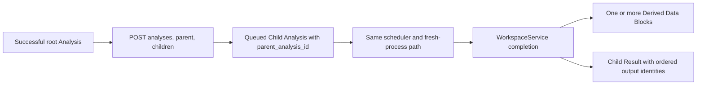

# Backend Analysis Data Flow

Every text-analysis kind uses the same Workspace-owned Analysis resource and
strict discriminated request, lifecycle, Result, query, and worker-result
unions. Computation remains behind the service and process boundaries shown
here.

## Root Submission And Execution

A Tab already fixes the root Analysis kind. Draft parameters remain in the
client; the backend receives one complete submission only when the user runs
it. The new Analysis is committed as `queued` before capacity is available.
Input snapshotting happens later, when the fair scheduler selects it.

The Workspace gate is held only for a narrow validation or commit. Process
execution, provider calls, response streaming, and SSE delivery do not hold it.
The child receives no Workspace object, service, database connection, request,
or private gate. Workers never report terminal Progress; the owning service
validates each raw report and writes `1.0` only with durable success.

Token-frequency submission resolves one exact source column and tokenizer
model per selected Data Block. The worker validates those mappings against the
immutable snapshot; there is no Workspace-wide tokenizer override.

## Result Projection, Tables, And Artifacts

Every successful Analysis stores one strict kind-specific Result payload in its
per-Analysis record. Large tables or model data publish atomically beneath the
Analysis Artifact directory and are referenced by portable semantic identity.
Public resources never expose host paths.

Result queries are side-effect free and carry all semantic projection
parameters. The backend persists no presentation preferences or
materialized-result cache. Token-frequency and sequential tables are complete
Arrow streams; topic assignments are independent Arrow pages with zero-row
schema streams. Topic Distribution is a fixed-size semantic Arrow extension
whose entries are outlier `-1` followed by every real topic. A read may make a
bounded response-lifetime snapshot, but it
does not change the Analysis, Tab, or Workspace Revision.
Topic artifacts with any other physical distribution schema fail integrity
validation and remain clearable; they are not migrated or decoded through a
compatibility path.

The Topic Modeling worker writes Topic Distribution as its named Arrow
extension in the assignment Artifact. Detachment preserves that schema while
joining selected source columns and publishing the new Data Block, so the
ordinary Workspace SQL and IPC path needs no Topic-specific metadata repair.

## Child Analyses

Supported explicit concordance, quotation, and Topic Modeling follow-up work is
represented as an ordinary direct Child Analysis, never as an
`AnalysisOperation` or generic child Task. The parent must be successful, the
request must match its kind and inputs, and grandchildren are invalid.

Topic Modeling detachment publishes two Data Blocks per requested source in
one Workspace transaction: the selected source rows with topic columns, then
the meanings used by that topic-data Data Block. The first retains the source
as parent and the second retains the first as parent. A validation, file, graph,
or persistence failure rejects the complete publication.

Root and child Analyses use the same lifecycle, cancellation, Progress, event,
integrity, persistence, and restart rules. Clearing the Tab removes the whole
public tree immediately; any running private process can finish cancellation
and cleanup but cannot mutate the cleared Tab.

Exact paths are listed in the
[backend API reference](../../reference/backend-api.md). Scheduling, recovery,
and shutdown are described in [Background Work](background-work.md).
