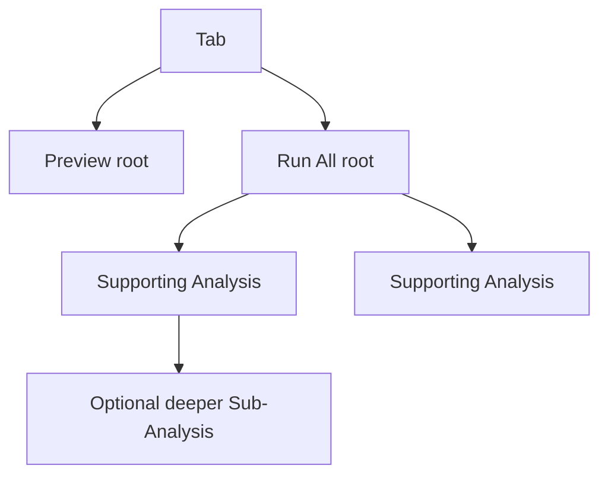
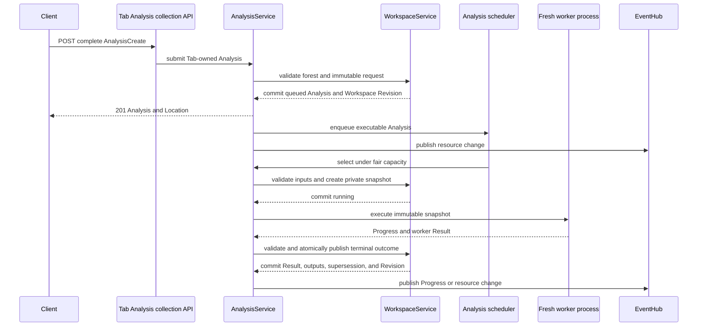
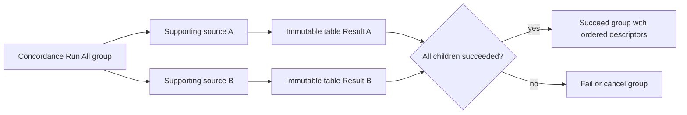
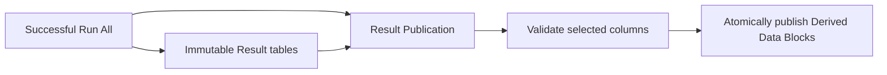
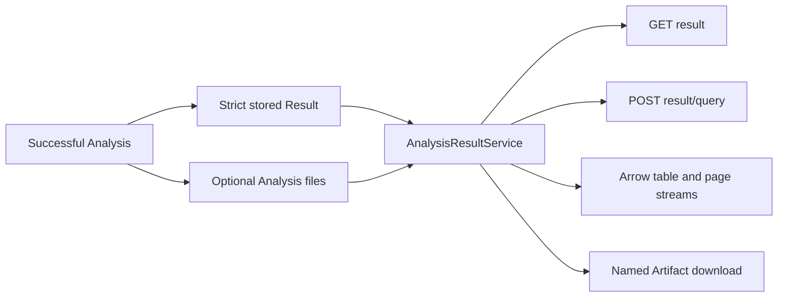

# Backend Analysis Data Flow

Every analysis kind uses the same Workspace-owned Analysis resource, scheduler,
strict request union, lifecycle, Result service, and worker-result boundary.

## Tab-Owned Forest

A Tab stores an ordered collection of Analysis identities. Each Analysis has an
execution scope (`preview`, `run_all`, or `supporting`), an optional parent in
the same Tab, and explicit terminal Analyses it supersedes after success.

The service validates same-Tab ownership, acyclicity, request kind, parent
compatibility, and supersession targets. It does not impose a one-root or
direct-child limit.

## Submission And Execution

The Workspace gate is held only for validation or commit. Process execution,
provider calls, streams, and SSE delivery do not hold it. Workers receive no
Workspace object, service, database connection, request, or private gate.

Input snapshots are created when scheduled, not submitted. Queued and running
Analyses reserve their selected Data Blocks. Execution reads only the immutable
request and snapshot.

## Scopes And Orchestration

Preview Analyses retain queryable input snapshots. `GET result` returns their
ready marker; `POST result/query` computes a fresh page without persisting a
page cache. Annotation Preview queries rerun provider inference for every page
request.

Run All Analyses process the complete snapshot. Concordance and Quotation store
complete immutable table Results. Annotation is the explicit in-place
exception and edits its selected Data Block through the Workspace mutation
boundary.

Supporting Analyses are ordinary Analyses with a parent. They use the same
scheduler, cancellation, Result, persistence, and Artifact contracts and may
own descendants.

Two-source Concordance Run All uses a thin Run All group that owns one
Supporting Analysis per source:

The thin group owns no worker process. Cancelling it cascades to active
descendants without signalling a nonexistent group worker.

A later Result Publication is a typed Supporting Analysis parented to the
successful Run All Analysis:

Result Publication reads only the parent Result Artifacts. Its document column
is mandatory, and its selected source identities, columns, and output names
are immutable request data.

## Supersession And Clearing

Replacement is success-dependent. A submitted Analysis may name terminal
Analyses in `supersedes_analysis_ids`; they remain readable during execution
and are removed only when replacement succeeds. Failure and cancellation leave
them untouched.

Cancelling an Analysis cascades through active descendants. Clearing a Tab
cancels active work, removes the complete forest, query snapshots, Results, and
Analysis-owned Artifacts, and leaves generic Tab presentation state intact.
The Annotation client additionally clears its persisted correction-column
draft when the user invokes **Clear Results**.

## Result Projection, Tables, And Artifacts

Each successful Analysis stores one strict kind-specific Result. Large tables
and model data publish beneath the Analysis Artifact directory and are exposed
by portable semantic identities rather than host paths.

Result queries are side-effect free and keys contain all content-bearing
projection inputs. A missing retained snapshot fails clearly rather than
falling back to a mutable Data Block. Topic Distribution remains a named Arrow
extension through storage, transport, and detachment.

## Tokenization

Token Frequency requests map every selected Data Block to one tokenizer.
Concordance Text mode may carry a partial mapping; Tokens mode requires every
selected Data Block. Execution never falls back to current Data Block
preferences or an account default.

`native:plain_words_en` executes directly. Other models use the per-user cache
keyed by model, tokenization parameters, and source-text content hash. Preview,
later pages, handoffs, Supporting work, and Run All use the same request-owned
path.

## Annotation Provider Secrets

Annotation requests retain only the safe provider configuration UUID, provider
type, and normalized Custom base URL. Single-user execution resolves the
write-only stored credential by UUID. Multi-user execution receives the
browser-owned key only at the request boundary. Names and credentials do not
enter Workspaces, Tabs, Results, provenance, logs, query keys, or telemetry.

## Persistence

Terminal Analysis forests, Results, Artifacts, and queryable snapshots persist
with the Workspace. Native schema 11 and portable archive format 10 validate
parent ownership, ordered Tab membership, terminal archive state, output
identities, and retained query inputs. Older layouts are rejected without
runtime migration.
