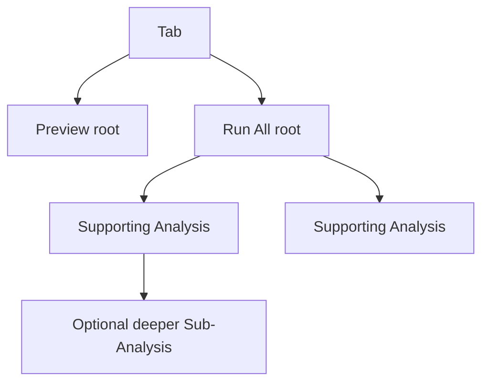
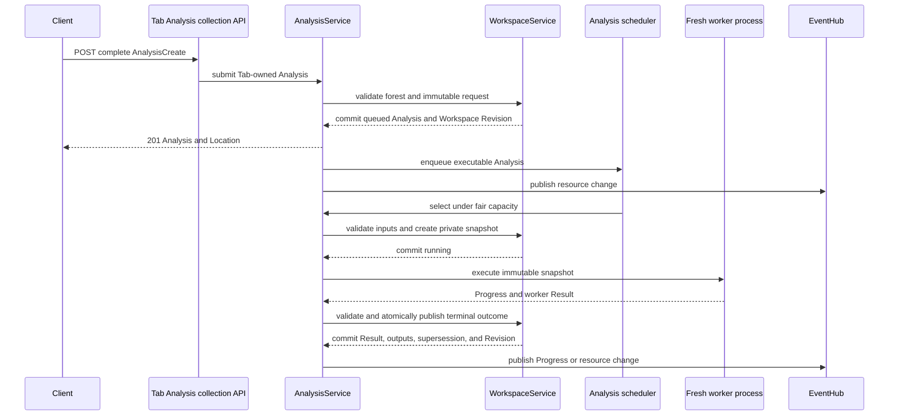
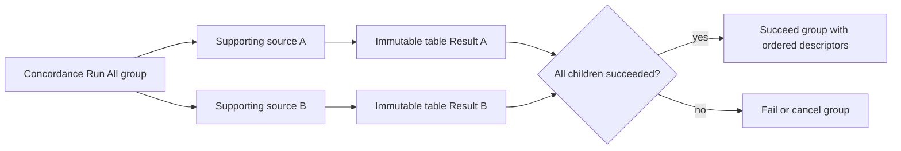
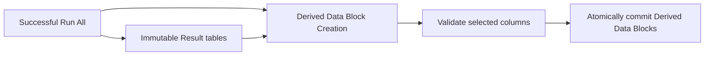
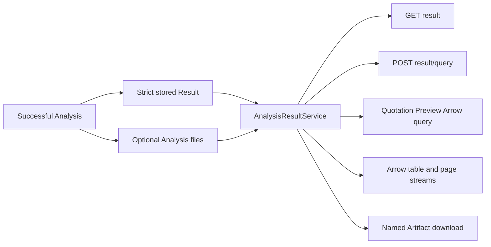

# Backend Analysis Data Flow

Every analysis kind uses the same Workspace-owned Analysis resource, scheduler,
strict request union, lifecycle, Result service, and worker-result boundary.

## Tab-Owned Forest

A Tab stores an ordered collection of Analysis identities. Each Analysis has an
execution scope (`preview`, `run_all`, or `supporting`), an optional parent in
the same Tab, and explicit terminal Analyses it supersedes after success.

The service validates same-Tab ownership, acyclicity, request kind, parent
compatibility, and supersession targets. Generic Tabs have no one-root or
direct-child limit. Annotation Tabs are linear: a new Preview or Run All
atomically removes the previous terminal Analysis and becomes the Tab's sole
root. Annotation rejects parents, Supporting scope, and explicit supersession
targets.

## Submission And Execution

The Workspace gate is held only for validation or commit. Process execution,
provider calls, streams, and SSE delivery do not hold it. Workers receive no
Workspace object, service, database connection, request, or private gate.

Input snapshots are created when scheduled, not submitted. Queued and running
Analyses reserve their selected Data Blocks. Execution reads only the immutable
request and snapshot.

## Scopes And Orchestration

Preview Analyses retain queryable input snapshots. `GET result` returns their
ready marker; `POST result/query` computes a fresh page without persisting a
page cache. Annotation Preview queries rerun provider inference for every page
request. Its shared example-preparation helper deterministically reconstructs
the request's per-label subset from the retained Example Data Block snapshot.
Quotation is the table-shaped exception: its dedicated
`POST result/tables/quotation-preview/query` response is Arrow IPC with source
row pagination headers. It returns matching documents only, but continuation is
calculated from every source document in the requested page range.

Run All Analyses process the complete snapshot. Concordance and Quotation store
complete immutable table Results. Annotation is the explicit in-place
exception and edits its selected Data Block through the Workspace mutation
boundary. The Run All request owns its batch size and processing mode while its
source request owns shared inference settings and the maximum, method, and seed
for per-label example selection. The worker prepares that subset once and every
provider batch, retry, or recursive split receives the same list. Run All groups rows into batches
of 20 by default, with a maximum configurable size of 100. One batch loop owns
all provider attempts; native SDK retries are disabled, so the default two
retries mean at most three calls for that batch. Each call has a 4,096-token
answer allowance, plus the requested reasoning budget when reasoning is
enabled. A successful response must be one JSON object containing exactly one
known class name or null per input row. Truncated, malformed, wrong-cardinality,
and unknown-label responses consume the same retry allowance. Context-limit
failures split immediately, while an invalid response splits after its retries
are exhausted. Each terminal batch reports its completed row count. Other
exhausted provider failures become row-aligned null labels, so the worker can
publish all successful batches instead of discarding the column; its durable
Result retains attempted-row, failed-batch, and failed-row counts. Cancellation
and failures outside provider inference still do not publish. Run All either
reprocesses every row or fills only blank annotations and never overlays
correction-column values. Preview processes exactly the requested page and has
no batch-size or processing-mode fields.

Supporting Analyses are ordinary Analyses with a parent. They use the same
scheduler, cancellation, Result, persistence, and Artifact contracts and may
own descendants.

Two-source Concordance Run All uses a thin Run All group that owns one
Supporting Analysis per source:

The thin group owns no worker process. Cancelling it cascades to active
descendants without signalling a nonexistent group worker.

A later Derived Data Block Creation is a typed Supporting Analysis parented to the
successful Run All Analysis:

Derived Data Block Creation reads only the parent Result Artifacts. Its document column
is mandatory, and its selected source identities, columns, and output names
are immutable request data.

## Supersession And Clearing

Replacement is success-dependent. A submitted Analysis may name terminal
Analyses in `supersedes_analysis_ids`; they remain readable during execution
and are removed only when replacement succeeds. Failure and cancellation leave
them untouched. Annotation does not use this generic mechanism: every accepted
root submission immediately replaces the prior Annotation Analysis.

Cancelling an Analysis cascades through active descendants. Clearing a Tab
cancels active work, removes the complete forest, query snapshots, Results, and
Analysis-owned Artifacts, and leaves generic Tab presentation state intact.
The Annotation client additionally clears its persisted live correction-column
selection when the user invokes **Clear Results**.

## Result Projection, Tables, And Artifacts

Each successful Analysis stores one strict kind-specific Result. Large tables
and model data publish beneath the Analysis Artifact directory and are exposed
by portable semantic identities rather than host paths.

Result queries are side-effect free and keys contain all content-bearing
projection inputs. A missing retained snapshot fails clearly rather than
falling back to a mutable Data Block. Topic Distribution remains a named Arrow
extension through storage, transport, and Derived Data Block Creation.

Concordance and Quotation Run All retain one row per matching source document.
The row carries source metadata, an internal stable source-row ID, and a nested
list of Concordance Matches or quotation extracts. Explicit document and match
projection resources expose deterministic Arrow pages without changing the
stored Result. Concordance adds a filtered document query whose exact-term and
relative-bin predicate runs before count, sort, and page. Concordance Match
Data Block Creation explodes the artifact; Concordance Document Data Block
Creation reuses the document filter and keeps stable source-row identity.
Quotation Result Data Block Creation remains flat.

Quotation Preview and Run All document projections share the same Arrow shape:
source columns plus `quotation: List<Struct<...>>`, with every quotation offset
stored as `Int64`. Preview encodes its computed Polars frame only at the Result
service response boundary and does not persist a table artifact.

Concordance density is a separate side-effect-free projection over the complete
immutable child Result. It returns exact-match series in 100 fixed relative
position bins and is independent of Review table page, sort, and row unit.

Topic Modelling runs its initial HDBSCAN fit with the Analysis request's
`min_cluster_size` (default 10), then publishes its natural JSON Result plus one
private versioned clustering-context Artifact. The context stores a weighted
Ward tree over the real HDBSCAN leaves and additive term, coordinate, document,
corpus, row, and retained-character facts; it stores neither source text nor embeddings. An
explicit `cluster_count` or `top_n_topics` Result query reads that immutable
Artifact, cuts only downward from the natural count, and asks the native
projector for a complete N-independent activation basis. Per-row distributions
are not serialized for Result queries. The runtime's bounded single-flight LRU
retains compact basis bytes by principal, Workspace, Analysis, immutable
context identity, and K; each request derives fresh Top-N counts and retains no
per-N Result. Public Results expose ordered source metadata and the applied
Top-N descriptor but no Artifact URL.

Topic Modelling Data Block Creation is the only table-materialization path. Its
Supporting request captures the displayed K, Top N, and projected meaning
overrides. The worker reads the parent's context and immutable input snapshot,
runs the same projector, selects the union of rows activating any selected
Topic, and atomically publishes assignment and meaning Data Blocks. It pads
complete sparse distributions only at this derived-Data-Block boundary. A
Result query itself never writes Artifacts, advances a revision, or emits
lifecycle state.

## Tokenization

Token Frequency requests map every selected Data Block to one tokenizer.
Concordance Text mode may carry a partial mapping; Tokens mode requires every
selected Data Block. Execution never falls back to current Data Block
preferences or an account default.

`native:plain_words_en` executes directly. Other models use the per-user cache
keyed by model, tokenization parameters, and source-text content hash. Preview,
later pages, handoffs, Supporting work, and Run All use the same request-owned
path.

## Annotation Provider Secrets

Annotation requests retain only the safe provider configuration UUID, provider
type, and normalized Custom base URL. Single-user execution resolves the
write-only stored credential by UUID. Multi-user execution receives the
browser-owned key only at the request boundary. A configuration may be keyless;
built-in execution then stops with `provider_credential_missing`, while Custom
execution may proceed. Credential edits affect later resolution, but a queued
or running Run All retains the credential captured when submitted. Names and
credentials do not enter Workspaces, Tabs, Results, provenance, query keys, or
telemetry.

Provider adapters normalize failures to a fixed safe code and message. Model
discovery and Preview return those failures as safe 502 responses. Run All
passes fatal failures through a private structured worker envelope and publishes
no artifact or Data Block mutation. Only irreducible single-row context-limit
or invalid-response failures may publish partial output. Their separate failed
row mask preserves prior values during reprocessing, leaves fill-missing rows
blank, and remains distinct from successful explicit-null predictions. Raw SDK
causes are retained only in request- or Analysis-correlated logs.

## Persistence

Terminal Analysis forests, Results, Artifacts, and queryable snapshots persist
with the Workspace. Annotation query snapshots materialize only the source and
optional Example Data Block because the validated class list is already part of
the immutable request. A successful Trends Run All also retains a private
Parquet publication artifact from the same input snapshot as its public Arrow
aggregate. Original source rows in that artifact carry reserved period and
group indices; the public aggregate exposes the corresponding `period_index`
and `group_index` values. Trends Data Block Creation filters only this immutable
artifact and never re-reads the live source Data Block.

Native schema 20 and portable archive format 19 validate
parent ownership, ordered Tab membership, terminal archive state, output
identities, and retained query inputs. Older layouts are rejected without
runtime migration.
