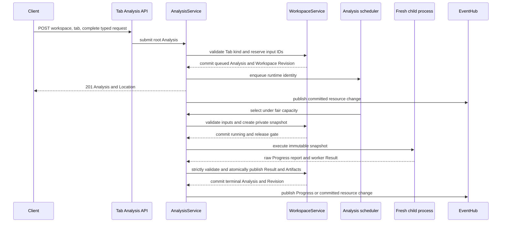
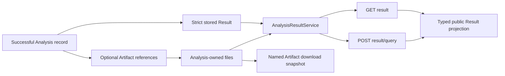
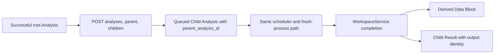

# Backend Analysis Data Flow

Every text-analysis kind uses the same Workspace-owned Analysis resource and
strict discriminated request, lifecycle, Result, query, and worker-result
unions. Computation remains behind the service and process boundaries shown
here.

## Root Submission And Execution

A Tab already fixes the root Analysis kind. Draft parameters remain in the
client; the backend receives one complete submission only when the user runs
it. The new Analysis is committed as `queued` before capacity is available.
Input snapshotting happens later, when the fair scheduler selects it.

The Workspace gate is held only for a narrow validation or commit. Process
execution, provider calls, response streaming, and SSE delivery do not hold it.
The child receives no Workspace object, service, database connection, request,
or private gate. Workers never report terminal Progress; the owning service
validates each raw report and writes `1.0` only with durable success.

Token-frequency submission resolves one exact source column and tokenizer
model per selected Data Block. The worker validates those mappings against the
immutable snapshot; there is no Workspace-wide tokenizer override.

## Result Projection And Artifacts

Every successful Analysis stores one strict kind-specific Result payload in its
per-Analysis record. Large tables or model data publish atomically beneath the
Analysis Artifact directory and are referenced by portable name and relative
path. Public resources never expose host paths.

Result queries are side-effect free and carry all projection parameters. The
backend persists no presentation preferences or materialized-result cache. A
query may make a bounded response-lifetime snapshot, but it does not change the
Analysis, Tab, or Workspace Revision.

## Child Analyses

Supported explicit concordance and quotation follow-up work is represented as
an ordinary direct Child Analysis, never as an `AnalysisOperation` or generic
child Task. The parent must be successful, the request must match its kind and
input, and grandchildren are invalid.

Root and child Analyses use the same lifecycle, cancellation, Progress, event,
integrity, persistence, and restart rules. Clearing the Tab removes the whole
public tree immediately; any running private process can finish cancellation
and cleanup but cannot mutate the cleared Tab.

Exact paths are listed in the
[backend API reference](../../reference/backend-api.md). Scheduling, recovery,
and shutdown are described in [Background Work](background-work.md).
