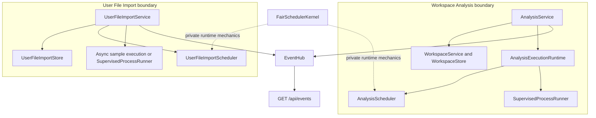

# Backend Background Work

## Resource-Owned Lifecycles

The backend deliberately has no generic Task layer. `AnalysisService` owns
Workspace-contained Analysis state and `UserFileImportService` owns retained
remote-import state. Each service persists its own strict resource, controls
its own transitions, and publishes through the shared `EventHub`.

The shared `BackgroundState`, `Progress`, `Failure`, event models, and fair
scheduler kernel are private runtime primitives. The kernel owns per-user
rotation, FIFO ordering, capacity, wakeup, queued cancellation, close, and idle
detection for each independent scheduler instance. These primitives do not
create cross-resource identity, persistence, cancellation, parentage, result,
or cleanup ownership.

## Analysis Execution

Analysis creation commits a queued Workspace-owned record before capacity is
available. A private work-conserving scheduler rotates users under contention
and preserves per-user FIFO order. When selected, the runtime re-enters the
Workspace gate, validates reserved Data Blocks, asks infrastructure storage to
publish an execution-private immutable snapshot, reserves a launch entry, and
atomically commits `running`.

Each admitted Analysis uses one fresh `spawn` child process. The shared process
runner owns only its launch entry, eventual process handle, raw progress/result
IPC, and termination. It owns no durable record and cannot mutate a Workspace.
Worker functions are picklable `@process_entrypoint` functions. Progress and
completion return to the application event loop, where `AnalysisService`
strictly validates them and commits the kind-specific Result through
`WorkspaceService`. Only that terminal commit writes Progress `1.0`.

The positive finite `analysis_execution_capacity` bounds simultaneous Analysis
processes. Saturation queues rather than rejects. The backend does not inject a
native-thread limit into Polars or model libraries and does not provide thread,
pool, retry, or alternate-executor fallbacks.

## User File Import Execution

Submission durably creates a queued User File Import before it waits for the
independent `user_file_import_capacity`. Sample imports use cancellable async
HTTP I/O against the canonical sample-data repository; Data Portal download and
tabulation use one private child process. Sample files stream directly into
private staging before atomic collection publication. The backend does not
package or read a local sample-data checkout. The service owns staging, quota
reservations, atomic publication, terminal persistence, and cleanup for both
kinds.

The import scheduler uses the same scheduler kernel as Analysis but no
shared queue, capacity slot, process-runner instance, record, or cancellation
state. One resource's failure is caught at its service boundary and cannot
cancel sibling work or another user's resources.

## Recovery And Shutdown

Runtime queues and handles are never persisted. Startup strictly loads User File
Import records and transitions retained queued/running imports to interrupted
Failure. Workspace-contained Analyses are not read at startup. After one
Workspace loads through explicit open, its valid queued/running Analyses are
committed as interrupted before the open response returns. Neither path
requeues, resumes, guesses, migrates, or rewrites unavailable records.

Shutdown changes readiness to `stopping`, closes both submission boundaries,
and stops both schedulers. Queued resources fail as interrupted. Analysis and
import process runners terminate concurrently against the same absolute
`shutdown_grace_seconds` deadline. A success already committed remains
successful, a previously requested user cancellation follows normal confirmed
cancellation, and any other confirmed stop becomes interrupted failure. A
record that cannot commit before shutdown remains non-terminal for deterministic
finalization when its owning resource is next loaded: imports at startup and
Analyses at explicit Workspace open.
