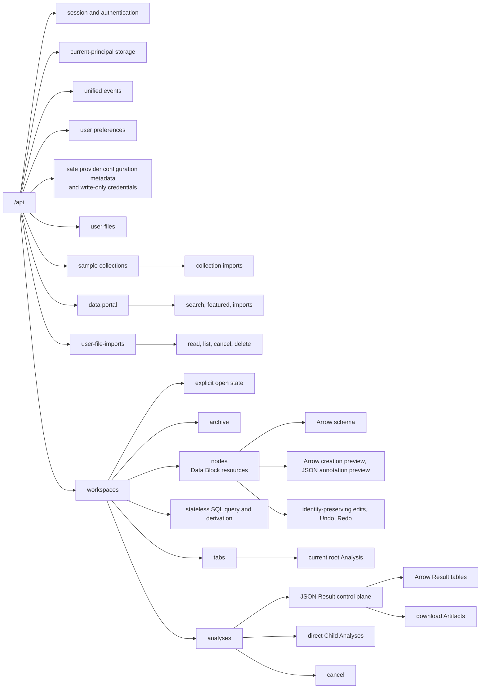

# Backend HTTP API Architecture

## Router Responsibilities

Routes declare HTTP contracts, resolve the current identity and runtime-owned
service, validate HTTP-only preconditions, call a narrowly scoped service
operation, shape headers/status, and return strict materialized resources.
Business workflows, storage, providers, Polars transforms, and resource
lifecycle transitions do not live in `api/`.

Operation IDs are explicit and stable. The exact method/path/operation set is
asserted against generated OpenAPI and listed in the
[backend API reference](../../reference/backend-api.md).

## Security

Hosted protected operations declare the `wordflow_session` cookie through
OpenAPI security. Single-user mode resolves its canonical root process identity
through the same dependency without issuing a cookie. Unsafe requests require
an exact allowed Origin and `X-CSRF-Token`; provider callbacks use their own
one-use validation.

CORS and trusted Host rules are explicit settings. No Wordflow API route accepts
bearer authentication or query-string credentials; typed write-only body
fields carry external-provider credentials where required. Cross-user
Workspace, Analysis, and User File Import lookups are concealed as not found.

Account preferences and provider credentials are independent current-principal
resources. Preference responses contain only synchronized non-secret choices.
Single-user credential reads return the ordered safe Annotation Provider
Configuration collection and Data Portal presence; collection CRUD writes the
canonical root credential file. Multi-user credential reads return
`annotation_providers: null` to report browser ownership and still expose
deployment-token availability, while every backend configuration write is
denied. Personal multi-user secrets enter only through provider-operation
request bodies and are resolved for that call without backend persistence or
caching.

Annotation model discovery, previews, and submissions carry the selected
configuration UUID, provider type, and optional normalized Custom base URL.
Single-user mode verifies that snapshot against the stored configuration before
resolving its secret. Multi-user mode uses the transient request key. Services
strip the key and retain only the safe snapshot in an immutable Analysis
request. Custom base URLs deliberately accept any syntactically valid absolute
HTTP(S) destination, including private and loopback hosts; bounded provider
timeouts, retries, concurrency, and generic error translation remain the
operational controls for this trusted-user SSRF boundary.

## Control And Table Data Planes

JSON is the control plane for resources, lifecycle, queries, errors, and small
semantic summaries. Tabular payloads cross the HTTP boundary only as Arrow IPC
streams with media type `application/vnd.apache.arrow.stream`:

- a complete immutable Result table has one URL and one self-contained stream;
- an open-ended table has independent schema and row-page URLs;
- each page is a complete stream and uses `X-Wordflow-Has-Next` for one-row
  lookahead pagination, without an expensive total-count query;
- a schema response is a zero-row stream, so schema and row decoding use one
  transport and one frontend library;
- Data Block metadata resources do not duplicate column names or stringified
  dtypes; the zero-row Arrow schema is authoritative;
- registered and unregistered extension types retain their exact names,
  storage types, and extension metadata from Data Block plans through IPC;
- topic-assignment distribution values carry the stable Arrow extension name
  `org.ldaca.wordflow.topic_distribution.v1` over a
  `fixed-size-list[N+1]<struct<topic_id: int64, proportion: float64>>` storage
  type, ordered as outlier `-1` followed by real topics `0..N-1`.

Data Blocks remain Parquet-backed internally. Parquet and serialized plans
retain extension schema identity; Arrow IPC exposes that same identity rather
than reconstructing it from names or shapes. Arrow IPC is the transport
boundary, not a second persistence authority. There is no protobuf envelope,
JSON table fallback, or alternate Parquet-over-HTTP table path.
The durable rationale is recorded in
[ADR 0005](../../adr/0005-arrow-ipc-for-tabular-http-data.md).

Workspace SQL uses one discriminated command. Query mode returns an independent
Arrow page with `X-Wordflow-Has-Next`; create mode returns the new JSON Data
Block resource. Both modes register only explicitly declared Data Blocks under
their exact UUIDs in a request-local lazy Polars SQL context. Query pagination
wraps the submitted SQL and may recompute each page. Creation commits through
the Workspace mutation boundary and records every declared input as ordered
creation lineage. SQL has no edit mode. The hybrid boundary and external-reader
policy are recorded in
[ADR 0008](../../adr/0008-workspace-sql-query-and-derivation.md).

Data Block creation and edit are separate control-plane commands. Creation
requests identify their source Data Blocks and may name a new resource. Edit
requests identify the target only in the URL and contain neither a source ID
nor a new Data Block name. Creation previews remain side-effect-free and are
shared by both frontend apply modes. Node resources return required
`can_undo` and `can_redo` flags; history availability is backend-owned and
runtime-only. The lineage/history rationale is recorded in
[ADR 0007](../../adr/0007-data-block-edits-and-session-history.md).

## Resources And Errors

The API uses direct typed resources, standard creation/deletion status codes,
relative `Location` headers, one-based pagination only for Analysis, Arrow row
pages, and retained-import collections, strong Workspace ETags, and typed
media for downloads and SSE. User Files return one complete deterministic tree
rather than a paginated directory protocol.

Framework-neutral errors are mapped to `ApiError` with a stable code, safe
message/details, and request ID. Validation never echoes Pydantic inputs,
bodies, credentials, host paths, or internal exception text.
Expected Polars operation failures are translated at the owning service
boundary; unclassified exceptions are logged in full and rendered as a
sanitized `500 ApiError` inside the same CORS, private-cache, and request-ID
middleware as ordinary responses. Browser clients therefore distinguish
backend failures from genuine network failures without receiving internal
execution plans or storage paths.

Blocking filesystem and Polars work uses the runtime AnyIO limiter with
non-abandoned cancellation. Workspace gates are released before remote calls,
process work, streams, or `FileResponse` delivery.
