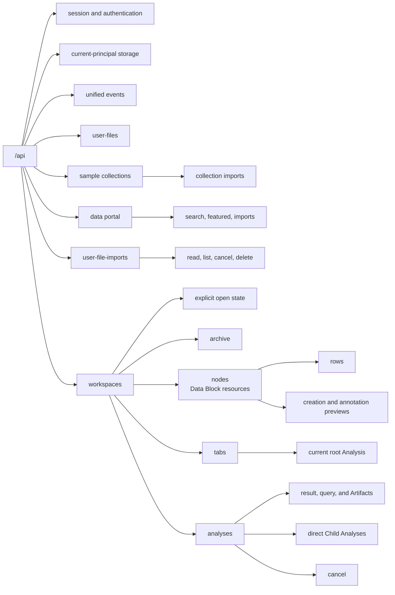

# Backend HTTP API Architecture

## Router Responsibilities

Routes declare HTTP contracts, resolve the current identity and runtime-owned
service, validate HTTP-only preconditions, call a narrowly scoped service
operation, shape headers/status, and return strict materialized resources.
Business workflows, storage, providers, Polars transforms, and resource
lifecycle transitions do not live in `api/`.

Operation IDs are explicit and stable. The exact method/path/operation set is
asserted against generated OpenAPI and listed in the
[backend API reference](../../reference/backend-api.md).

## Security

Hosted protected operations declare the `wordflow_session` cookie through
OpenAPI security. Desktop mode resolves its process identity through the same
dependency without issuing a cookie. Unsafe requests require an exact allowed
Origin and `X-CSRF-Token`; provider callbacks use their own one-use validation.

CORS and trusted Host rules are explicit settings. No Wordflow API route accepts
bearer authentication or query-string credentials; provider adapters may use
their own server-side credentials. Cross-user Workspace, Analysis, and User
File Import lookups are concealed as not found.

## Resources And Errors

The API uses direct typed resources, standard creation/deletion status codes,
relative `Location` headers, one-based pagination only for Analysis, row, and
retained-import collections, strong Workspace ETags, and typed media for
downloads and SSE. User Files return one complete deterministic tree rather
than a paginated directory protocol.

Framework-neutral errors are mapped to `ApiError` with a stable code, safe
message/details, and request ID. Validation never echoes Pydantic inputs,
bodies, credentials, host paths, or internal exception text.

Blocking filesystem and Polars work uses the runtime AnyIO limiter with
non-abandoned cancellation. Workspace gates are released before remote calls,
process work, streams, or `FileResponse` delivery.
