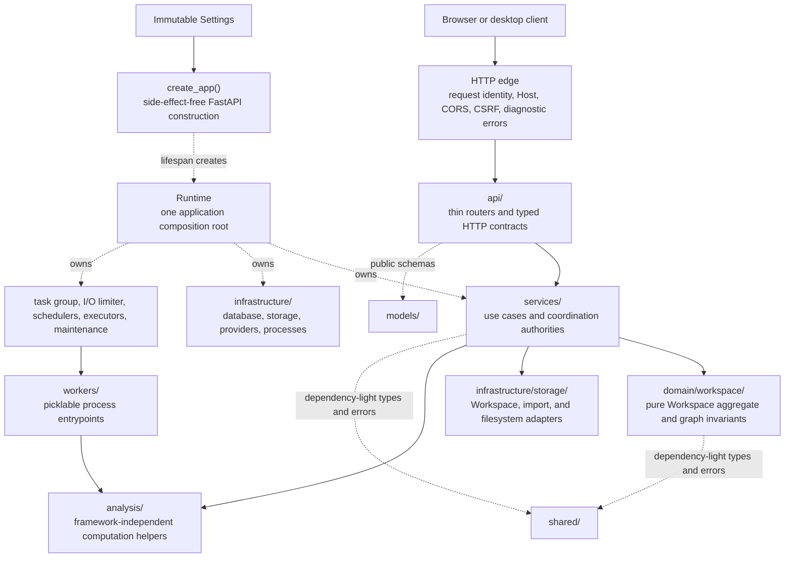

# Backend Overview

Wordflow's backend is a single-process FastAPI service with one canonical
resource API. Analysis algorithms live behind the runtime and HTTP boundaries
described here.

## Layers

1. `main.py` constructs a side-effect-free FastAPI application from immutable
   settings.
2. `api/` declares routes, resolves request dependencies, and shapes HTTP
   responses.
3. `services/` owns use cases and lifespan-owned coordination state.
4. `domain/workspace/` owns only the framework-neutral Workspace aggregate and
   graph invariants. It does not know about persistence, services, or HTTP.
5. `analysis/` owns framework-neutral computation helpers; `workers/` owns
   picklable process entry points.
6. `infrastructure/` owns databases, providers, Workspace and User File Import
   persistence adapters, durable filesystem primitives, and process edges.
7. `models/` contains strict public request/resource schemas; `shared/`
   contains dependency-light errors and serialization types.

Dependencies point inward: services, domain, analysis, workers, and
infrastructure do not import `ldaca_wordflow.api`. Architecture tests enforce
this direction and the absence of removed facades.

## Runtime Authorities

- `Runtime` owns readiness, the database, services, event hub, task group,
  schedulers, executors, and I/O limiter for one app lifespan.
- `WorkspaceService` owns Workspace residency and every mutation.
- `AnalysisService` owns Workspace-contained Analysis lifecycle state, while
  `AnalysisExecutionRuntime` owns only private scheduling and process handles.
- `UserFileImportService` independently owns retained remote-import lifecycle,
  scheduling, persistence, and cleanup.
- `EventHub` is the single live refresh transport for Workspaces, Tabs,
  Analyses, and User File Imports; it is not durable state.
- `SessionService` and `OAuthService` own identity state and provider exchange.
- `UserPreferenceStore` owns only per-user non-secret preferences.
  `ProviderCredentialStore` independently owns the single-user root's ordered
  Annotation Provider Configuration collection, Data Portal credential, and
  mode-aware transient credential resolution. It never reads or writes
  personal credential files in multi-user mode. Both business stores delegate
  bounded, no-follow, quota-admitted TOML publication to one infrastructure
  storage primitive while retaining independent schemas.
- `UserFileStore` and `WorkspaceArchiveService` own their respective storage
  boundaries.

The package includes narrow vendored runtime subsets for RO-Crate tabulation
and quotation extraction. They are ordinary modules with their required data
and licenses, not nested projects or submodules.

## Further Reading

- [Runtime](runtime.md)
- [Workspaces](workspaces.md)
- [Background work](background-work.md)
- [HTTP API](http-api.md)
- [Analysis data flow](analysis-data-flow.md)
- [Exact endpoint reference](../../reference/backend-api.md)
- [Settings reference](../../reference/backend-settings.md)
