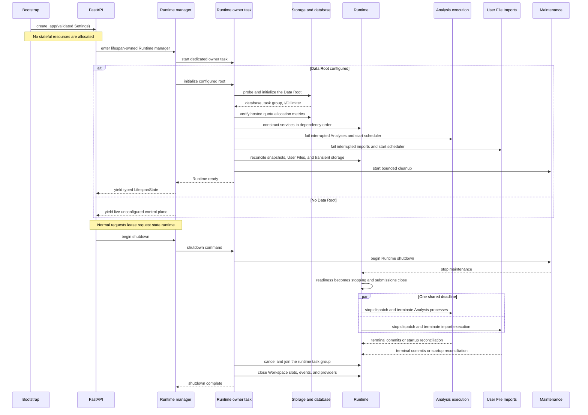

# Backend Runtime

## Bootstrap And App Construction

`Settings` is loaded and validated before app construction. `create_app`
registers middleware, handlers, routers, OpenAPI metadata, health, and optional
SPA serving without allocating stateful resources. OpenAPI export therefore
does not enter lifespan or require a Data Root.

The CLI configures stderr bootstrap logging and delegates to `server_launcher.py`. For a
desktop port-zero launch, the launcher binds and retains the socket before
constructing final settings, then publishes a private startup record only after
ASGI lifespan has succeeded. The startup record reports control-plane
liveness; a Data Root is not required at that point.

Browser development is intentionally split: Uvicorn imports the API-only ASGI
application with reload enabled, while Vite owns the frontend development
server. The backend explicitly allows the exact `localhost:3000` and
`127.0.0.1:3000` Vite origins for that process. The
production CLI instead constructs one FastAPI application with the compiled
SPA mounted, so the browser and API share one origin and one process entrypoint.
The backend launcher does not supervise the Vite development server.

The launcher accepts an explicit ASGI `root_path` for arbitrary reverse-proxy
deployments. The deployment caller owns discovery of its externally visible
prefix; the backend does not inspect platform-specific environment variables.
BinderHub's notebook passes its `jupyter-server-proxy` path through this generic
argument so generated links, OAuth return paths, CSRF path handling, and the
packaged SPA remain below the user's JupyterHub service prefix. Changes to
`root_path` handling must retain a test for explicit prefix forwarding.

BinderHub notebooks also require a non-blocking Python entrypoint. A notebook
cell starts the bound Uvicorn server with `serve_frontend=True` as an
asynchronous task, receives a caller-owned handle, and can continue executing
while the compiled frontend and backend are reachable through
`jupyter-server-proxy` on the selected port. The handle provides
bounded graceful shutdown. This in-process background mode is part of the
BinderHub contract; it is not the process model used by split browser
development or hosted production. The executable setup is documented in the
[BinderHub runbook](../../runbooks/binderhub.md).

## Lifespan Ownership

`runtime_manager_context` is the lifespan owner. A non-empty `DATA_ROOT` has
immutable environment authority. Otherwise the manager reads versioned
platform configuration from `settings.json`; without either source it yields
an unconfigured control plane. The manager dynamically enters
`runtime_context` only while a root is active. A dedicated Runtime owner task
receives initialize, configure, and shutdown commands from the manager. That
task alone enters and exits every `runtime_context`; request tasks await the
transaction result and never manipulate its exit stack, task group, or cancel
scope.

`runtime_context` uses `AsyncExitStack`. Runtime startup
initializes storage and SQLite, creates the task group and
I/O limiter, verifies hosted filesystem-allocation accounting, constructs
services, reconciles Workspaces, Analyses, User File Imports, response snapshots,
and transient storage, starts both private schedulers, then starts bounded
maintenance. A distinct resource stack owns provider clients, Workspace open
state and the event hub. The runtime task-group owner is
registered above that stack so no application task can outlive a dependency.

Finite API requests acquire a manager lease and retrieve that pinned Runtime
from `request.state`. A root change runs as one shielded owner command, so
request cancellation cannot abandon a partially closed transition.
Control-plane routes remain available without a Runtime.
There is no settings or
service singleton and no fallback when lifespan is inactive, allowing tests to
run independent apps with separate roots in one process.

## Shutdown

The dedicated Runtime owner task performs initialization, replacement,
rollback, and shutdown. The task-group owner first marks `RuntimeReadiness` as
`stopping` and closes Analysis
and User File Import submission. It stops maintenance, then gives both
execution owners the same absolute deadline derived from the positive finite
`shutdown_grace_seconds` setting. Queued resources commit interrupted Failure;
running process handles terminate concurrently. At the deadline, remaining
children are killed and async runner scopes are cancelled.

Only confirmed termination is committed during shutdown. If a terminal commit
cannot complete before exit, the strict non-terminal record remains for startup
interruption reconciliation; shutdown does not guess its outcome. After
execution shutdown, the application task group is cancelled and joined, then
the resource stack unwinds provider clients, Workspace slots, and event
subscribers in reverse construction order. The same exit stacks
unwind partial startup. Workspace shutdown does not invent a save because every
mutation commits before releasing its gate.

## Process Model

Each backend instance intentionally supports one ASGI process. Multiple Uvicorn
workers would split Workspace gates, event subscribers, queues, and execution
handles. See [ADR 0001](../../adr/0001-single-process-lifespan-owned-backend.md).
Independent backend instances may share one Data Root; there is no root-level
process lock. Open and delete lifetimes instead use one operating-system lock
per Workspace, allowing independent instances to open different Workspaces
while rejecting conflicting ownership of the same Workspace. This coordination
does not make multiple Uvicorn workers within one application supported; each
persistent store remains responsible for its own transaction or atomic-write
boundary.

Supported process-entry profiles are split Vite/Uvicorn development, direct
ASGI hosting, the bundled production CLI, the Tauri-supervised backend CLI, and
BinderHub/JupyterHub notebook hosting. The BinderHub profile intentionally owns
an asynchronous in-process server handle; the other profiles are
process-supervised. All profiles share the same application factory and
lifespan ownership; only socket/bootstrap, frontend mounting, supervision, and
externally visible `root_path` handling differ.

`GET /health/live` is public and returns HTTP 200 while the HTTP control plane
functions. `GET /health/ready` returns HTTP 200 only when the complete Runtime
is ready and HTTP 503 for every other manager state. `GET /api/data-root` is
the bootstrap state resource. In single-user mode, a same-origin token permits
`PUT /api/data-root`; the manager blocks new work, drains finite requests,
submits the replacement to the dedicated owner task, closes streams through
Runtime teardown, opens and probes the candidate, and
persists only after successful initialization. Failed changes reconstruct the
previous Runtime when possible. Environment and multi-user roots are immutable
through this API.
