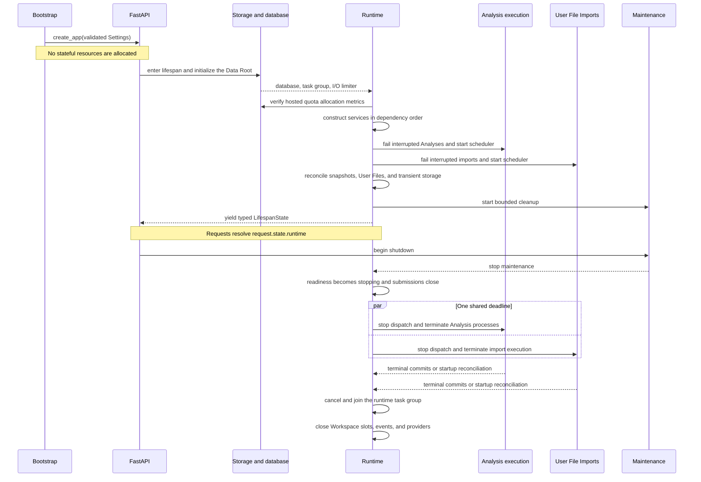

# Backend Runtime

## Bootstrap And App Construction

`Settings` is loaded and validated before app construction. `create_app`
registers middleware, handlers, routers, OpenAPI metadata, health, and optional
SPA serving without allocating stateful resources. OpenAPI export therefore
does not enter lifespan or require a Data Root.

The CLI configures process logging and delegates to `server_launcher.py`. For a
desktop port-zero launch, the launcher binds and retains the socket before
constructing final settings, then publishes a private startup record only after
ASGI lifespan has succeeded.

Browser development is intentionally split: Uvicorn imports the API-only ASGI
application with reload enabled, while Vite owns the frontend development
server. The backend explicitly allows the Vite origin for that process. The
production CLI instead constructs one FastAPI application with the compiled
SPA mounted, so the browser and API share one origin and one process entrypoint.
The backend launcher does not supervise the Vite development server.

The launcher also intentionally supports BinderHub through JupyterHub's
`JUPYTERHUB_SERVICE_PREFIX` contract. In that profile it derives the ASGI
`root_path` for the current `jupyter-server-proxy` port so generated links,
OAuth return paths, CSRF path handling, and the packaged SPA remain below the
user's JupyterHub service prefix. BinderHub is a first-class supported
deployment profile; changes to launcher or `root_path` handling must retain an
integration test for the derived proxy path.

BinderHub notebooks also require a non-blocking Python entrypoint. A notebook
cell starts the bound Uvicorn server as an asynchronous task, receives a
caller-owned handle, and can continue executing while the compiled frontend
and backend are reachable through `jupyter-server-proxy`. The handle provides
bounded graceful shutdown. This in-process background mode is part of the
BinderHub contract; it is not the process model used by split browser
development or hosted production. The executable setup is documented in the
[BinderHub runbook](../../runbooks/binderhub.md).

## Lifespan Ownership

`runtime_context` uses `AsyncExitStack` and yields typed `LifespanState`. Startup
initializes storage and SQLite, creates the task group and
I/O limiter, verifies hosted filesystem-allocation accounting, constructs
services, reconciles Workspaces, Analyses, User File Imports, response snapshots,
and transient storage, starts both private schedulers, then starts bounded
maintenance. A distinct resource stack owns provider clients, Workspace open
state and the event hub. The runtime task-group owner is
registered above that stack so no application task can outlive a dependency.

Requests retrieve the runtime from `request.state`. There is no settings or
service singleton and no fallback when lifespan is inactive, allowing tests to
run independent apps with separate roots in one process.

## Shutdown

The task-group owner first marks `RuntimeReadiness` as `stopping`, so `/health`
returns HTTP 503 with the same minimal readiness payload, and closes Analysis
and User File Import submission. It stops maintenance, then gives both
execution owners the same absolute deadline derived from the positive finite
`shutdown_grace_seconds` setting. Queued resources commit interrupted Failure;
running process handles terminate concurrently. At the deadline, remaining
children are killed and async runner scopes are cancelled.

Only confirmed termination is committed during shutdown. If a terminal commit
cannot complete before exit, the strict non-terminal record remains for startup
interruption reconciliation; shutdown does not guess its outcome. After
execution shutdown, the application task group is cancelled and joined, then
the resource stack unwinds provider clients, Workspace slots, and event
subscribers in reverse construction order. The same exit stacks
unwind partial startup. Workspace shutdown does not invent a save because every
mutation commits before releasing its gate.

## Process Model

Each backend instance intentionally supports one ASGI process. Multiple Uvicorn
workers would split Workspace gates, event subscribers, queues, and execution
handles. See [ADR 0001](../../adr/0001-single-process-lifespan-owned-backend.md).
Independent backend instances may share one Data Root; there is no root-level
process lock. Each persistent store remains responsible for its own transaction
or atomic-write boundary.

Supported process-entry profiles are split Vite/Uvicorn development, direct
ASGI hosting, the bundled production CLI, the Tauri-supervised backend CLI, and
BinderHub/JupyterHub notebook hosting. The BinderHub profile intentionally owns
an asynchronous in-process server handle; the other profiles are
process-supervised. All profiles share the same application factory and
lifespan ownership; only socket/bootstrap, frontend mounting, supervision, and
externally visible `root_path` handling differ.

`GET /health` is public and reports only `ready` or `stopping` plus the installed
package version. `stopping` uses HTTP 503. The route does not claim per-component
health or database latency.
