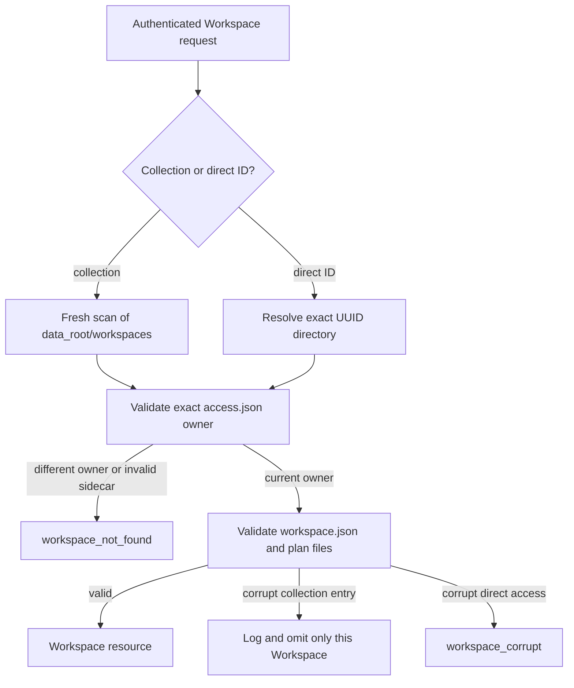
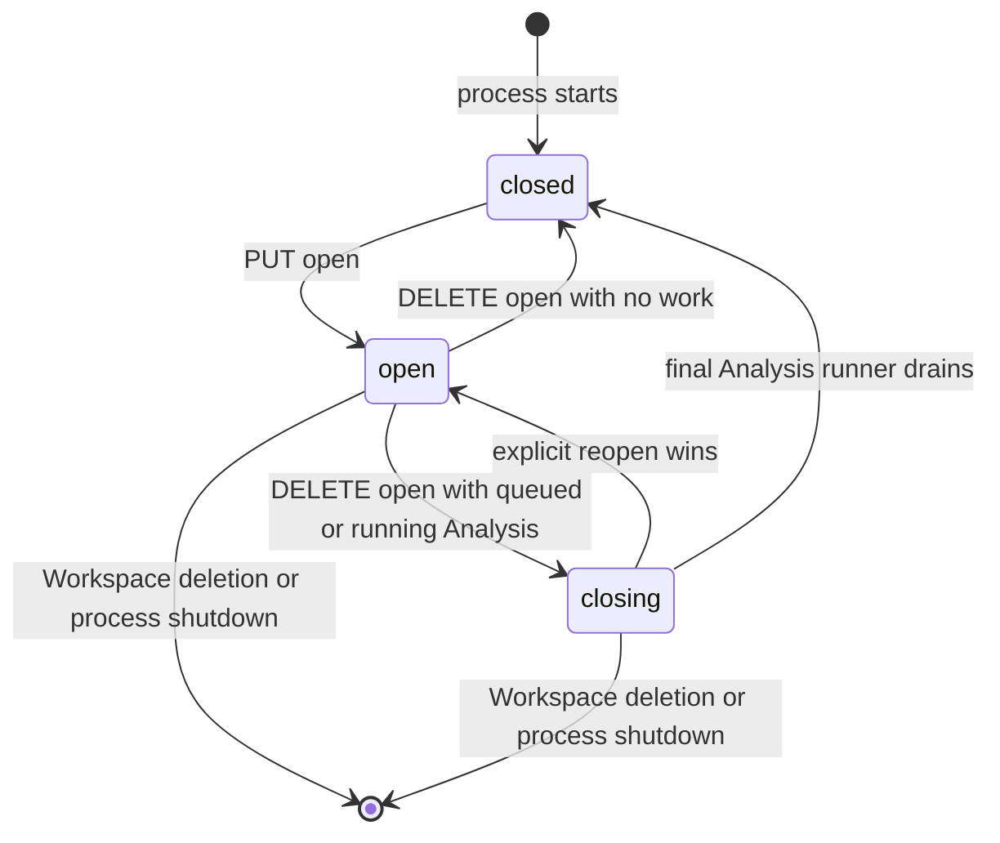

# Backend Workspace Architecture

## Catalogue And Access Boundary

The filesystem is the sole durable Workspace catalogue. Live Workspaces are
UUID-named direct children of `data_root/workspaces/`; SQLite contains no
Workspace row, ownership mapping, lifecycle state, or deletion tombstone.
Every live folder has a strict deployment-only `access.json` containing exactly
one `owner_id`. This sidecar is not portable analytical content.

`WorkspaceService` is the only caller that turns an authenticated principal and
Workspace ID into a host path. Direct lookup validates the UUID directory and
sidecar on every call. Collection lookup performs a fresh bounded filesystem
scan; it has no catalogue cache, watcher, or per-user Workspace directory.



Non-UUID entries, links, reparse points, and missing or malformed access
sidecars are logged and skipped without blocking valid siblings. A corrupt
Workspace with a valid current-owner sidecar is omitted from a collection and
fails direct access with `500 workspace_corrupt`. Other users receive a
concealed 404 before portable data is parsed. The valid sidecar is sufficient
to authorize deletion of corrupt content.

## Service Boundary

`WorkspaceService` is the sole residency and mutation authority. The runtime
keeps one coordination slot per Workspace ID and at most one aggregate object
in that slot. Every load, mutation, completion, archive install, or deletion
for the same Workspace passes through its asynchronous gate.

`WorkspaceLifecycleService` owns public open, close, and delete commands. A
short-lived per-user gate serializes those commands so one user can have at
most one `open` Workspace. Opening first validates the target, then requests
closure of every open sibling, and finally opens the target. An idle sibling
closes immediately; a busy sibling may remain `closing` until admitted
Analysis work drains. Multiple closing Workspaces are permitted. Reopening a
closing target makes it the sole open Workspace. Gates are independent across
users and are removed when no lifecycle command is waiting or running.

If opening the target fails after sibling closure has begun, the service
returns the real failure and leaves the resulting runtime states visible. It
does not fabricate a rollback. Runtime-state events publish every transition,
and clients reconcile from the resulting Workspace resources. There is no
detached lifecycle path, remembered selected Workspace, automatic load, LRU,
idle timer, or automatic eviction.



All child-resource operations require the Workspace to be explicitly open.
Close is idempotent. With active Analysis work it changes the process-local
state to `closing`: new mutations and submissions fail, while already-admitted
completion may re-enter the gate. The final runner removes the aggregate from
memory. A reopen serialized before final removal restores `open` state.

Routes and completion handlers use function-scoped read or mutation contexts.
Each lease carries the validated Workspace path, so subordinate services never
repeat ownership lookup or consult an index. Response models are materialized
before the context releases its gate. Remote provider calls, process execution,
SSE, and response streaming occur outside the gate.

## Aggregate And Store

`domain.workspace.Workspace` owns the live Data Block graph. A live `Node`
contains a Polars `LazyFrame`, resolved parent objects, and bounded runtime-only
Undo/Redo plan stacks. The aggregate does not serialize itself or know about
HTTP. Provenance and parents record creation lineage; replacing a node plan
does not rewrite either or propagate into independently owned descendant plans.
Physical and semantic extension dtypes both remain in that LazyFrame schema;
there is no second per-node custom-type registry to reconcile with plan
history.

`infrastructure.storage.WorkspaceStore` is the only snapshot-format boundary.
It validates the complete `workspace.json` envelope and plan files, constructs
unattached nodes, resolves parents, rejects invalid or cyclic graphs, and
strictly loads per-Tab and per-Analysis records, and publishes the aggregate
only after complete validation. Generation-named plan, Tab, and Analysis files
are written before the atomically replaced `workspace.json` commit point. The
store shares the central durable-filesystem primitives for file and directory
`fsync` and same-filesystem atomic replacement.

Snapshots encode only each node's current plan. Construction and reconstruction
therefore start with empty history, as do clones and imported Workspaces.

The deployment layout is:

```text
data_root/
├── deployment.sqlite3
├── workspaces/
│   ├── .staging/
│   ├── .trash/
│   └── <workspace-id>/
│       ├── access.json
│       ├── workspace.json
│       ├── data/
│       ├── tabs/<tab-id>/<generation>.json
│       └── analyses/<analysis-id>/<generation>.json
└── users/
    └── <user-id>/
        ├── files/
        └── imports/
```

Creation builds the snapshot and access sidecar below `.staging/`, then one
atomic rename publishes the complete live directory. Archive import validates
portable content, always assigns a fresh Workspace ID and owner sidecar, and
replaces archived timestamps with one new publication timestamp. Its current
final-source rebase occurs after the live rename; the resulting crash window is
tracked in the
[persistence-integrity reference](../../reference/persistence-integrity.md).
Export omits `access.json`; import rejects an archive-supplied sidecar.

Portable archive version 6 materializes Data Blocks and retained Analysis query
inputs as Parquet, includes terminal live Analyses and declared Artifacts, and
contains no serialized executable plans. Import reconstructs private lazy plans
from those safe files, rebases their sources and Workspace identity after final
publication, and strictly rejects older archive versions. Queued and running
Analyses are omitted; their Tabs are exported empty.

## Mutation And Deletion

Every committed content change advances the Workspace Revision and returns a
strong `ETag`. The client does not submit an expected Revision: the one in-memory
aggregate and its gate give commands a single server order. The store still
checks the expected on-disk Revision at commit so an out-of-boundary writer is
detected rather than overwritten. Blocking persistence runs in non-abandoned
threads, so cancellation never releases a gate while its write continues.

Data Block Edit, Undo, and Redo commands use the same mutation gate. Before a
mutation, the service captures every resident node's plan stacks. If validation
or publication fails and the aggregate is reconstructed from the committed
snapshot, matching nodes receive those captured stacks so a rejected command
neither advances nor erases session history.

Deletion coordinates with private Analysis execution and excludes new
submission or completion through the same Workspace gate. Once execution has
been signalled to stop, the complete Workspace directory is atomically renamed into
`.trash/`, making it unreachable before recursive cleanup. The sidecar moves
with the directory, so an interrupted cleanup remains attributable and startup
can retry removal without inventing a database tombstone.

User File and archive behavior is described in
[Files and Storage](../../domain/files-and-storage.md).
