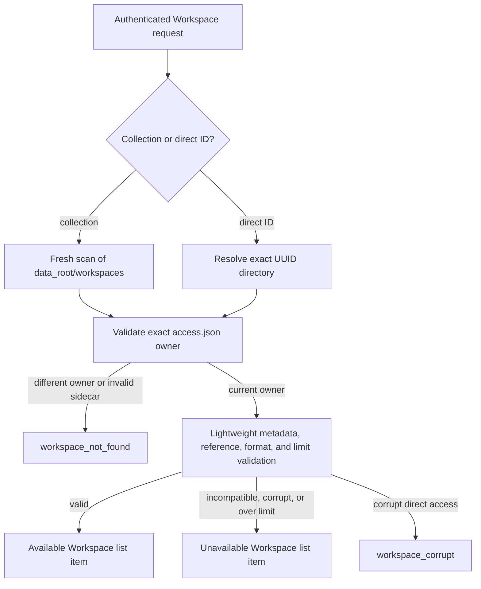
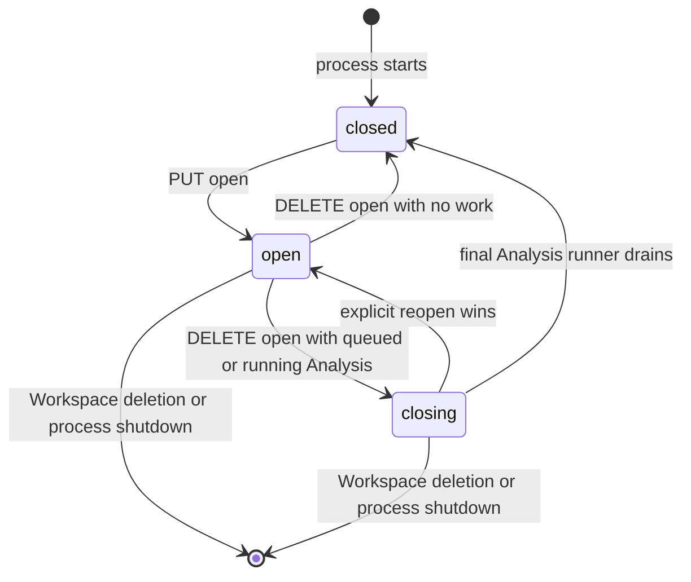

# Backend Workspace Architecture

## Catalogue And Access Boundary

The filesystem is the sole durable Workspace catalogue. Live Workspaces are
UUID-named direct children of `data_root/workspaces/`; SQLite contains no
Workspace row, ownership mapping, lifecycle state, or deletion tombstone.
Every live folder has a strict deployment-only `access.json` containing exactly
one `owner_id`. This sidecar is not portable analytical content.

`WorkspaceService` is the only caller that turns an authenticated principal and
Workspace ID into a host path. Direct lookup validates the UUID directory and
sidecar on every call. Collection lookup performs a fresh bounded filesystem
scan; it has no catalogue cache, watcher, or per-user Workspace directory.



Non-UUID entries, links, reparse points, and missing or malformed access
sidecars are logged and skipped without blocking valid siblings. Collection
discovery validates metadata, graph and plan references, native format, and
configured limits without reconstructing every Tab, Analysis, or lazy plan. An
incompatible, corrupt, or over-limit Workspace with a valid current-owner
sidecar appears as an Unavailable Workspace with a safe reason. Incompatible
entries also retain best-effort name, description, and timestamp text read from
the parsed metadata envelope; strict opening still fails with
`500 workspace_corrupt`. The client keeps a Load action for every unavailable
entry and displays that ordinary open error. A recognized incompatible entry's
archive action emits a bounded raw ZIP of the stored content while omitting
deployment-only `access.json`, so the bytes can be preserved even though this
build cannot load them. Other users receive a concealed 404 before portable
data is parsed. The valid sidecar is sufficient to authorize deletion of
unavailable content.

## Service Boundary

`WorkspaceService` remains the sole public residency and mutation authority.
It delegates three deep private mechanisms: safe catalogue reads plus
in-process residency and process locks, staged mutation commit/rollback, and
post-commit event diff publication. These collaborators expose no second
Workspace service or mutation path. The runtime keeps one coordination slot
per Workspace ID and at most one aggregate object in that slot. Every load,
mutation, completion, archive install, or deletion for the same Workspace
passes through its asynchronous gate. The slot also retains a non-blocking
operating-system file lock for the complete `open` or `closing` lifetime. This
makes one Workspace exclusive across cooperating backend processes without
locking the Data Root or unrelated Workspaces.

`WorkspaceLifecycleService` owns public open, close, and delete commands. A
short-lived per-user gate serializes those commands so one user can have at
most one `open` Workspace in that process. Opening first validates and reserves
cross-process ownership of the target, then requests closure of every open
sibling, and finally loads the target. Lock contention therefore leaves the
current Workspace open. An idle sibling closes immediately; a busy sibling may
remain `closing` until admitted Analysis work drains and retains its process
lock until final close. Multiple closing Workspaces are permitted. Reopening a
closing target reuses its retained lock and makes it the sole open Workspace.
Gates are independent across users and are removed when no lifecycle command
is waiting or running.

If opening the target fails after sibling closure has begun, the service
returns the real failure and leaves the resulting runtime states visible. It
does not fabricate a rollback. Runtime-state events publish every transition,
and clients reconcile from the resulting Workspace resources. There is no
detached lifecycle path, remembered selected Workspace, automatic load, LRU,
idle timer, or automatic eviction.

The lock registry is `data_root/workspaces/.locks/`, with one persistent
`<workspace-id>.lock` rendezvous file per Workspace. On Unix the descriptor
uses non-blocking `flock`; on Windows it uses non-blocking `msvcrt.locking`.
The operating-system lock is authoritative. PID text is rewritten only for
diagnostics, so an unexpected process exit releases ownership without stale
file removal. Registry directories and entries must be owned, ordinary local
filesystem objects: links, reparse points, unexpected file types, and ownership
mismatches fail closed. A safe but contended lock is `workspace_in_use`; an
unsafe or inaccessible registry is `workspace_lock_unavailable`.



All child-resource operations require the Workspace to be explicitly open.
Close is idempotent. With active Analysis work it changes the process-local
state to `closing`: new mutations and submissions fail, while already-admitted
completion may re-enter the gate. The final runner removes the aggregate from
memory. A reopen serialized before final removal restores `open` state.

Routes and completion handlers use function-scoped read or mutation contexts.
Each lease carries the validated Workspace path, so subordinate services never
repeat ownership lookup or consult an index. Response models are materialized
before the context releases its gate. Remote provider calls, process execution,
SSE, and response streaming occur outside the gate.

## Aggregate And Store

`domain.workspace.Workspace` owns the live Data Block graph. A live `Node`
contains a Polars `LazyFrame`, resolved parent objects, and bounded runtime-only
Undo/Redo plan stacks. The aggregate does not serialize itself or know about
HTTP. Provenance and parents record creation lineage; replacing a node plan
does not rewrite either or propagate into independently owned descendant plans.
Physical and semantic extension dtypes both remain in that LazyFrame schema;
there is no second per-node custom-type registry to reconcile with plan
history.

`infrastructure.storage.WorkspaceStore` is the only snapshot-format boundary.
Native data schema version 1 governs the `workspace.json` envelope, Data Block
graph and plans, and stable child-record references. A separate registry gives
each top-level Analysis kind its own schema version; Annotation, Concordance,
Quotation, Trends, Token Frequency, and Topic Modelling are all version 1.
Supporting request kinds use their owning top-level kind.

Each generation-named Tab record is a storage-only
`{id, analysis_kind, schema_version, payload}` envelope. Each Analysis record
adds its stable `tab_id`. The store validates those duplicated identities and
kinds after dispatch without exposing storage fields through ordinary public
resources. A data-version mismatch rejects the complete Workspace. An
unsupported Analysis-kind version instead preserves its exact bytes as an
`incompatible_schema` Tab or Analysis; malformed current-version records are
`record_invalid`. An unavailable Tab or parent Analysis makes only its owned
subtree unavailable. Compatible Data Blocks, Tabs, and independent Analysis
branches remain usable, and unrelated commits copy opaque unavailable records
byte-for-byte. Generation files are written before the atomically replaced
`workspace.json` commit point. The store shares the central durable-filesystem
primitives for file and directory `fsync` and same-filesystem atomic
replacement.

Snapshots encode only each node's current plan. Construction and reconstruction
therefore start with empty history, as do clones and imported Workspaces.

The deployment layout is:

```text
data_root/
├── deployment.sqlite3 [hosted multi-user only]
├── workspaces/
│   ├── .staging/
│   ├── .trash/
│   ├── .locks/
│   │   └── <workspace-id>.lock
│   └── <workspace-id>/
│       ├── access.json
│       ├── workspace.json
│       ├── data/
│       ├── tabs/<tab-id>/<generation>.json
│       └── analyses/<analysis-id>/<generation>.json
└── users/
    └── <user-id>/
        ├── files/
        └── imports/
```

Creation builds the snapshot and access sidecar below `.staging/`, then one
atomic rename publishes the complete live directory. Archive import validates
portable content, always assigns a fresh Workspace ID and owner sidecar, and
replaces archived timestamps with one new publication timestamp. It compiles
final paths, rebases Data Block plans and retained query snapshots, validates
the complete representation against its future root, and remeasures quota
while the bytes remain staged. The atomic rename is the only publication commit
point; no mutation follows visibility. Export omits `access.json`; import
rejects an archive-supplied sidecar. Lock files are outside Workspace
directories and are never portable archive content.

Portable archive data format version 1 uses the same stable per-kind Tab and
Analysis envelopes. It materializes Data Blocks and retained Analysis query
inputs as Parquet, includes terminal compatible Analysis forests and declared
Artifacts, and contains no serialized executable plans. Import rejects an
unsupported data version but accepts supported data containing newer Analysis
versions. Unsupported Tabs and Analyses, their namespaced files, and descendants
of an omitted parent are omitted; surviving Tab references are filtered.
Exports apply the same policy to unavailable native children. Both routes
report omitted counts in `X-Wordflow-Omitted-Tab-Count` and
`X-Wordflow-Omitted-Analysis-Count`. Import reconstructs private lazy plans
from safe retained files and rebases their sources and Workspace identity after
final publication. Native schema 23 receives no format-specific detection or
reader: catalogue discovery classifies the failed current-contract validation
as corrupt, and Load invokes the ordinary backend open path and returns its
error. Archive format 22 is rejected without migration or a fallback reader.
Queued and running Analyses remain omitted from each Tab's archived forest.

## Mutation And Deletion

Every committed content change advances the Workspace Revision and returns a
strong `ETag`. The client does not submit an expected Revision: the one in-memory
aggregate and its gate give commands a single server order. The store still
checks the expected on-disk Revision at commit so an out-of-boundary writer is
detected rather than overwritten. Blocking persistence runs in non-abandoned
threads, so cancellation never releases a gate while its write continues.

Data Block Edit, Undo, and Redo commands use the same mutation gate. Before a
mutation, the service captures every resident node's plan stacks. If validation
or publication fails and the aggregate is reconstructed from the committed
snapshot, matching nodes receive those captured stacks so a rejected command
neither advances nor erases session history.

Deletion coordinates with private Analysis execution and excludes new
submission or completion through the same Workspace gate. A locally closed
Workspace first acquires the same process lock, so another backend cannot delete
a Workspace it has open. Once execution has been signalled to stop, the complete
Workspace directory is atomically renamed into `.trash/`, making it unreachable
before recursive cleanup. The sidecar moves with the directory, so an
interrupted cleanup remains attributable and startup can retry removal without
inventing a database tombstone.

Startup clears only the service-private `.staging` and `.trash` roots and never
enters a UUID Workspace directory. After authentication, catalogue listing
inspects owner-attributable metadata and returns incompatible, corrupt, or
over-limit Workspaces as unavailable records without hiding healthy siblings.
Explicit open acquires one Workspace lock, loads that Workspace, and only then
performs best-effort orphan cleanup. Valid queued or running Analyses left by a
previous process are committed as interrupted before the open response returns;
invalid or unsupported child records remain byte-identical until an explicit
Clear Results or delete action removes them.

User File and archive behavior is described in
[Files and Storage](../../domain/files-and-storage.md).
