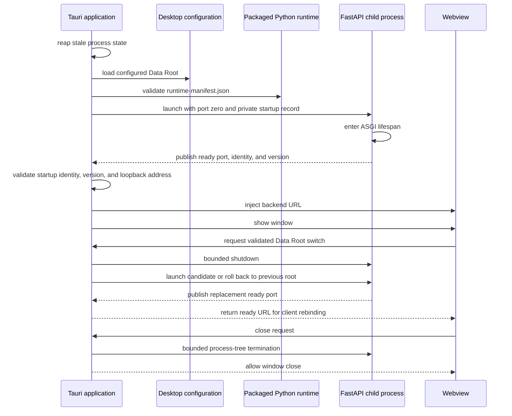

# Desktop Architecture

Tauri is a native supervisor around the same React frontend and FastAPI
backend. Rust owns runtime discovery, the local child process, Data Root
configuration, native downloads, restart, and shutdown.

## Runtime Contract

`runtime-manifest.json` is the sole packaged Python layout contract. It records
target platform, Python selector and ABI, backend lock provenance, and portable
relative interpreter, Python-home, and site-package paths. Rust validates the
complete manifest and never recursively guesses a runtime.

At startup, Tauri reaps stale process state, loads the desktop Data Root,
launches the backend with port zero and a private startup record, waits for
ASGI lifespan readiness, validates process identity and package version,
injects the assigned URL, and only then shows the window.

The supervisor owns `starting`, `ready`, `restarting`, `failed`, and `stopped`
states. It never holds its mutex over process or filesystem work. A closing app
changes the lifecycle away from `restarting`, so a late candidate is shut down
instead of installed.

## Native Boundaries

Data Root switching is a restart transaction: probe the candidate, stop the
old backend, verify the candidate, persist configuration atomically, and roll
back to the prior root on failure. The command returns the currently ready URL,
which the webview uses to rebind raw URL consumers, the generated client, and
server-state queries. An unexpected child exit is surfaced as backend
unavailability; the supervisor does not hide it behind speculative retry.

Native downloads accept a relative backend API path and safe filename, reject
redirects, stream to a temporary file, and publish without replacement. The
webview cannot supply an arbitrary URL or privileged headers.

Close requests trigger bounded process-tree termination before the window
closes. Unix uses a process group with escalation; Windows terminates the child
tree.
