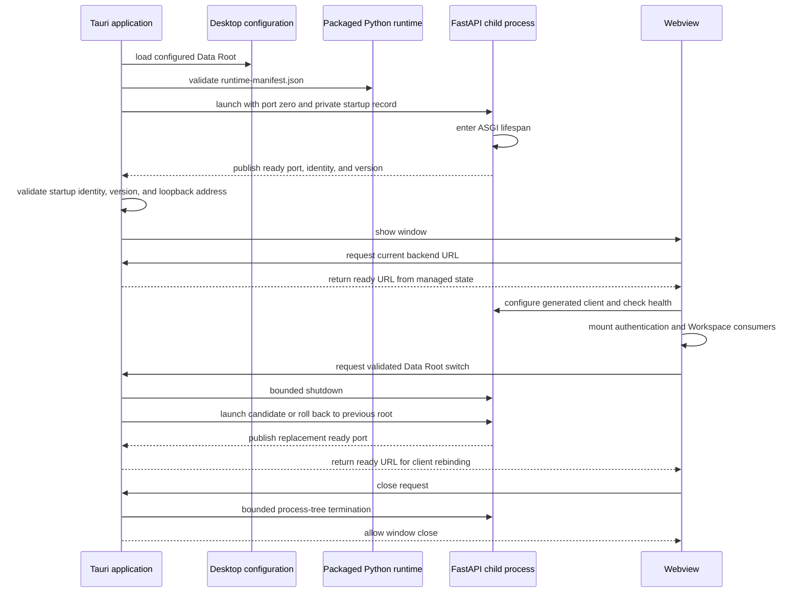
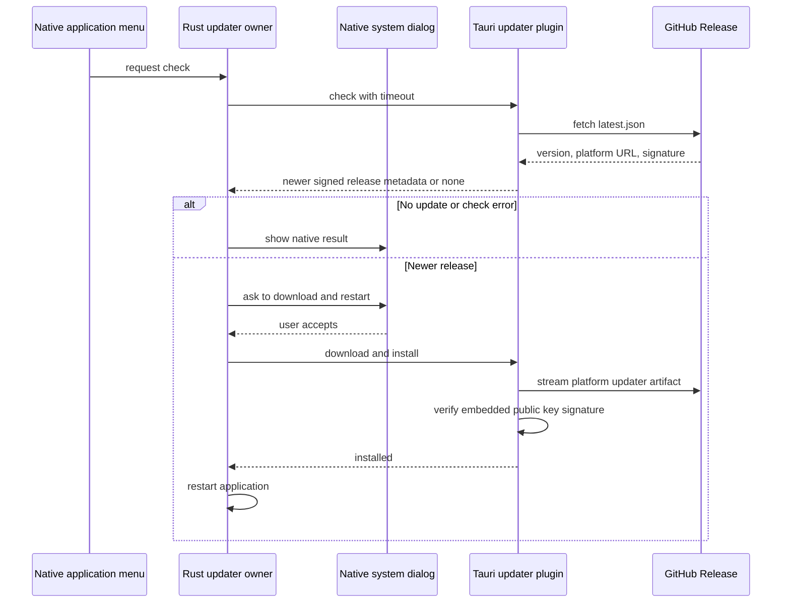

# Desktop Architecture

Tauri is a native supervisor around the same React frontend and FastAPI
backend. Rust owns runtime discovery, the local child process, Data Root
configuration, native downloads, signed application updates, restart, and
shutdown.

## Runtime Contract

`runtime-manifest.json` is the sole packaged Python layout contract. It records
target platform, Python selector and ABI, backend lock provenance, and portable
relative interpreter, Python-home, and site-package paths. Rust validates the
complete manifest and never recursively guesses a runtime.

At startup, Tauri loads the desktop Data Root, launches the backend with port
zero and a private startup record, waits for
ASGI lifespan readiness, validates process identity and package version,
installs the assigned URL in managed Rust state, and only then shows the window.
The frontend connection gate obtains that URL through `get_backend_url`,
configures the generated client, and verifies `/health` before mounting
authentication or Workspace consumers. Reloading repeats IPC discovery, so a
stale JavaScript value cannot select an old backend port.

Each desktop process owns only its own backend child. The backend parent
watchdog exits if that desktop process disappears, so multiple desktop
instances can run against the same Data Root without a shared PID record or
cross-instance process cleanup.

The packaged backend runs with Python bytecode writes disabled. Python may use
bytecode included before signing, but it must not add or update `__pycache__`
content inside the sealed application bundle at runtime.

The supervisor owns `starting`, `ready`, `restarting`, `failed`, and `stopped`
states. It never holds its mutex over process or filesystem work. A closing app
changes the lifecycle away from `restarting`, so a late candidate is shut down
instead of installed.

The main window remains hidden until backend readiness. If runtime resolution,
Data Root configuration, or backend startup fails, Tauri schedules a native
error dialog without blocking setup and exits after the user acknowledges it.
This keeps startup failures visible even though the webview is not yet usable.

## Native Boundaries

Backend connection discovery has one frontend gate and two runtime adapters.
Browser builds retain the existing environment, runtime `basePath`, local
development port, and same-origin rules without importing or invoking Tauri.
Desktop builds dynamically load the Tauri API, treat `get_backend_url` as the
source of truth, and retry both discovery and health checks with bounded
backoff. Rust does not inject JavaScript or guess a fixed backend port.

Data Root switching is a restart transaction: probe the candidate, stop the
old backend, verify the candidate, persist configuration atomically, and roll
back to the prior root on failure. The command returns the currently ready URL,
which the webview uses to rebind raw URL consumers, the generated client, and
server-state queries. An unexpected child exit is surfaced as backend
unavailability; the supervisor does not hide it behind speculative retry.

Page zoom is owned by Tauri. The desktop shell leaves the webview at its default
100% scale and enables Tauri's platform zoom shortcuts. On macOS and Linux, the
injected shortcut handler requires the main webview's explicit
`core:webview:allow-set-webview-zoom` capability. Wordflow does not add custom
zoom controls or persist zoom state.

Debug desktop builds allow both the fixed Vite development origin and the
platform's packaged Tauri origin through backend CORS, so `tauri dev` and a
packaged debug application use the same supervisor. Release builds allow only
the packaged Tauri origin.

Native downloads accept a relative backend API path and safe filename, reject
redirects, stream to a temporary file, and publish without replacement. The
webview cannot supply an arbitrary URL or privileged headers.

## Application Updates

The official Tauri updater is the only application-update path. Rust owns the
signed update resource and the complete check, download, install, and restart
lifecycle. The native application menu exposes **Check for Updates…** as the
sole control. Checks are manual; application startup performs no update request
and creates no updater window. Rust applies a 15-second request timeout and
uses standard operating-system dialogs for the up-to-date result, errors, and
the install confirmation. The main React application and web deployment have
no updater UI, state, dependencies, or permissions.

The updater public key and endpoint are compiled into Tauri configuration.
The private updater key exists only as GitHub Actions secrets. GitHub Releases
retain the versioned installers and updater packages; neither the FastAPI
backend nor a Workspace stores application versions. Release tags and assets
are treated as immutable after publication.

Main-window close requests trigger bounded process-tree termination before the
window closes. Unix uses a process group with escalation; Windows terminates
the child tree.
