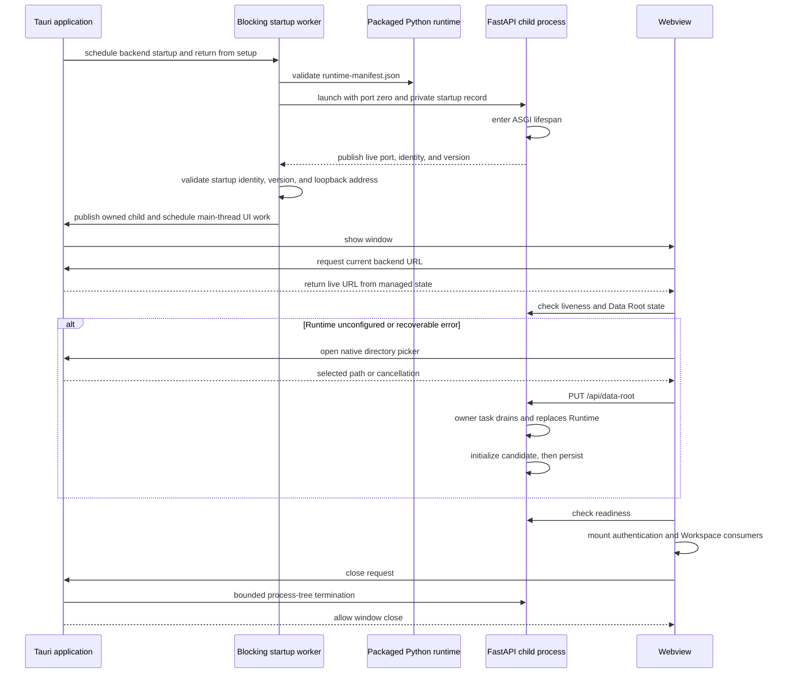
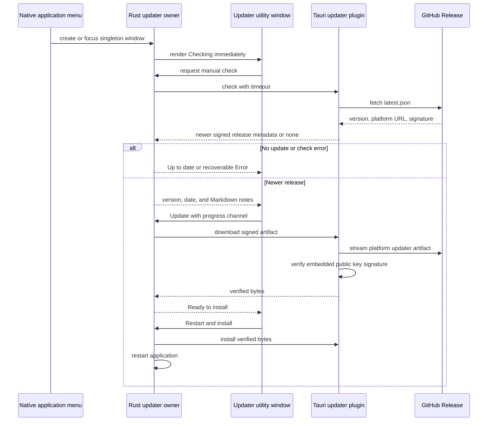

# Desktop Architecture

Tauri is a native supervisor around the same React frontend and FastAPI
backend. Rust owns runtime selection, the local child process, native folder
selection, native downloads, signed application updates, and shutdown. Python
owns Data Root validation, persistence, and Runtime switching.

## Runtime Contract

`runtime-manifest.json` is the sole packaged Python layout contract. Schema 3
records the installed backend version, target platform, Python selector and
ABI, exact `backend/uv.lock` digest, and portable relative interpreter,
Python-home, and site-package paths. Rust validates the complete manifest
before starting Python.

Runtime selection has two explicit build profiles. `tauri dev` enables the
`dev-runtime` Cargo feature and reads only the freshly prepared
`frontend/src-tauri/backend-runtime` directory. Packaging applies
`tauri.bundle.conf.json`, embeds that same staged directory, and packaged code
reads only Tauri's `backend-runtime` resource. There is no environment override,
executable-adjacent search, debug fallback, or recursive interpreter discovery.
The base Tauri configuration deliberately has no resource entry, so ordinary
Cargo checks compile the supervisor without pretending a missing runtime is a
valid package.

Runtime dependency selection is explicit. Local development and default
desktop builds use the checked-out `polars-text` and `polars-source-utils`
sources recorded by `backend/uv.lock`. The opt-in release `no_sources` input
passes `uv sync --no-sources`, so CI resolves published packages from PyPI and
refuses to build either extension from an sdist.

At startup, Tauri's synchronous setup hook installs native wiring, validates
that the hidden main window exists, schedules one blocking startup worker, and
returns. The worker launches the backend with port zero and a private startup
record, waits for ASGI control-plane liveness, validates process identity and
package version, and atomically transfers the child and assigned URL into
managed Rust state. Window and dialog operations are then scheduled explicitly
on Tauri's main thread; the main thread never polls a file or waits on Python.
The frontend connection gate obtains that URL through `get_backend_url`,
configures the generated client, checks `/health/live`, obtains
`/api/data-root`, and verifies `/health/ready` before mounting authentication
or Workspace consumers. Reloading repeats IPC discovery, so a
stale JavaScript value cannot select an old backend port.

The bootstrap gate offers directory selection only while unconfigured or after
a recoverable configuration error. Initialization and replacement render
progress, and process shutdown renders non-interactive shutdown progress;
`stopping` is never presented as first-run setup.

Each desktop process owns only its own backend child. The backend parent
watchdog exits if that desktop process disappears, so multiple desktop
instances can run against the same Data Root without a shared PID record or
cross-instance process cleanup.

The packaged backend runs with Python bytecode writes disabled. Python may use
bytecode included before signing, but it must not add or update `__pycache__`
content inside the sealed application bundle at runtime.

The supervisor owns `starting`, `live`, `failed`, and `stopped` process states.
The startup worker owns the child until the single `starting` to `live`
publication succeeds. Close and exit first publish cancellation, so readiness
polling stops promptly; a late success or failure cannot overwrite `stopped`.
If publication is rejected, the worker's process owner performs bounded
process-tree shutdown. The parent-PID watchdog remains a final guard for abrupt
desktop termination. The supervisor never restarts the child for a Data Root
change.

The main window remains hidden until backend liveness. If runtime resolution or
backend startup fails, Tauri schedules a native
error dialog without blocking setup and exits after the user acknowledges it.
This keeps startup failures visible even though the webview is not yet usable.

## Native Boundaries

Backend connection discovery has one frontend gate and two runtime adapters.
Browser builds retain the existing environment, runtime `basePath`, local
development port, and same-origin rules without importing or invoking Tauri.
Desktop builds dynamically load the Tauri API, treat `get_backend_url` as the
source of truth, and retry both discovery and health checks with bounded
backoff. Rust does not inject JavaScript or guess a fixed backend port.

The native directory picker returns only a selected path. The webview submits
that path to `PUT /api/data-root`; acceptance comes only from the Python
backend's filesystem probe and successful Runtime initialization. A generation
change remounts application providers and caches. The current notarized build
is not App-Sandboxed, so this native selection plus the child-process probe is
the supported macOS access model. Security-scoped bookmarks and Mac App Store
sandbox support are outside this contract.

Page zoom is owned by Tauri. The desktop shell leaves the webview at its default
100% scale and enables Tauri's platform zoom shortcuts. On macOS and Linux, the
injected shortcut handler requires the main webview's explicit
`core:webview:allow-set-webview-zoom` capability. Wordflow does not add custom
zoom controls or persist zoom state.

The main macOS window keeps native decorations and traffic-light controls while
using Tauri's overlay title-bar style with the native title hidden. The main
React entry reserves a shared 35-pixel, theme-owned header above every
bootstrap, authentication, and Workspace state. Browser deployments render the
same application chrome; only macOS Tauri adds left clearance for its native
traffic lights. Within an active Workspace, the header presents session-only
view and analysis Tab history plus a 22-pixel VS Code command-center control
backed by the shared Workspace Tabs query. Compact Wordflow information and
citation controls occupy the left side, Settings occupies the far-right edge,
and the sidebar does not duplicate those controls. Blank macOS chrome starts
native dragging through the narrow `core:window:allow-start-dragging`
capability, while the navigation, quick access, and application controls opt
out. The header has no visual divider from the application shell. The separate
updater entry retains its own utility-window layout.

Debug desktop builds allow both the fixed Vite development origin and the
platform's packaged Tauri origin through backend CORS, so `tauri dev` and a
packaged debug application use the same supervisor. Release builds allow only
the packaged Tauri origin. The Vite development server uses a fixed strict
`127.0.0.1:3001` profile and ignores `src-tauri` changes. During `tauri dev`,
the webview loads that server for hot module replacement. During `tauri build`,
Vite produces the static `frontendDist` before Tauri bundles it; an installed
desktop application requires neither Node.js nor a Vite server.

Desktop packaging treats `frontend/src-tauri/icons/wordflow.icon` as the native
Icon Composer source. On current macOS toolchains Tauri compiles it into the
application asset catalog so the system can render its Liquid Glass layers;
the configured ICNS remains the compatibility fallback. Windows installers and
browser surfaces use flattened renders of the same composition.

Rust owns the complete desktop Downloads-folder boundary. GET resources accept
only a relative backend `/api/` path; Data Block exports have a separate typed
POST command rather than a generic native HTTP proxy. Both reject redirects and
stream the backend response to a private temporary file. Client-generated
charts, tables, and archives cross IPC as bytes and use the same native file
installer. Installation atomically claims the first available safe filename,
so concurrent desktop instances cannot overwrite each other. The webview has no
filesystem permission and cannot supply an arbitrary URL, HTTP method, headers,
or destination path. Browser deployments continue to fetch through the
generated client and delegate saving to the browser download UI.

Plugin-specific capabilities grant only the JavaScript commands the webview
invokes: native folder selection and revealing an already saved file. Two
additional explicit core grants support Tauri's zoom shortcut and macOS title
bar dragging commands; `core:default` remains Tauri's standard core set. Rust-side dialogs do not
require a webview dialog-default grant. Production scripts are restricted to
`self`; Tauri injects the hashes and nonces required by bundled assets. The
separate development CSP admits only the fixed loopback Vite WebSocket and
development script evaluation needed for HMR, so development accommodations
never ship in the packaged policy.

## Application Updates

The official Tauri updater is the only application-update path. Rust owns the
signed update resource and the complete check, download, install, and restart
lifecycle. The native application menu exposes **Check for Updates…** as the
manual entry point and opens or focuses one `updater` utility window. A separate
Vite entry renders that window without mounting the backend bootstrap,
authentication, router, or Workspace. The updater webview receives only
`core:default`; JavaScript cannot call the Updater, Store, opener, or process
plugins directly. Typed Rust commands expose only the updater operations and
validated HTTPS release-note links it needs.

Automatic checks are enabled by default and occur at most once per 24 hours.
Rust persists `automaticChecks`, `lastCheckAt`, and `skippedVersion` in the
device-local Tauri Store. Automatic checks remain silent when no update is
available, fail without interrupting startup, and suppress only the exact
skipped version. Manual checks bypass both cadence and skip suppression. The
desktop-only General setting changes automatic checking; browser deployments
render no setting and make no updater request.

The verified artifact remains in Rust memory between download and installation;
there is no intermediate file controlled by the webview. Closing the updater
window is equivalent to **Decide later** and clears the staged update, except
that close is prevented during download and installation. Only closing the
`main` window initiates backend shutdown.

The updater public key and endpoint are compiled into Tauri configuration.
The private updater key exists only as GitHub Actions secrets. GitHub Releases
retain the versioned installers and updater packages; neither the FastAPI
backend nor a Workspace stores application versions. Release tags and assets
are treated as immutable after publication.

Main-window close requests trigger bounded process-tree termination before the
window closes. Unix uses a process group with escalation; Windows terminates
the child tree.
