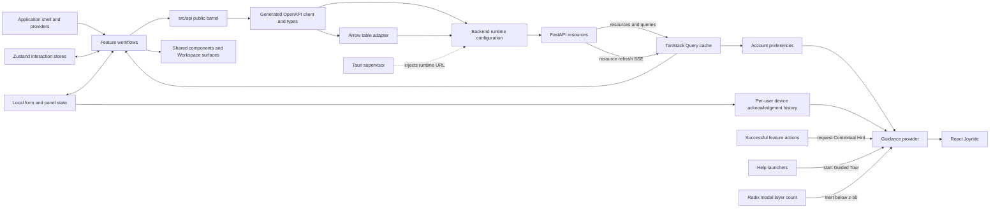

# Frontend Overview

The frontend is a React 19, Vite, and TypeScript single-page application used
both in a browser and inside Tauri. It renders Workspace and Analysis features,
consumes the backend's generated OpenAPI client, and observes resource refresh
events over SSE.

## Boundaries

- `src/api/` is the public barrel for generated SDK functions and types.
- `src/lib/backend/` owns generated-client runtime configuration and API-base
  resolution.
- `src/lib/arrow/` owns official Apache Arrow IPC decoding and semantic field
  classification; `src/api/tableApi.ts` is the narrow
  generated-client adapter for binary row pages.
- `src/features/` owns user workflows; `views/` contains sidebar features and
  `workspace/` contains the persistent graph, data, and background-work
  surfaces.
- `src/providers/` owns app-level providers.
- `src/stores/` owns client interaction state that is not server-derived.
- `src/features/preferences/` reads and mutates synchronized account preferences
  through TanStack Query. Server preference data is never mirrored into
  Zustand.
- `src/features/guidance/` owns empty production registries, explicit
  Contextual Hint and Guided Tour requests, Joyride adaptation, device-local
  version acknowledgments, and modal-layer coordination. It does not poll the
  DOM or infer guidance from global application conditions.
- `src/tutorials/` and `frontend/public/` own the in-app documentation
  registry and content.
- `src-tauri/` owns the native desktop supervisor and commands.

The app has one static route so the same built assets work behind FastAPI SPA
fallback and inside the desktop bundle. View identity is URL search state
mirrored into client UI state rather than server routing.

The contextual-guidance master switch is unresolved until the authenticated
preference query succeeds, so automatic guidance remains off during bootstrap.
Hint acknowledgments use `user ID -> hint ID -> highest version` in local
storage. A Guided Tour is deliberately started and does not consult that
switch. Shared Dialog, AlertDialog, and Sheet content registers the app modal
count; Joyride remains rendered in a z-40 portal beneath z-50 modals while that
portal is inert and hidden from assistive technology.

## Backend Contract Transition

The backend's exported OpenAPI schema is authoritative. The checked-in
frontend schema, generated client, and consumers must be regenerated and
updated together after backend contract changes; generated files are never
edited by hand. During a cross-package cutover, frontend code may temporarily
lag the backend and must not be used to infer the canonical backend surface.

The project uses React Compiler. Manual memoization is reserved for
identity-sensitive boundaries such as contexts, effects, React Flow, tables,
and external-library adapters rather than routine render optimization.
