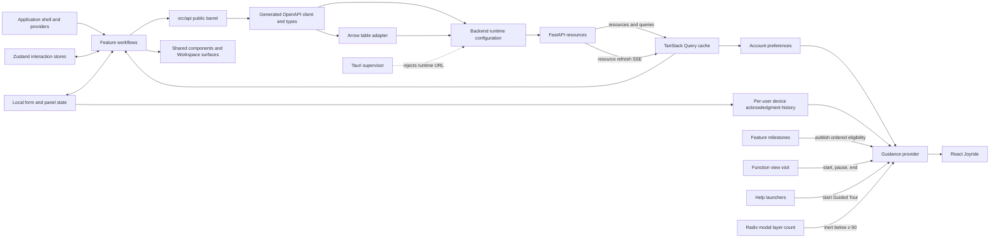

# Frontend Overview

The frontend is a React 19, Vite, and TypeScript single-page application used
both in a browser and inside Tauri. It renders Workspace and Analysis features,
consumes the backend's generated OpenAPI client, and observes resource refresh
events over SSE.

## Boundaries

- `src/api/` is the public barrel for generated SDK functions and types.
- `src/lib/backend/` owns generated-client runtime configuration and API-base
  resolution.
- `src/lib/arrow/` owns official Apache Arrow IPC decoding and lossless field
  inspection; it does not maintain a parallel column-kind naming registry.
  `src/api/tableApi.ts` is the narrow
  generated-client adapter for binary row pages.
- `src/features/` owns user workflows; `views/` contains sidebar features and
  `workspace/` contains the persistent graph, data, and background-work
  surfaces.
- `src/providers/` owns app-level providers.
- `src/stores/` owns client interaction state that is not server-derived.
- `src/features/preferences/` reads and mutates synchronized account preferences
  through TanStack Query. Server preference data is never mirrored into
  Zustand.
- `src/features/provider-credentials/` owns the mode-specific Settings facade,
  the non-devtools multi-user provider-configuration store, and request-boundary
  credential injection. Components receive safe ordered configuration metadata
  rather than secret values.
- `src/features/guidance/` owns versioned production definitions, ordered
  per-function milestone sequences, function-visit coordination, deliberate
  Guided Tour requests, Joyride adaptation, device-local acknowledgments, and
  modal-layer coordination. Features publish reached milestones from their
  own state or successful events; the guidance boundary does not poll the DOM
  or infer application conditions.
- `src/tutorials/` and `frontend/public/` own the complete in-app documentation
  registry and offline content. `frontend/scripts/sync-published-docs.mjs`
  mirrors that content outward to the publication submodule; content never
  synchronizes in the opposite direction.
- `src-tauri/` owns the native desktop supervisor and commands.

The app has one static route so the same built assets work behind FastAPI SPA
fallback and inside the desktop bundle. View identity is URL search state
mirrored into client UI state rather than server routing.

Feature content can be nested inside independently resizable sidebar, main, and
Workspace panes. Layouts within those panes respond to their available width
through intrinsic wrapping and named container queries. Viewport breakpoints
remain appropriate for viewport-owned surfaces such as mobile navigation and
dialogs, but do not determine the layout of nested feature content.

The contextual-guidance master switch is unresolved until the authenticated
preference query succeeds, so automatic guidance remains off during bootstrap.
Hint acknowledgments use `user ID -> hint ID -> highest version` in local
storage. A Guided Tour is deliberately started and does not consult that
switch. Shared Dialog, AlertDialog, and Sheet content registers the app modal
count. While guidance is active, Joyride renders in a full-viewport z-100
portal above application content; the portal becomes inert and hidden from
assistive technology while an app modal is open.

All nine function views publish progressive Contextual Hint milestones. A view
visit spans Analysis Tab changes inside that function and ends only when the
sidebar function changes. The provider selects the earliest eligible,
unacknowledged version; event-only successes remain in an in-memory backlog for
later visits in the same session. Acknowledgment advances immediately, while
Not now, Escape, and missing targets pause the visit without acknowledgment.
Joyride remains responsible for positioning, focus, overlay, scrolling, and
collision handling.

The backend User File tree is complete. The Data Loader derives its own tree by
removing file leaves whose `loadable` signal is false while preserving every
directory, including empty directories. Counts and empty-state guidance use
only the resulting Loadable User Files. Local file picking, single-folder
picking, and file/folder drops share one browser upload-selection adapter. It
retains relative paths, filters hidden entries, and preflights the full
selection against the refreshed complete tree before any mutation. The upload
coordinator then creates missing directories parent-first and uploads files
sequentially, with cooperative cancellation and one final tree refresh after a
mutating attempt. Folder drop uses feature-detected Entries API traversal;
folder picking is the compatibility fallback used by browser and macOS Tauri
builds alike.

Online documentation is an optional urgent-update channel. The build-time
`VITE_DOCS_ORIGIN` identifies the site root, and the frontend appends the
current app's `v{major}.{minor}` tag. Markdown from that tag is tried before the
bundled copy; network and HTTP failures fall back locally. Registry caches are
scoped to the resolved origin and tag so one minor version cannot shadow
another.

## Backend Contract Transition

The backend's exported OpenAPI schema is authoritative. The checked-in
frontend schema, generated client, and consumers must be regenerated and
updated together after backend contract changes; generated files are never
edited by hand. During a cross-package cutover, frontend code may temporarily
lag the backend and must not be used to infer the canonical backend surface.

The project uses React Compiler. Manual memoization is reserved for
identity-sensitive boundaries such as contexts, effects, React Flow, tables,
and external-library adapters rather than routine render optimization.
