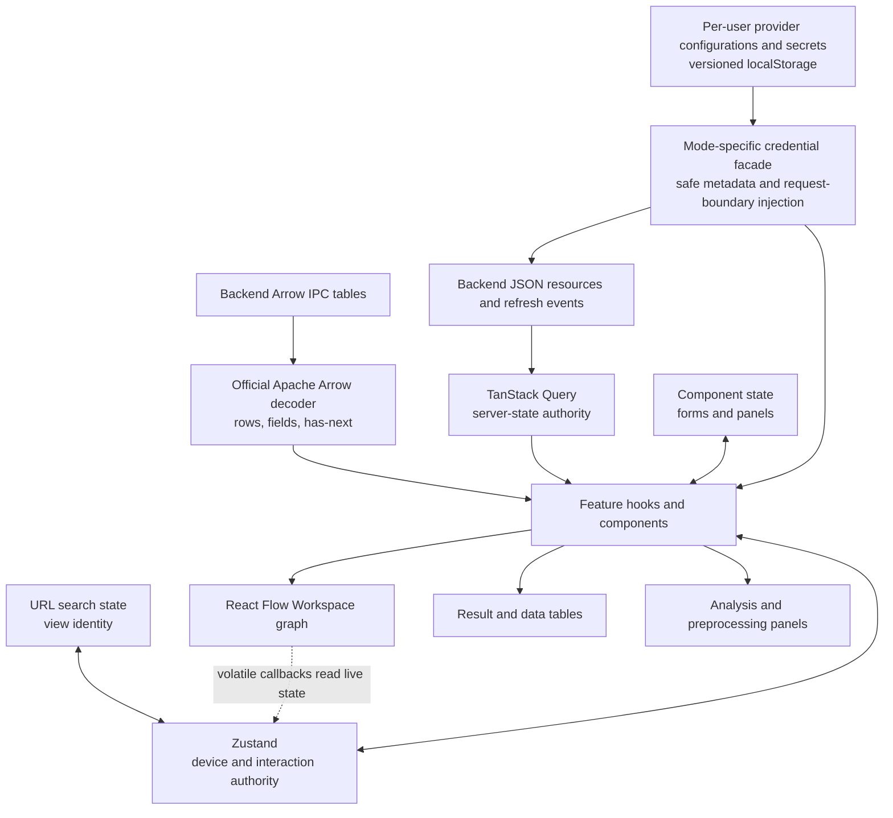

# Frontend State And Data Flow

## Server And Client State

TanStack Query owns server-derived resources, request identity, and cache
invalidation. This includes Workspace runtime state, Tabs, Analyses, Results,
imports, SQL pages, and schemas. Zustand owns only cross-feature client
interaction or device state such as the active view, selected and pinned Data
Blocks, and scoped presentation preferences. Local component state owns form,
pagination, dialog, and panel interaction.

Feature code consumes generated SDK functions and generated types through
`@/api`. The narrow table adapter decodes generated-client binary responses
with `apache-arrow`; complete Result table URLs use the same decoder directly.
It classifies columns through official Arrow types, including view and
large-offset representations emitted natively by Polars. Decoder failures stay
ordinary errors on the affected table query and retain the underlying Arrow
cause.
Known semantic extension names select specialized behavior such as the Topic
Distribution renderer. An unrecognized extension remains addressable as
`extension:<exact-name>` and retains its Arrow field metadata instead of being
collapsed into the generic `unknown` category.
Raw network calls are limited to boundaries the generator cannot express
conveniently, such as complete table URLs, native downloads, or SSE, and still
follow the backend's cookie, CSRF, Origin, and typed resource contracts. There
is no JSON table decoder, backend compatibility rewrite, or alternate decoder.

Annotation Provider Configurations are an intentional separate boundary. In
multi-user mode, a non-devtools Zustand store persists the ordered, user-named
configuration collection and its secrets by authenticated user ID under
`wordflow-provider-credentials` version 2. Components receive only safe
configuration metadata. A request facade reads the selected configuration's
secret synchronously by UUID inside the final generated SDK call. Model-list
queries are keyed by configuration UUID and a safe credential revision; secret
values never enter query keys, mutation state, Tab state, hydrated requests,
errors, or telemetry. Logout does not delete another account's browser
partition, and browser storage events synchronize replacement and deletion
across tabs. In single-user mode, the same facade projects the backend-owned
collection and invokes its write-only CRUD operations without creating a
browser credential entry.

Annotation Tab presentation state retains the selected configuration UUID,
provider type, and a per-configuration model map. Fresh Tabs choose the first
configured entry. If the selected entry disappears, the first remaining entry
of the same provider type is chosen; otherwise the selection is cleared.
Hydrating a historical Analysis first restores its exact safe request snapshot,
so any fallback is visible to re-run change detection rather than rewriting the
historical request.

Frontend-owned Data Block reads use Workspace SQL through a narrow handwritten
adapter around the generated mixed-response operation. The adapter asserts
Arrow content for query mode and JSON for creation mode. SQL builders own
identifier quoting, literal escaping, glob translation, and explicit null
ordering. Query keys contain every declared Data Block ID so edit, history, and
delete invalidation clears dependent SQL pages.

## Workspace Composition

`WorkspaceProvider` presents focused data, selection, status, and action
slices. Workspace identity is always explicit in server query keys and
requests. Client selection is not permission to call an implicit backend
Workspace.

The current Workspace is derived only from the complete Workspace collection:
zero `open` resources means there is no current Workspace, exactly one is the
current Workspace, and more than one is a visible invariant error. The client
does not restore a last Workspace from browser storage or automatically open a
closed resource. Open, close, and runtime-state events immediately reconcile
the collection before dependent queries run.

Dagre derives canonical graph positions from Workspace identity, ordered Data
Block IDs, and lineage endpoints. React Flow owns only temporary drag positions
and its internal node cache while that topology is unchanged; a Workspace or
topology change replaces every position with the new Dagre layout. Positions
are not persisted. Graph callbacks that depend on volatile UI state must read
that state when invoked unless the value is part of the graph's
resynchronization signature; otherwise a view switch can leave a cached
callback stale.

## Analysis Lifecycle

One shared controller follows the durable ownership chain from active Tab to
Analysis to Result. The Analysis query owns request and lifecycle state; the
separate Result query is enabled only for success and contains output only.
Selected Data Blocks and submitted parameters hydrate from the immutable
Analysis request. Resource refresh events invalidate those query keys; the
feature retains workflow controls because it knows the root/child Analysis
relationship.

Every root Analysis uses the shared Tab submission envelope, including
Quotation and AI Annotation. Only typed child detachment commands use the
Workspace mutation facade. Features with immediate, background, or hybrid
execution may present progress differently, but the Tab, Analysis, and Result
resource chain is unchanged and callers never infer Result availability from
response truthiness.

The active Tab is device-local presentation state, stored in localStorage by
Workspace and analysis kind. Returning to an analysis view or reloading the
client restores the last Tab when that backend Tab still exists. Missing or
deleted Tab IDs fall back to the first available Tab and repair the local entry;
the backend remains authoritative for Tab identity, content, and ownership.

All analysis features share one complete Workspace Tab query and filter it by
kind locally. This prevents independently cached feature lists from disagreeing
after create, rename, clear, or delete. The Task Inbox reads every Analysis page
for the active Workspace plus the user's file-import lifecycle and projects
those Query resources directly; it has no Zustand task collection or
feature-specific pruning. SSE patches exact resource caches when possible and
invalidates collection, Tab, and graph queries for authoritative hydration.
Analysis rows are read-only in the Task Inbox because their owning Tabs control
lifecycle. Queued or running User File Imports expose cancellation there;
terminal imports expose deletion of the retained history record. Successful and
failed imports do not expire automatically.

Presentation-only settings use browser-local storage partitioned by user,
Workspace, and analysis kind or Tab as appropriate. They include the active
Tab, quotation context length, token-frequency display preferences, and
sequential chart state. These values can be lost without changing the durable
Analysis or Result and are not exported with a Workspace.

Hydration and deletion prune device-only references to missing Workspaces,
Tabs, Data Blocks, file paths, presets, and preprocessing inputs. Pruning never
creates or selects a backend resource.

Action availability follows the Analysis attached to the Tab, not whether that
Analysis produced a Result. An attached queued or running Analysis cannot be
replaced. Failed and cancelled Analyses can be cleared or retried unchanged;
successful Analyses can be re-run after the request changes. Re-run first clears
the attached Analysis and submits the replacement only after that clear
succeeds, preserving the one-root-Analysis-per-Tab invariant.

Preprocessing preview identity includes every serialized input. Switching an
input cancels the previous request and late responses cannot replace the new
state.

Result pages remain immutable Query data. Concordance and Quotation pagination
changes the complete Result-projection query key rather than merging pages into
component or Zustand state. Initial hydration reads the Analysis's stored
canonical Result; only an explicit page, page-size, or sort change requests an
alternate projection. Categorical values use infinite queries, and
preprocessing previews use debounced, cancellable queries.

Filter, Find, Create, and Expression keep their create/update choice in
local component state. Create is the default, and changing the tool or selected
Data Block resets the choice; it is not an account or device preference.
Sample, Join, and Stack expose no update mode. Successful edits and history
commands invalidate the graph, node metadata, row, and schema queries together.
Data View and graph menus derive Undo/Redo disabled state only from the
backend's `can_undo` and `can_redo` flags.

## Data Block Preferences

Fetched Data Block metadata projects independent optional Document Column and
Tokenizer Preferences. A fresh selector uses the applicable value only as its
initial choice. Token Frequency and Concordance expose and immediately persist
both controls; Quotation and Topic Modeling expose and persist only the
document column. No function writes a preference for a control it does not
show.

Each control uses its own partial Data Block `PATCH`. A successful mutation
merges only that field into every matching node-info cache before invalidating
the resource, so overlapping document and tokenizer writes cannot replay stale
values over one another. A local explicit clear and a draft whose persistence
failed remain authoritative for the current selector rather than falling back
to refreshed Data Block metadata.

Analysis hydration has a stronger authority. Stored document-column and
tokenizer-model mappings, plus Concordance search mode, come from the immutable
Analysis request and replace selector defaults, including explicit absence.
They also participate in re-run change detection. Token Frequency passes its
exact submitted tokenizer mapping into a Concordance handoff instead of
consulting current Data Block preferences. On a fresh Concordance selection,
Tokens mode is selected automatically when every selected Data Block has a
model unless the user explicitly chose Text mode.

## Documentation Registry

The bundled registry keeps help available offline; a valid remote registry may
shadow bundled entries. `frontend/scripts/check-docs-drift.mjs` validates
registered documents, anchors, relative links, and literal consumer keys.
