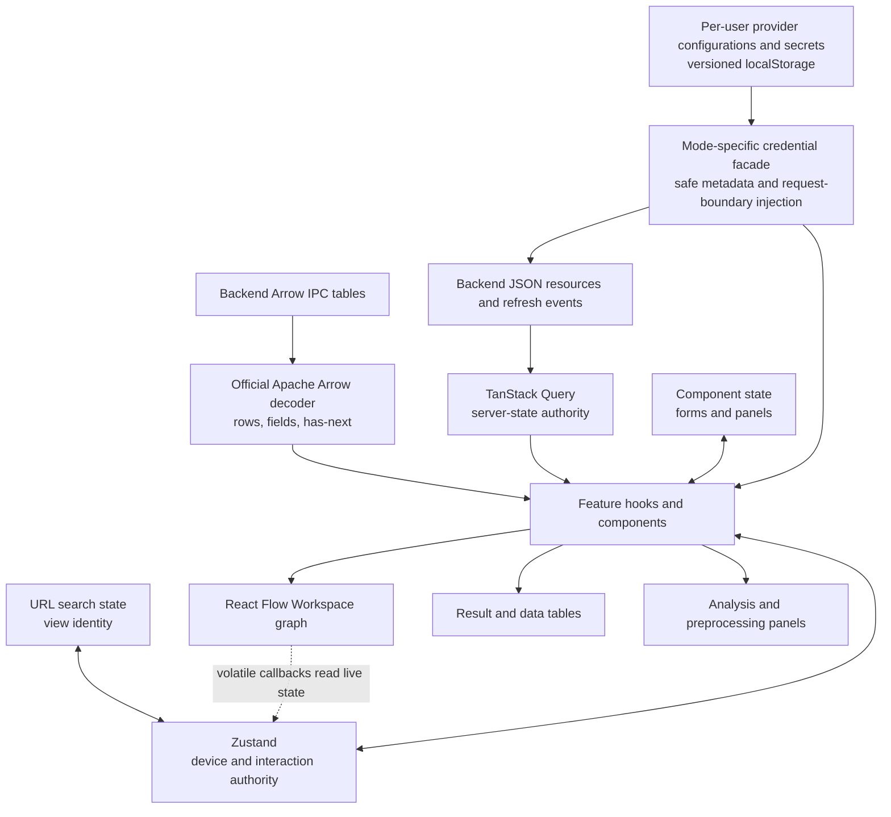

# Frontend State And Data Flow

## Server And Client State

TanStack Query owns server-derived resources, request identity, and cache
invalidation. This includes Workspace runtime state, Tabs, Analyses, Results,
imports, SQL pages, and schemas. Zustand owns only cross-feature client
interaction or device state such as the active view, selected and pinned Data
Blocks, and scoped presentation preferences. Local component state owns form,
pagination, dialog, and panel interaction.

Query keys mirror server-resource ownership. Workspace summaries use the
explicit `["workspaces", "list"]` collection key, while each Workspace detail
subtree starts with `["workspaces", workspace_id]`; refreshing the collection
therefore cannot refetch SQL pages, Results, or other detail resources. File
lists and path-addressed file projections follow the same split. Global model
and sample catalogues live outside Workspace keys. The shared key factory owns
these hierarchies, and the TanStack Query ESLint rules enforce complete query
function dependencies.

Feature code consumes generated SDK functions and generated types through
`@/api`. The narrow table adapter decodes generated-client binary responses
with `apache-arrow`; complete Result table URLs use the same decoder directly.
It classifies columns through official Arrow types, including view and
large-offset representations emitted natively by Polars. Decoder failures stay
ordinary errors on the affected table query and retain the underlying Arrow
cause.
Known semantic extension names select specialized behavior such as the Topic
Distribution renderer. An unrecognized extension remains addressable as
`extension:<exact-name>` and retains its Arrow field metadata instead of being
collapsed into the generic `unknown` category.
Raw network calls are limited to boundaries the generator cannot express
conveniently, such as complete table URLs, native downloads, or SSE, and still
follow the backend's cookie, CSRF, Origin, and typed resource contracts. There
is no JSON table decoder, backend compatibility rewrite, or alternate decoder.

Annotation Provider Configurations are an intentional separate boundary. In
multi-user mode, a non-devtools Zustand store persists the ordered, user-named
configuration collection and its secrets by authenticated user ID under
`wordflow-provider-credentials` version 2. Components receive only safe
configuration metadata. A request facade reads the selected configuration's
secret synchronously by UUID inside the final generated SDK call. Model-list
queries are keyed by configuration UUID, immutable safe locator metadata, and a
safe credential revision; secret values never enter query keys, mutation state,
Tab state, hydrated requests, errors, or telemetry. Logout does not delete
another account's browser partition, and browser storage events synchronize
replacement and deletion across tabs. In single-user mode, the same facade
projects the backend-owned collection and invokes its write-only CRUD
operations without creating a browser credential entry.

Annotation Tab presentation state retains the selected configuration UUID,
provider type, a per-configuration model map, and the selected AI Preview
correction column per source Data Block. Fresh Tabs choose the first configured
provider entry. If the selected entry disappears, the first remaining entry of
the same provider type is chosen; otherwise the selection is cleared. Preview
inference is a page query against a Preview-scoped Analysis and its pages use
zero-lifetime Query entries. Labels are not written into the source.
Choosing a correction is instead an explicit Workspace `set_cell`
action against the selected correction column. The parameter panel owns column
selection and creation, and captures the exact selection in every Preview or
Run All request. **Clear Results** clears both the Analysis forest and this Tab
draft so a new task does not inherit the prior correction column. Example Data
Block, prompt, and inference settings share one collapsed **Advanced** section;
the correction column can seed the source Data Block and its correction column
as the example pair. Hydrating a historical Analysis first restores its exact
safe request snapshot, so any provider fallback is visible to re-run change
detection rather than rewriting the historical request.

Annotation comparison selections are presentation state keyed by source Data
Block and are shared by Manual, Preview, and Review in the same Tab. Preview
compares only its current page. Manual and Review use a dedicated full-table
grouped-count Query resource keyed by Workspace, Data Block dependencies,
source SQL, reference column, and target column. A successful Manual label edit
applies its old and new count pairs to that resource after persistence; it does
not invalidate and rescan the aggregate. A missing baseline is fetched once,
and ordinary refetch-on-mount or focus reconciles edits made elsewhere.

Frontend-owned Data Block reads use Workspace SQL through a narrow handwritten
adapter around the generated mixed-response operation. The adapter asserts
Arrow content for query mode and JSON for creation mode. SQL builders own
identifier quoting, literal escaping, glob translation, and explicit null
ordering. Query keys contain every declared Data Block ID so edit, history, and
delete invalidation clears dependent SQL pages, column-derived values, language
detection, and preprocessing previews. Preprocessing preview keys retain the
structured request, operation, ordered Data Block dependencies, and pagination;
manual refresh refetches that same cache resource instead of minting an alias.

The Workspace graph response is the sole cached owner of complete Data Block
metadata. Selector hooks project document, tokenizer, shape, history, and color
fields directly from that response and fetch only Arrow schemas separately.
They do not issue a second per-selection node-info request.

Path-addressed file resources share one subtree containing raw content,
worksheet inventories, and preview pages. Replacing, deleting, or moving a path
removes that subtree before the file list refreshes, so a reused filename cannot
surface a previous file's cached preview.

## Workspace Composition

`WorkspaceProvider` presents focused data, selection, status, and action
slices. Workspace identity is always explicit in server query keys and
requests. Client selection is not permission to call an implicit backend
Workspace.

The current Workspace is derived only from the complete Workspace collection:
zero `open` resources means there is no current Workspace, exactly one is the
current Workspace, and more than one is a visible invariant error. The client
does not restore a last Workspace from browser storage or automatically open a
closed resource. Open, close, and runtime-state events immediately reconcile
the collection before dependent queries run.

Dagre derives canonical graph positions from Workspace identity, ordered Data
Block IDs, and lineage endpoints. React Flow owns only temporary drag positions
and its internal node cache while that topology is unchanged; a Workspace or
topology change replaces every position with the new Dagre layout. Positions
are not persisted. Graph callbacks that depend on volatile UI state must read
that state when invoked unless the value is part of the graph's
resynchronization signature; otherwise a view switch can leave a cached
callback stale.

## Analysis Lifecycle

One Query owner reads each active Tab's complete Analysis forest. It polls while
any member is active and derives newest Preview, newest Run All, active
Analyses, parent/descendant relationships, and historical hydration candidates.
Features do not keep a second Analysis identifier or lifecycle cache.

Every submission uses the generic Tab Analysis collection operation with an
execution scope, complete immutable request, optional parent, and explicit
supersession targets. Preview and Run All are independent: either can be the
first Analysis in a Tab. Supporting Analyses use the same resource and may
appear at any depth. Annotation uses that collection operation as a linear
single-root workflow: it sends neither parent nor supersession identities, and
the backend immediately replaces the Tab's prior Preview or Run All.

The separate Result query is enabled only for a successful Analysis and
contains output only. Current inputs and controls hydrate first from the newest
Preview request, or from a standalone Run All request's embedded source when no
Preview exists. Historical values win over mutable Data Block preferences.
Resource events invalidate the forest and exact Result keys.

Preview, Run All, Stop, and Clear use shared lifecycle controls where those
operations exist. Full-only functions render no Preview control. Preview
replacement submits with explicit supersession and does not clear first.
Active Run All locks the submitted parameter panel; a successful Run All does
not. Annotation replacement is the exception: each Preview or Run All becomes
the Tab's sole Analysis immediately. An Active Analysis Draft is client-only
and is never written into Query data.

Concordance and Quotation Review query immutable Analysis table pages. Run All
therefore creates no graph node and Review does not depend on Workspace SQL.
`CONC_dispersion` is derived by the existing frontend presentation from grouped
physical occurrence rows. Review feeds those pages back through the normal
Concordance model, preserving Table View, Dispersion View, metadata selection,
sorting, paging, row detail, and separated/combined presentation.

Two-source Concordance Run All appears as one thin Run All root with one
Supporting Analysis per source. The forest projection keeps that relationship
generic; Concordance interprets the group for progress and ordered Review.
**Add to Workspace** opens the shared Result Publication dialog and submits one
typed Supporting Analysis under the successful Run All parent. Only successful
publication invalidates the Workspace graph.

The active Tab is device-local presentation state, stored in localStorage by
Workspace and analysis kind. Returning to an analysis view or reloading the
client restores the last Tab when that backend Tab still exists. Missing or
deleted Tab IDs fall back to the first available Tab and repair the local entry;
the backend remains authoritative for Tab identity, content, and ownership.

All analysis features share one complete Workspace Tab query and filter it by
kind locally. This prevents independently cached feature lists from disagreeing
after create, rename, clear, or delete. The Task Inbox reads every Analysis page
for the active Workspace plus the user's file-import lifecycle and projects
those Query resources directly; it has no Zustand task collection or
feature-specific pruning. SSE patches exact resource caches when possible and
invalidates collection, Tab, and graph queries for authoritative hydration.
Analysis rows are read-only in the Task Inbox because their owning Tabs control
lifecycle. Queued or running User File Imports expose cancellation there;
terminal imports expose deletion of the retained history record. Successful and
failed imports do not expire automatically.

Presentation-only settings use browser-local storage partitioned by user,
Workspace, and analysis kind or Tab as appropriate. They include the active
Tab, quotation context length, token-frequency display preferences, and
sequential chart state. These values can be lost without changing the durable
Analysis or Result and are not exported with a Workspace.

Hydration and deletion prune device-only references to missing Workspaces,
Tabs, Data Blocks, file paths, presets, and preprocessing inputs. Pruning never
creates or selects a backend resource.

Action availability follows the applicable Analysis scope, not Result
truthiness. Direct Run All remains available before Preview. Successful
replacement names the terminal predecessor it supersedes; failed or cancelled
replacement preserves the old Analysis. Clear removes the complete Tab forest,
while Stop targets the active Analysis and its descendants.

Preprocessing preview identity includes its operation, structured request,
ordered Data Block dependencies, and pagination. Switching an input cancels the
previous request and late responses cannot replace the new state.

Result pages remain immutable Query data. Concordance and Quotation pagination
changes the complete Result-projection query key rather than merging pages into
component or Zustand state. Initial hydration reads the Analysis's stored
canonical Result; only an explicit page, page-size, or sort change requests an
alternate projection. While a Preview page is processing, its table keeps the
current headers and pagination mounted and replaces stale rows with an inline
processing state. Quotation may use same-Analysis placeholder data only to
retain that presentation shape; the requested page remains a distinct Query
resource and the placeholder is not cached as its Result. Categorical values use infinite queries, and
preprocessing previews use debounced, cancellable queries.

Filter, Find, Create, and Expression keep their create/update choice in
local component state. Create is the default, and changing the tool or selected
Data Block resets the choice; it is not an account or device preference.
Sample, Join, and Stack expose no update mode. Successful edits and history
commands invalidate the graph, dependent row and preview data, and schema
queries together.
Data View and graph menus derive Undo/Redo disabled state only from the
backend's `can_undo` and `can_redo` flags.

## Data Block Preferences

Fetched Data Block metadata projects independent optional Document Column and
Tokenizer Preferences. A fresh selector uses the applicable value only as its
initial choice. Token Frequency and Concordance expose and immediately persist
both controls; Quotation and Topic Modeling expose and persist only the
document column. No function writes a preference for a control it does not
show.

Each control uses its own partial Data Block `PATCH`. A successful mutation
merges only that field into the canonical Workspace graph cache before
invalidating the resource, so overlapping document and tokenizer writes cannot
replay stale values over one another. A local explicit clear and a draft whose
persistence failed remain authoritative for the current selector rather than
falling back to refreshed Data Block metadata.

Analysis hydration has a stronger authority. Stored document-column and
tokenizer-model mappings, plus Concordance search mode, come from the immutable
Analysis request and replace selector defaults, including explicit absence.
They also participate in re-run change detection. Token Frequency passes its
exact submitted tokenizer mapping into a Concordance handoff instead of
consulting current Data Block preferences. On a fresh Concordance selection,
Tokens mode is selected automatically when every selected Data Block has a
model unless the user explicitly chose Text mode.

## Documentation Registry

The bundled registry keeps help available offline; a valid remote registry may
shadow bundled entries. `frontend/scripts/check-docs-drift.mjs` validates
registered documents, anchors, relative links, and literal consumer keys.
