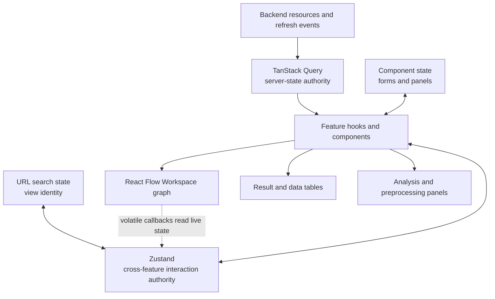

# Frontend State And Data Flow

## Server And Client State

TanStack Query owns server-derived resources, request identity, and cache
invalidation. Zustand owns cross-feature client interaction state such as the
active view, selected Workspace/Data Blocks, preferences, and transient
background-work presentation. Local component state owns form and panel
interaction.

Feature code consumes generated SDK functions and generated types through
`@/api`. Raw network calls are limited to boundaries the generator cannot
express conveniently, such as native downloads or SSE, and still follow the
backend's cookie, CSRF, Origin, and typed resource contracts.

## Workspace Composition

`WorkspaceProvider` presents focused data, selection, status, and action
slices. Workspace identity is always explicit in server query keys and
requests. Client selection is not permission to call an implicit backend
Workspace.

React Flow owns drag position and its internal node cache. Graph callbacks that
depend on volatile UI state must read that state when invoked unless the value
is part of the graph's resynchronization signature; otherwise a view switch can
leave a cached callback stale.

## Analysis Lifecycle

Analysis features own their selected Data Blocks, current Tab and Analysis
identity, request hydration, and Result projection. Resource refresh events
invalidate the query cache; the owning feature retains workflow controls
because it knows the root/child Analysis relationship.

Preprocessing preview identity includes every serialized input. Switching an
input cancels the previous request and late responses cannot replace the new
state.

## Documentation Registry

The bundled registry keeps help available offline; a valid remote registry may
shadow bundled entries. `frontend/scripts/check-docs-drift.mjs` validates
registered documents, anchors, relative links, and literal consumer keys.
