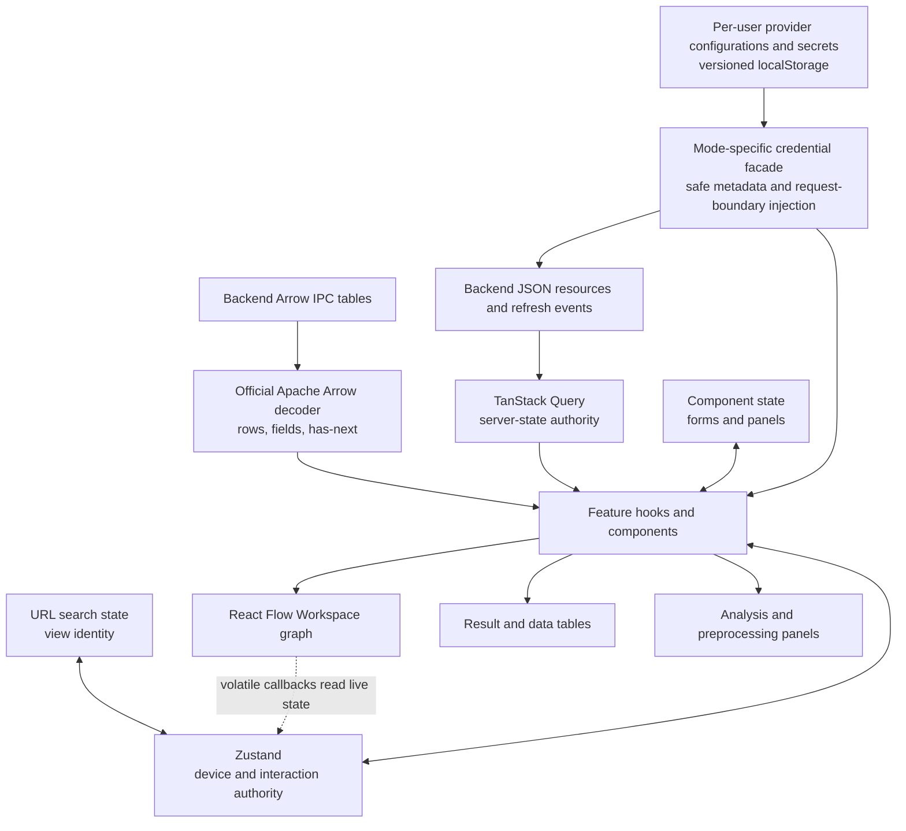

# Frontend State And Data Flow

## Server And Client State

TanStack Query owns server-derived resources, request identity, and cache
invalidation. This includes Workspace runtime state, Tabs, Analyses, Results,
imports, SQL pages, and schemas. Zustand owns only cross-feature client
interaction or device state such as the active view, selected and pinned Data
Blocks, and scoped presentation preferences. Local component state owns form,
pagination, dialog, and panel interaction.

Query keys mirror server-resource ownership. Workspace summaries use the
explicit `["workspaces", "list"]` collection key, while each Workspace detail
subtree starts with `["workspaces", workspace_id]`; refreshing the collection
therefore cannot refetch SQL pages, Results, or other detail resources. File
lists and path-addressed file projections follow the same split. Global model
and sample catalogues live outside Workspace keys. The shared key factory owns
these hierarchies, and the TanStack Query ESLint rules enforce complete query
function dependencies.

Feature code consumes generated SDK functions and generated types through
`@/api`. The narrow table adapter decodes generated-client binary responses
with `apache-arrow`; complete Result table URLs use the same decoder directly.
It carries decoded Arrow `Field` objects to consumers, including view and
large-offset representations emitted natively by Polars, without creating a
frontend column-kind registry. Type labels use the exact
`ARROW:extension:name` value when present and Arrow's native type spelling
otherwise. Feature selectors and preprocessing controls inspect those fields
directly. Decoder failures stay ordinary errors on the affected table query and
retain the underlying Arrow cause. Known semantic extension identities select
specialized behavior such as the Topic Distribution renderer. An unrecognized
extension remains addressable by its exact name and retains its Arrow field
metadata instead of being collapsed into a generic category.
Raw network calls are limited to boundaries the generator cannot express
conveniently, such as complete table URLs, native downloads, or SSE, and still
follow the backend's cookie, CSRF, Origin, and typed resource contracts. There
is no JSON table decoder, backend compatibility rewrite, or alternate decoder.

Annotation Provider Configurations are an intentional separate boundary. In
multi-user mode, a non-devtools Zustand store persists the ordered, user-named
configuration collection and its secrets by authenticated user ID under
`wordflow-provider-credentials` version 2. Components receive only safe
configuration metadata. A request facade reads the selected configuration's
secret synchronously by UUID inside the final generated SDK call. Model-list
queries are keyed by configuration UUID, immutable safe locator metadata, and a
safe credential revision; secret values never enter query keys, mutation state,
Tab state, hydrated requests, errors, or telemetry. Name-only edits preserve
cached inference, while credential replacement or removal invalidates model and
active Preview queries. Logout does not delete
another account's browser partition, and browser storage events synchronize
replacement and deletion across tabs. In single-user mode, the same facade
projects the backend-owned collection and invokes its write-only CRUD
operations without creating a browser credential entry.

Annotation Tab presentation state retains the selected configuration UUID,
provider type, a per-configuration model map, and the selected AI Preview
correction column per source Data Block. Fresh Tabs choose the first usable
provider entry. Keyless built-ins remain visible but disabled. If the selected
entry becomes keyless it remains selected with Settings guidance; if it is
deleted, the selected UUID, type, and current model are cleared without choosing
another account. Other configurations' remembered models remain. Preview
inference is a page query against a Preview-scoped Analysis and its pages use
zero-lifetime Query entries. Labels are not written into the source.
Choosing a correction is instead an explicit Workspace `set_cell`
action against the selected correction column. A shared table-toolbar control
owns live selection and creation in Manual, Preview, and Review. That selection
is persisted immediately in the Tab and captured as an immutable provenance
snapshot in every Preview or Run All request. Hydrating a historical request
does not overwrite newer Tab state. **Clear Results** clears both the Analysis
forest and this Tab selection without deleting the column or its values. The Example
Data Block selector stays in the main parameter panel. Directly below it, the
Tab retains maximum examples per class, sampling method, and random seed
settings. The controls remain disabled until both example columns are selected
and while Analysis parameters are locked; their intrinsic grid wraps with the
card width. Retained Analysis requests restore all three values. The collapsed
**Advanced** row summarizes Provider and Model; its expanded content keeps those
controls side by side with prompt and inference settings below. The Run All
processing mode, batch size, and per-batch retry limit are captured in the
immutable Analysis request. Reprocessing every row is the default; users
can instead fill only blank annotations. Batch size defaults to 20 rows and is
bounded to 100 rows, while two retries provide at most three attempts per batch;
Preview and Review toolbars can seed the source Data Block and selected
correction column as the example pair. Provider fallback remains visible to
execution-request change detection rather than rewriting a historical request.

Annotation comparison columns, reliability metric, and metadata selections are
presentation state keyed by source Data Block and are shared by Manual, Preview,
and Review in the same Tab. Compare To and Show metadata selections are
mutually exclusive; selector items already owned by the opposite role are
disabled, Select all skips them, legacy overlap resolves to Compare To, and the
active correction column is removed from both roles. Comparison choices are
restricted to string and categorical schema columns. Cohen's Kappa is the
default metric; Percent Agreement and nominal Krippendorff's Alpha use the same
grouped counts. Reveal state is mount-local, so each selected comparison starts
masked after remount. Only revealed comparisons participate in reliability
queries, difference tinting, or filters.

Manual and Review retain at most one mount-local named-column difference
filter. Its funnel stays visible but disabled while the comparison is hidden;
hiding or deselecting the column clears it. Each filtered page and its exact row
count are separate Workspace SQL Query resources keyed by the generated
single-column predicate and pagination. Workspace SQL applies that predicate
before server pagination. Manual pages carry a transient absolute source-row
number created before filtering so an edit still targets the original Data
Block row; that transport column is never shown or persisted. Changing the
filter resets pagination to page one. After a successful edit, the page and
filtered count refresh immediately and pagination clamps if the final page
becomes empty.
When selected, the correction column is always present and editable. Manual
edits annotation and correction cells; Preview and Review edit only correction
cells and keep their prediction or submitted annotation read-only. Each write
uses the transient absolute source-row number, disables only the affected cell,
and rolls back its local value on failure. Preview compares only its current
page. Revealed Manual and Review comparisons use a dedicated full-table
grouped-count Query resource keyed by Workspace, Data Block dependencies,
source SQL, reference column, and target column. A revealed column projects
that resource as the selected reliability value beside the table header and a
plain count matrix on hover or focus; no separate comparison card owns state. A
successful Manual label edit applies its old and new count pairs to that
resource after persistence; it does not invalidate and rescan the aggregate. A
missing baseline is fetched once, and ordinary refetch-on-mount or focus
reconciles edits made elsewhere.
Difference filtering never changes those aggregate resources, so reliability
continues to describe the complete Data Block. Manual and Review header filter
toggles control only the displayed rows and pagination. Preview, Manual, and
Review all use the selected Data Block's previewed color as a light difference
tint: the annotation or prediction cell is tinted when any revealed comparison
differs, and a revealed comparison cell is tinted only when that value differs.
Hidden cells render the uniform `•••` mask without exposing the underlying
value, emptiness, score, matrix, or tint. Null pairs follow ordinary SQL
inequality semantics and are neither filtered nor highlighted. The shared
color control commits `Node.color` before
Preview, Run All, or Manual Start; a failed commit aborts that action.

Frontend-owned Data Block reads use Workspace SQL through a narrow handwritten
adapter around the generated mixed-response operation. The adapter asserts
Arrow content for query mode and JSON for creation mode. SQL builders own
identifier quoting, literal escaping, glob translation, and explicit null
ordering. Query keys contain every declared Data Block ID so edit, history, and
delete invalidation clears dependent SQL pages, column-derived values, language
detection, and preprocessing previews. Preprocessing preview keys retain the
structured request, operation, ordered Data Block dependencies, and pagination;
manual refresh refetches that same cache resource instead of minting an alias.

The Workspace graph response is the sole cached owner of complete Data Block
metadata. Selector hooks project document, tokenizer, shape, history, and color
fields directly from that response and fetch only Arrow schemas separately.
They do not issue a second per-selection node-info request.

Path-addressed file resources share one subtree containing raw content,
worksheet inventories, and preview pages. Replacing, deleting, or moving a path
removes that subtree before the file list refreshes, so a reused filename cannot
surface a previous file's cached preview.

## Workspace Composition

`WorkspaceProvider` presents focused data, selection, status, and action
slices. Workspace identity is always explicit in server query keys and
requests. Client selection is not permission to call an implicit backend
Workspace.

The current Workspace is derived only from the complete Workspace collection:
zero `open` resources means there is no current Workspace, exactly one is the
current Workspace, and more than one is a visible invariant error. The client
does not restore a last Workspace from browser storage or automatically open a
closed resource. Open, close, and runtime-state events immediately reconcile
the collection before dependent queries run.

Dagre derives canonical graph positions from Workspace identity, ordered Data
Block IDs, and lineage endpoints. React Flow owns only temporary drag positions
and its internal node cache while that topology is unchanged; a Workspace or
topology change replaces every position with the new Dagre layout. Positions
are not persisted. Graph callbacks that depend on volatile UI state must read
that state when invoked unless the value is part of the graph's
resynchronization signature; otherwise a view switch can leave a cached
callback stale.

## Analysis Lifecycle

One Query owner reads each active Tab's complete Analysis forest. It polls while
any member is active and derives newest Preview, newest Run All, active
Analyses, parent/descendant relationships, and historical hydration candidates.
Features do not keep a second durable Analysis identifier or lifecycle cache.
The shared submission controller retains only the accepted Analysis ID and
action while Query adopts the returned resource into that forest, then stops
consulting the handoff.

Every submission uses the generic Tab Analysis collection operation with an
execution scope, complete immutable request, optional parent, and explicit
supersession targets. Preview and Run All are independent: either can be the
first Analysis in a Tab. Supporting Analyses use the same resource and may
appear at any depth. Annotation uses that collection operation as a linear
single-root workflow: it sends neither parent nor supersession identities, and
the backend immediately replaces the Tab's prior Preview or Run All.

The separate Result query is enabled only for a successful Analysis and
contains output only. Current inputs and controls hydrate first from the newest
Preview request, or from a standalone Run All request's embedded source when no
Preview exists. Historical values win over mutable Data Block preferences.
Resource events invalidate the forest and exact Result keys.

Preview, Run All, Stop, and Clear use shared lifecycle controls where those
operations exist. Full-only functions render no Preview control. Preview
replacement submits with explicit supersession and does not clear first.
Every disabled lifecycle action exposes its current disabled reason through the
shared action tooltip on pointer hover or keyboard focus; features supply
domain-specific reasons while the shared renderer owns the interaction.
The labels are always **Preview**, **Run**, and **Run All**. The parameter panel
locks from the local submission boundary until the active Preview or Run All
finishes, then unlocks while the successful Result remains visible. A local
action flag covers only request submission; once the backend accepts an
Analysis, its Query resource owns the handoff until the Tab forest adopts it.
Each action compares its complete current execution request with its own latest successful
request; an exact change enables that action and an exact revert disables it.
Presentation-only controls do not participate. A failed or cancelled root
unlocks parameters but disables every execution action in the Tab until
**Clear Results** removes the forest. Submission errors before an Analysis is
persisted simply release the local lock. Stop appears only after an active
Analysis exists, and Clear is disabled during active work. Annotation
replacement is the exception to forest retention: each Preview or Run All
becomes the Tab's sole Analysis immediately. An Active Analysis Draft is
client-only and is never written into Query data.

Displayed Results resolve source identity, columns, ordering, search semantics,
counts, seeds, and truncation metadata from immutable Result artifacts or the
submitted request, with current Workspace metadata only as a fallback. Editing
the next draft therefore cannot rebind an existing Result. Manual Annotation
uses the same principle locally: **Start** captures the source, annotation
column, Codebook mapping, and related table inputs. The setup remains editable
while that table is open, **Close** remains available even if the next draft is
incomplete, and the next Start captures a replacement snapshot.

Concordance and Quotation Review query explicit document or match projections
of immutable Analysis tables. Run All therefore creates no graph node and
Review does not depend on Workspace SQL. Concordance Table View always pages by
matches, Concordance Dispersion View always pages by qualifying source rows,
and Quotation Review retains its existing projection controls.
`CONC_dispersion` remains frontend presentation state rather than a stored
column.

Concordance Review fetches whole-Result density only while Dispersion View is
active. Its TanStack Query key is Workspace, child Analysis, and table identity,
excluding page and sort. The frontend reaggregates the backend's exact-term
100-bin series into the selected display resolution. Exact, case-sensitive
term exclusions are shared across every source and Combined View, while selected
bins remain view-block-specific. A shared, session-only Uncased flag optionally
case-folds exact labels and aggregates their density series, counts, and colours;
changing that mode clears term exclusions so a partially hidden case group
cannot survive the semantic switch. Grouped legend actions expand back to every
exact spelling before projection or Data Block Creation. Both exclusions and
selected bins are included in each document-projection query key, reset that
source to page one, and filter before sorting, counting, and paging. Separated
mode keeps those filters per source. Combined mode owns one frontend-only filter
and sends it independently to each source.

Two-source Concordance Run All appears as one thin Run All root with one
Supporting Analysis per source. The forest projection keeps that relationship
generic; Concordance interprets the group for progress and ordered Review.
**Add to Workspace** opens the shared Derived Data Block Creation dialog and submits one
typed Supporting Analysis under the successful Run All parent. Table View
submits Concordance Match Data Block Creation; Dispersion View submits
Concordance Document Data Block Creation with its active term and bin filter.
Concordance lets the user include or exclude each source before submitting the
atomic creation. Only successful creation invalidates the Workspace graph.

The active Tab is device-local presentation state, stored in localStorage by
Workspace and analysis kind. Returning to an analysis view or reloading the
client restores the last Tab when that backend Tab still exists. Missing or
deleted Tab IDs fall back to the first available Tab and repair the local entry;
the backend remains authoritative for Tab identity, content, and ownership.

All analysis features share one complete Workspace Tab query and filter it by
kind locally. This prevents independently cached feature lists from disagreeing
after create, rename, clear, or delete. The Task Inbox reads every Analysis page
for the active Workspace plus the user's file-import lifecycle and projects
those Query resources directly; it has no Zustand task collection or
feature-specific pruning. SSE patches exact resource caches when possible and
invalidates collection, Tab, and graph queries for authoritative hydration.
Analysis rows are read-only in the Task Inbox because their owning Tabs control
lifecycle. Queued or running User File Imports expose cancellation there;
terminal imports expose deletion of the retained history record. Successful and
failed imports do not expire automatically.

Presentation-only settings use browser-local storage partitioned by user,
Workspace, and analysis kind or Tab as appropriate. They include the active
Tab, quotation context length, token-frequency token limits, and
sequential chart state. These values can be lost without changing the durable
Analysis or Result and are not exported with a Workspace.

Stopword lists for Token Frequency and Topic Modelling, the Topic Modelling
Words-per-topic cap, and its last successfully applied non-default Topic
projection `(Analysis, cluster count, Top N)` are backend-owned Tab presentation settings. Features patch
them optimistically in the shared Tab Query cache, roll back on failure, and do
not refetch the immutable Result. Stopword enablement and detected language are
Result-scoped transient state and reset when a Result hydrates. In Topic
Modelling, the saved list remains visible and editable while filtering is off;
opening its language action menu starts first-input language detection without
persisting the detected or selected language. The cluster slider owns one local
pointer transaction: movement updates its controlled draft, a normal release
commits the latest draft once, and pointer cancellation, lost capture, or window
blur restores the applied count without querying. Keyboard changes commit
immediately. The Top-topics-per-row number input commits on Enter or blur;
partial input and the already-applied value do not query. Each distinct K/N
commit creates one no-store Result request with a client-only attempt key; the
attempt key is part of TanStack identity but not the backend payload. Lowering
K below N sends one pair with N clamped to K. The prior graph and Topic list
remain mounted but inert until a matching non-placeholder response is
installed. A K change also waits for measured and fitted React Flow nodes;
an N-only response keeps selection, search, lasso, viewport, tooltip identity,
and an open publication dialog. Cancelled and late responses cannot replace
the current attempt, a failure restores the applied controls, and a successful
attempt issues one Tab presentation PATCH.

The Topic graph is a non-editable React Flow projection over normalized backend
coordinates. React Flow owns its container measurement and viewport; fitted
views include complete node bounds and refit on container resize, while a user
pan or zoom switches to a deliberately manual viewport until Fit View or the
next Result projection. A freehand canvas overlay owns sticky additive lasso
gestures and projects Topic centres through the current viewport. Its transient
ID union filters the All Topics list together with search, remains independent
from manually selected Topics, and resets when the K-based layout identity
changes rather than when only Top N changes.
Image export serializes the shared bubble model through the current viewport
rather than screenshotting React Flow's HTML controls.

Hydration and deletion prune device-only references to missing Workspaces,
Tabs, Data Blocks, file paths, presets, and preprocessing inputs. Pruning never
creates or selects a backend resource.

Action availability follows the applicable Analysis scope, not Result
truthiness. Direct Run All remains available before Preview. Successful
replacement names the terminal predecessor it supersedes; failed or cancelled
replacement preserves the old Analysis. Clear removes the complete Tab forest,
while Stop targets the active Analysis and its descendants.

Preprocessing preview identity includes its operation, structured request,
ordered Data Block dependencies, and pagination. Switching an input cancels the
previous request and late responses cannot replace the new state.

Result pages remain immutable Query data. Concordance and Quotation pagination
keys include the explicit row unit and complete Result-projection request rather than merging pages into
component or Zustand state. Initial hydration reads the Analysis's stored
canonical Result; only an explicit page, page-size, or sort change requests an
alternate projection. While a Preview page is processing, its table keeps the
current headers and pagination mounted and replaces stale rows with an inline
processing state. Quotation may use same-Analysis placeholder data only to
retain that presentation shape; the requested page remains a distinct Query
resource and the placeholder is not cached as its Result. Categorical values use infinite queries, and
preprocessing previews use debounced, cancellable queries.

Quotation Preview and Run All use separate transport adapters but converge on
one Arrow-native page projector. The projector reads the decoded `Table`,
`Vector`, and struct values rather than JSON-friendly display rows, maps nested
quotation fields to canonical `QUOTE_*` fields, and produces the presentation
state directly. Native `bigint` offsets become numbers only during bounded span
normalization; ordinary table cells retain the generic display conversion.
Preview document controls and Run All Review controls keep independent page
requests and defaults.

Filter, Find, Create, and Expression keep their create/update choice in
local component state. Create is the default, and changing the tool or selected
Data Block resets the choice; it is not an account or device preference.
Sample, Join, and Stack expose no update mode. Successful edits and history
commands invalidate the graph, dependent row and preview data, and schema
queries together.
Data View uses the selected Data Block's graph-owned shape as its exact row
count, so its compact pagination can expose the last page and a validated page
jump without another query. If that shape is unavailable, Data View keeps the
Arrow page's one-row lookahead and renders compact ellipses as inert markers;
it does not count or materialize the complete table just to enable a jump. Data
View and graph menus derive Undo/Redo disabled state only from the backend's
`can_undo` and `can_redo` flags.

## Data Block Preferences

Fetched Data Block metadata projects independent optional Document Column and
Tokenizer Preferences. A fresh selector uses the applicable value only as its
initial choice. Token Frequency and Concordance expose and immediately persist
both controls; Quotation and Topic Modelling expose and persist only the
document column. No function writes a preference for a control it does not
show.

Each control uses its own partial Data Block `PATCH`. A successful mutation
merges only that field into the canonical Workspace graph cache before
invalidating the resource, so overlapping document and tokenizer writes cannot
replay stale values over one another. A local explicit clear and a draft whose
persistence failed remain authoritative for the current selector rather than
falling back to refreshed Data Block metadata.

Analysis hydration has a stronger authority. Stored document-column and
tokenizer-model mappings, plus Concordance search mode, come from the immutable
Analysis request and replace selector defaults, including explicit absence.
They also participate in execution-request change detection. Token Frequency passes its
exact submitted tokenizer mapping into a Concordance handoff instead of
consulting current Data Block preferences. Fresh Concordance selections remain
in Text mode even when every selected Data Block has a model. Selecting Tokens
mode explicitly enables the tokenizer selectors; execution then requires a
model for every selected source. Reopening an existing Analysis restores the
search mode captured in its request.

## Documentation Registry

The bundled registry keeps help available offline; a valid remote registry may
shadow bundled entries. `frontend/scripts/check-docs-drift.mjs` validates
registered documents, anchors, relative links, and literal consumer keys.
