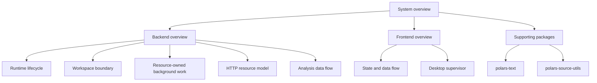

# Architecture

Architecture documentation narrows from system topology to one ownership or
flow question per focused page.

- [System overview](system-overview.md) describes the monorepo and end-to-end
  runtime.
- [Backend overview](backend/overview.md) routes into FastAPI lifecycle,
  Workspace, resource-owned background work, and HTTP boundaries.
- [Backend background work](backend/background-work.md) separates Analysis and
  User File Import lifecycle, scheduling, recovery, and shutdown ownership.
- [Analysis data flow](backend/analysis-data-flow.md) explains the shared
  Analysis pipeline and its Result and child-resource ownership.
- [Frontend overview](frontend/overview.md) covers the React application,
  state ownership, and desktop shell.
- [polars-text](packages/polars-text.md) and
  [polars-source-utils](packages/polars-source-utils.md) describe the compiled
  supporting packages.

Architecture pages state current ownership and dependency direction. Product
meaning belongs in `docs/domain/`; operational commands belong in
`docs/runbooks/`; exact interfaces belong in `docs/reference/`.
