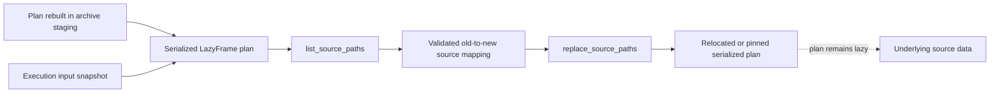

# polars-source-utils Architecture

`polars-source-utils` is a narrow Rust/PyO3 package for listing and replacing
source paths inside serialized Polars `LazyFrame` plans.

It exists because plans rebuilt from materialized Workspace archives and
immutable execution-input snapshots must rewrite scan roots without collecting
a plan or rewriting source data. Portable archives contain Parquet rather than
serialized plans; the package acts only after import has rebuilt a private lazy
plan. It owns the broad `polars-plan` deserialization feature surface
required for that binary operation; `polars-text` remains focused on text
expressions.

The public interface is intentionally small:

- `list_source_paths(plan_path)` returns the plan's referenced source paths.
- `replace_source_paths(plan_path, replacements)` rewrites matching plan paths.

Traversal names every current `DslPlan` variant explicitly, including `Pivot`,
`MergeSorted`, and `Gather`, so an upstream plan addition fails compilation
until its child ownership is reviewed. Rewrites serialize into a same-directory
temporary file, flush and sync it, and atomically replace the original only
after serialization succeeds.

The backend calls these functions only while rebasing archive staging trees or
pinning Analysis inputs into private execution snapshots. Ordinary Workspace
loads do not rewrite serialized plans.
