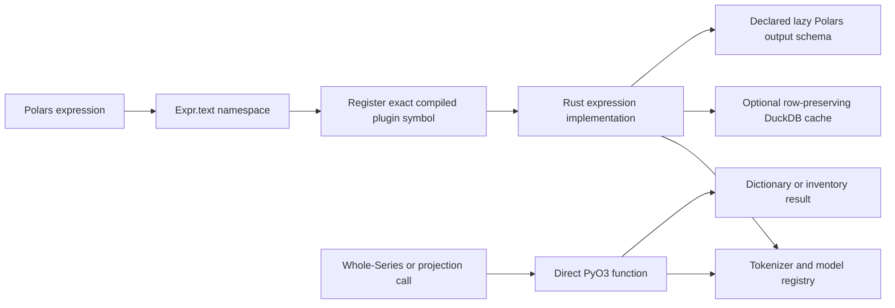

# polars-text Architecture

`polars-text` is the compiled text-processing layer used by Wordflow. Python
provides the typed ergonomic API and registers Polars expressions; Rust/PyO3
implements the heavy work.

## Boundaries

- `polars_text/_expressions.py` validates arguments once and registers plugin
  functions against the exact imported extension path.
- `polars_text/namespace.py` is the only expression façade.
- `src/expressions.rs` implements lazy Polars plugins and output schemas.
- `src/tokenizer.rs` owns tokenizer backend dispatch and its process-local
  registry.
- `src/cache.rs` owns the shared DuckDB-backed, row-preserving cache flow and
  locking; token and embedding schemas remain with their expression modules.
  Each configured file is dedicated disposable package storage: unknown
  schemas are initialized in a same-directory temporary database and replace
  the old cache only after successful initialization.
- `src/concordance.rs` and `src/offsets.rs` own matching and Unicode offset
  conversion.
- `src/topic_modeling/` owns Topic Segment construction, native embedding,
  reduction, clustering, deterministic cosine average-linkage projection,
  document roll-up, and
  c-TF-IDF topic-label computation. Its internal unit is a Topic Segment.

Topic modelling is one non-elementwise scalar expression. It consumes the full
document column and returns one run result with independent `documents[]` and
complete `topics[]` lists plus run metadata and an opaque projection context.
Segmentation is the only mode-specific stage; every source character belongs to
at most one segment, and the shared rollup weights owned Unicode characters
without changing the equal-observation clustering input. Direct PyO3 projectors
cut a cosine average-linkage tree over natural Topic embeddings without
rerunning embedding or HDBSCAN. PaCMAP is used once for segment clustering and,
for three or more projected Topics, only on merged Topic centroids for display
coordinates. Topic Data Block Creation requests complete row coverage. Result-time bubble
queries request only Topic metadata plus aggregated
`(corpus, topic, minimum N, count)` activations, so row coverage is not
serialized across the native boundary for interactive Top-N changes. A no-topic
result has no projection context and therefore no projection Artifact.

Expression APIs preserve lazy execution. Direct PyO3 functions are reserved
for whole-Series token frequencies and topic projections, which are not natural
row expressions. The tokenizer inventory is immutable Python data.

Serialized LazyFrame path inspection and rewriting does not belong here; it is
owned by `polars-source-utils`, keeping tokenizer-focused builds independent of
the broad `polars-plan` feature surface.
