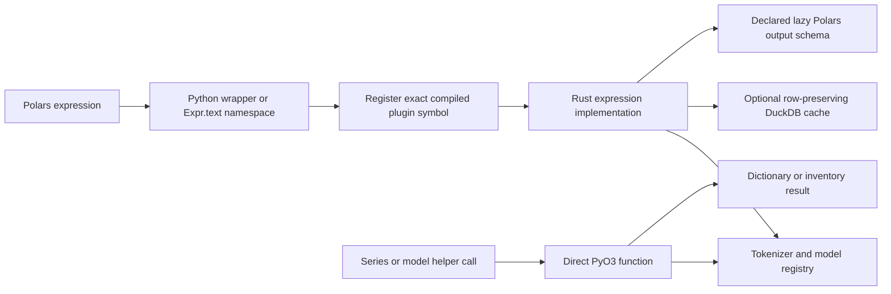

# polars-text Architecture

`polars-text` is the compiled text-processing layer used by Wordflow. Python
provides the typed ergonomic API and registers Polars expressions; Rust/PyO3
implements the heavy work.

## Boundaries

- `polars_text/functions.py` registers plugin functions against the exact
  imported extension path.
- `polars_text/namespace.py` exposes the `.text` expression namespace.
- `src/expressions.rs` implements lazy Polars plugins and output schemas.
- `src/tokenizer.rs` owns tokenizer backend dispatch and its process-local
  registry.
- `src/cache.rs` owns the shared DuckDB-backed, row-preserving cache flow and
  locking; token and embedding schemas remain with their expression modules.
- `src/concordance.rs` and `src/offsets.rs` own matching and Unicode offset
  conversion.
- `src/topic_modeling/` owns native embedding, reduction, clustering, and
  topic-label computation.

Expression APIs preserve lazy execution. Direct PyO3 functions are reserved
for operations that are not natural expressions, such as model inventory,
prefetch, and token-frequency dictionaries.

Serialized LazyFrame path inspection and rewriting does not belong here; it is
owned by `polars-source-utils`, keeping tokenizer-focused builds independent of
the broad `polars-plan` feature surface.
