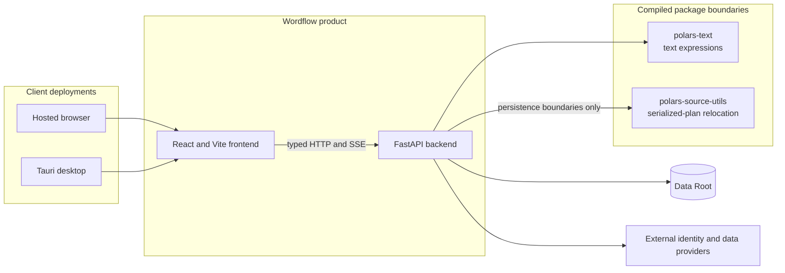

# System Overview

LDaCA Wordflow is a text-analysis application distributed as a hosted web app,
a packaged desktop app, and a Python package that can serve the bundled SPA.

## Projects

- `frontend/` contains the React/Vite application and Tauri desktop shell.
- `backend/` contains the FastAPI service published as `ldaca-wordflow`.
- `polars-text/` contains Rust/PyO3 Polars text-processing extensions.
- `polars-source-utils/` contains Rust/PyO3 serialized-plan path utilities.

The three non-frontend package roots are Git submodules with their own
manifests, tests, and release workflows. The root project coordinates local
source resolution, frontend packaging, desktop builds, and version stamping.

## Runtime Flow

1. The React client selects a Workspace and addresses backend resources by ID.
2. The backend snapshots User Files into Source Data Blocks and persists the
   Workspace graph.
3. Tabs and Analyses persist as portable Workspace-owned resources; remote
   collection downloads persist independently as user-owned User File Imports.
4. Private schedulers select queued work fairly, and fresh worker processes
   receive immutable Analysis inputs and write bounded Artifacts.
5. Analysis completion may publish Derived Data Blocks through the Workspace
   mutation boundary.
6. The unified SSE stream carries revisioned resource refresh and live Progress
   events; clients refetch authoritative REST resources.

In a hosted deployment, FastAPI normally serves the SPA on the same site. In a
desktop deployment, Tauri launches the packaged Python runtime on a private
loopback port, injects the URL into the same SPA, and owns process restart and
Data Root selection.

## Dependency Direction

The backend owns product state and HTTP contracts. The frontend consumes the
exported OpenAPI schema. `polars-text` provides computation primitives, while
`polars-source-utils` is used only at explicit serialized-plan persistence and
relocation boundaries.
