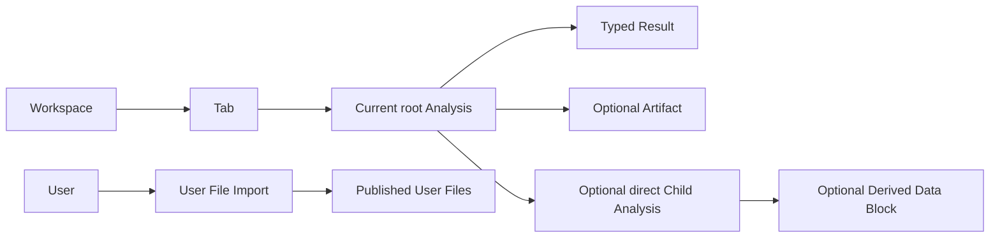

# Analyses And User File Imports

Wordflow has two durable kinds of background work, each owned by the resource
whose behavior it represents. They share lifecycle vocabulary and event
transport, but there is no generic Task resource, repository, API, or state
machine.

## Shared Lifecycle Meaning

Analyses and User File Imports both use `queued`, `running`, `succeeded`,
`failed`, and `cancelled`. Their own strict domain models validate transitions,
timestamps, Failure, Progress, Result presence, and Revision.

A cancellation request is not terminal cancellation. Queued work can cancel
immediately; running work becomes `cancelled` only after its execution has
stopped. If success and confirmed cancellation race, the first terminal state
committed under the owning gate wins. A system interruption fails the resource
with its specific interruption code and does not invent a user-cancellation
timestamp.

Intermediate Progress is a service-owned in-memory overlay and SSE event. It
does not rewrite the durable resource or advance its Revision. Creation and a
terminal transition persist Progress. A restart therefore loses intermediate
Progress and fails any retained non-terminal resource as interrupted; work is
never resumed or partially repaired.

## Analysis

An Analysis is portable Workspace content. A root Analysis is referenced by
one Tab, and the Tab kind fixes which discriminated root request it accepts.
The immutable request, lifecycle, safe Failure, terminal Result payload,
Artifact references, and the ordered unique `output_node_ids` list persist in a
strict per-Analysis record beneath the Workspace.

Execution snapshots are created only when the scheduler selects the Analysis.
The owning Data Blocks are reserved while the Analysis is queued or running,
and the selected worker receives immutable private inputs rather than a live
Workspace. Draft request parameters and all presentation preferences remain
outside the backend resource.

An Annotation submission may carry a write-only Provider Credential to the
execution boundary. The service removes it before creating the immutable
Analysis request, so persistence, hydration, retries, Tabs, Results, and
Artifacts never contain it.

A successful concordance, quotation, or Topic Modeling root may own any number
of direct typed Child Analyses for supported detachment operations. A child is
an ordinary Analysis with `parent_analysis_id`; it has the same lifecycle and
event contract, cannot own a grandchild, and may atomically create one or more
Derived Data Blocks through the Workspace mutation boundary. Non-publishing
Analyses use an empty output list. Topic Modeling records each selected source's
semantic pair while ordering the flat identities as topic data followed by
topic meanings in source-request order.

`output_node_ids` is a strict current contract. Persisted records with the
removed singular field or no output list are corrupt rather than migrated.

Clearing a Tab immediately removes its root from the public resource graph and
allows a new root submission. Queued work is cancelled without starting;
running private execution finishes cancellation and cleanup without being able
to mutate the cleared Tab.

## User File Import

A User File Import is retained under one user's `users/<user-id>/imports/`
area as one strict atomic JSON record. It represents publication of either a
complete sample collection or one Data Portal collection into User Files. Its
persisted request contains no provider credential.

A Data Portal submission may carry a write-only token for the initial provider
operation. The service resolves it before retaining the import and passes it
only through the private execution context; restart recovery therefore never
attempts to restore or expose a personal token.

Sample collections come only from the canonical remote sample-data repository.
The backend fetches its catalogue on demand, downloads the selected files
directly into private staging, and publishes the complete collection under
`files/sample_data/<collection-id>/`. The backend package carries no sample
manifest, dataset copy, digest registry, or local-source fallback.

User File Imports have their own service, fair runtime-only scheduler, capacity,
execution handles, cancellation, persistence, and cleanup. They do not belong
to a Workspace and cannot create or mutate an Analysis. A successful import
records the public destination, file count, and bytes written; deleting a
terminal import deletes only its history record, not the published User Files.

## Event Refresh

Both resource types publish changes and live Progress through the single
authenticated `/api/events` stream. Events identify the authoritative resource
and its latest Revision where one was durably committed. They are refresh
signals, not a second state store: reconnecting clients refetch resources, and
slow subscribers receive `resync_required` rather than historical replay.
