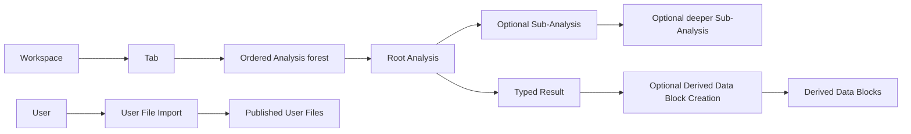

# Analyses And User File Imports

Wordflow has two durable kinds of background work. Analyses belong to a
Workspace Tab. User File Imports belong directly to a user. They share
lifecycle vocabulary and event transport, but there is no generic Task
resource, repository, or API.

## Shared Lifecycle Meaning

Analyses and User File Imports use `queued`, `running`, `succeeded`, `failed`,
and `cancelled`. Their strict domain models validate transitions, timestamps,
Failure, Progress, Result presence, and Revision.

A cancellation request is not terminal cancellation. Queued work can cancel
immediately; running work becomes `cancelled` only after execution has stopped.
If success and confirmed cancellation race, the first terminal state committed
under the owning gate wins. Intermediate Progress is an in-memory service
overlay and SSE event. It does not rewrite the durable resource or advance its
Revision.

## Analysis Forest

Each Tab owns an ordered list of Analysis identities. Those records form a
forest:

- an Analysis with no `parent_analysis_id` is a root;
- a Sub-Analysis names one parent in the same Tab;
- parent links may have arbitrary depth and must remain acyclic;
- every Analysis appears exactly once in its Tab's ordered collection.

An Analysis declares one execution scope:

- `preview` answers page-oriented exploration without publishing a Data Block;
- `run_all` processes the complete immutable input;
- `supporting` performs work owned by another Analysis, such as one source of a
  multi-source Concordance Run All.

Scope does not change lifecycle semantics. Preview and Run All are independent
roots unless a concrete workflow chooses a parent. A user may run Run All
without first running Preview, and any Analysis kind may use a Supporting
Sub-Analysis when orchestration requires it.

The immutable request, execution scope, parent, explicit supersession targets,
lifecycle, safe Failure, terminal Result, Artifact references, and ordered
unique `output_node_ids` persist in each strict Analysis record. Draft
parameters remain client-only. Persisted kind-specific presentation
preferences belong to the Tab and are never copied into an immutable request
or Result.

## Submission, Supersession, Cancellation, And Clearing

Submission validates the complete request and commits the new Analysis as
`queued` before runtime capacity is available. Input snapshotting occurs only
when the scheduler selects it. Workers receive immutable private inputs rather
than a live Workspace.

A new Analysis may name terminal Analyses in the same Tab through
`supersedes_analysis_ids`. The predecessors remain readable while the
replacement is queued or running. Successful completion removes them; failed
or cancelled replacement preserves them. Annotation is the deliberate linear
exception: submitting a new Preview or Run All immediately removes the Tab's
previous Analysis and creates one replacement root. Annotation never owns
multiple live Analysis identities or Supporting Analyses.

Cancelling an Analysis cascades to its active descendants. A thin group
Analysis that has no scheduled worker is never signalled as though it owned a
process. Clearing a Tab cancels active work and removes the complete forest.
Deleting a Tab performs the same Analysis cleanup before removing the Tab.

## Results And Immutable Inputs

Successful Analyses store a strict kind-specific Result, edit a Data Block
through an explicit in-place contract, or publish output Data Blocks atomically.
Concordance and Quotation retain immutable Run All tables as Analysis-owned
Artifacts. Their Review pages remain tied to the submitted request and Result
rather than a current Workspace projection. Preview page queries are
side-effect free and are not persisted as cached Result pages.

Token Frequency and Concordance execute exclusively from the immutable request
and input snapshot. Tokenizer mappings never fall back to mutable Data Block
preferences. `native:plain_words_en` bypasses the token cache; other models use
the per-user content-addressed cache.

## Annotation

Manual Annotation is not an Analysis. Creating an annotation column, choosing a
code, and saving a Codebook are ordinary Data Block Edits. Its
**Compare To** selection is shared with Preview and Review for the same Data
Block. Compare To and Show metadata are disjoint roles, and the active
correction column is eligible for neither. A selected comparison is masked
when each table mounts and contributes no reliability query, score, matrix,
difference tint, or filter until explicitly revealed from its header. Only
string and categorical columns are comparison targets. Percent Agreement,
Cohen's Kappa, and nominal Krippendorff's Alpha are available; Cohen's Kappa is
the default. The selections and metric are device-local presentation state
keyed by source Data Block and shared across all three modes; reveal and filter
state are mount-local. Revealed Manual comparisons cover the whole current Data
Block. After a manual label is saved, the frontend adjusts the affected
aggregate pairs and recalculates the selected score without rescanning the Data
Block; failed saves do not change the comparison. Changes made through another
surface are reconciled when the comparison resource next refetches.

AI Annotation Preview is a Preview-scoped Analysis. Each requested page is
fresh inference over the retained snapshot. Predictions are never written
automatically. Reviewer corrections are explicit `set_cell` Data Block Edits
to the correction column currently selected by the Tab. The immutable request
retains the selection captured at submission for provenance, but never
overwrites newer Tab state. Selecting **None** or using **Clear Results** clears
the live selection without deleting the column or its values. Preview renders
the prediction and selected editable correction as separate columns with an
intervening arrow. Preview comparisons reuse the same header-level presentation
as Review, but count only the fresh predictions and selected comparison-column
values on the current Preview page after reveal. Selected comparison columns
appear masked and read-only after the optional correction column. Revealing a
header shows its values and the selected reliability measure with its
conventional `%`, `κ`, or `α` sign, and exposes the exact current-page
confusion-matrix counts on hover or focus.

An optional Example Data Block supplies a pool of reviewed text-label pairs.
The immutable request owns a maximum per exact, case-sensitive label, a first,
last, or seeded-random method, and the seed. Preparation trims and removes blank
pairs, keeps label groups in first-seen order even when a label is absent from
the Codebook, and concatenates each selected group. Preview deterministically
reconstructs the same subset from its retained snapshot for every page query.

Annotation Run All is an independent Run-All-scoped Analysis. It processes the
complete snapshot and writes the selected annotation column in place. The
correction column never changes Run All predictions. **Reprocess all rows**
replaces the annotation column and is the default; **Fill missing only** sends
only blank annotation rows and preserves every existing label. A provider batch
accepts only a complete row-aligned JSON label array. Invalid responses are
retried, then recursively split so a degenerate large reply does not discard
otherwise valid rows. A terminal provider batch contributes null labels while
successful batches are still committed, keeping every output row aligned.
The durable Result records attempted rows, failed terminal batches, and failed
rows so partial completion remains explicit after the commit.
Run All prepares the request's example subset once before batching and reuses
it unchanged for every provider batch, retry, and recursive split.
Submitting it replaces the current Annotation Preview or Run All immediately;
a later Run All likewise replaces the earlier Run All.

Annotation Review shows the document and read-only completed annotation, plus
the selected editable correction column, with other columns available through
the metadata selector. Manual exposes the same correction selector while also
keeping the annotation editable. Preview and Review can use the selected
correction as the Example Data Block; Manual intentionally omits that shortcut.
The shared table footer provides rows-per-page selection and direct numbered pagination.
**Compare To** accepts one or more other columns and adds them as read-only
table columns after the optional correction column in Manual and Run All
Review. Each selected column starts masked; its header can reveal the values,
selected reliability score, exact confusion-matrix counts, difference tint,
and per-column difference filter. A hidden column's filter remains visible but
disabled. Hiding or deselecting the filtered column clears that mount-local
filter. Filtered pages and counts are evaluated by Workspace SQL before server
pagination. The metric is shared with Manual and Preview. Revealed-column
counts and scores cover the complete current Data Block rather than only the
visible Review page.

## Concordance And Quotation

Concordance and Quotation Preview use Preview-scoped Analyses. Each requested
page is computed from the retained immutable snapshot.
Quotation's stored Result is only a durable ready marker. Its document pages
are on-demand Arrow projections and are never persisted as table artifacts.

Quotation Run All is one Run-All-scoped Analysis with one immutable nested
document Result. Concordance Run All is a thin Run-All-scoped Analysis Group
with one Supporting Sub-Analysis and nested document Result per selected
source. Supporting work executes independently, but the group succeeds only
after every source Result is durable.

Review reads explicit projections of those Results. A
matching document is one stored row and owns a nested list of Concordance
Matches or quotation extracts. `CONC_dispersion` is derived by the frontend and
is never stored as a backend column. Concordance Table View reads matches;
Dispersion View filters and pages documents. Quotation retains its existing
document or match Review projections.

Each new Concordance Run All source Result records the total source documents,
matching documents, and Concordance Matches. Review presents one source-specific
summary in the footer of its result shell in both Table View and Dispersion View;
these totals do not change with pagination or Review filters. Combined View
retains separate source summaries rather than aggregating them. Older retained
Results without the source total remain loadable and omit that source's summary
rather than infer a denominator.

Each Concordance Match records L1 (`CONC_l1`), the token immediately left of the
match, and R1 (`CONC_r1`), the token immediately right of it, together with their
whole-Result frequencies. Text-mode requests may ignore punctuation for context
selection: tokens containing no Unicode alphanumeric characters do not consume
the left/right limits or become L1/R1, while contexts and extraction retain the
original source punctuation and whitespace. This option does not alter literal
or regular-expression match selection. Tokens mode retains its tokenizer-owned
punctuation filtering. Separated Preview sorts only selected source metadata;
generated scalar headers point readers to Run All. Separated Review may sort the
materialized match projection by public scalar Result fields using direct,
case-sensitive Polars ordering. The table intentionally leaves the document and
full left/right context headers plain, while combined tables remain unsorted.
Equal values in an explicit Review sort have no secondary ordering contract.

**Add to Workspace** submits a typed Supporting Analysis under the successful
Run All parent. Concordance Match Data Block Creation emits selected flat match
columns. Concordance Document Data Block Creation emits the required document
and newline-joined `CONC_extraction` plus optional metadata after applying the
Review term/bin filter. Checked sources, including empty ones, are committed
atomically. Every created Data Block starts without a persisted color and
therefore renders with the default grey instead of inheriting its source Data
Block's analysis color. Run All itself never changes the Workspace graph.

## Other Analysis Kinds

Token Frequency, Trends, Topic Modelling, and other full-table functions submit
Run-All-scoped Analyses directly. Topic Modelling Data Block Creation remains
an ordinary Supporting Analysis and may create multiple ordered output Data
Blocks.

A Topic Modelling Analysis request owns one segmentation method, maximum token
count, and HDBSCAN minimum cluster size for all selected Data Blocks. Minimum
cluster size defaults to 10 and must be at least 2. The successful Result
records the total Topic Segment count and how many semantic segments were truncated.
Automatic segmentation may split and overlap text; Paragraph and Sentence
segmentation preserve their respective Unicode text boundaries and truncate an
oversized segment on the right.

Every segmentation method then uses the same embedding, reduction, clustering,
c-TF-IDF, and Result-construction pipeline. HDBSCAN uses the request's minimum
cluster size and treats each Topic Segment as one equal observation. Its
real Topics become the maximum-resolution leaves of a deterministic Ward merge
tree; outlier `-1` is never merged. Document Topic Distributions are a separate
rollup: each retained segment contributes its
Unicode-character length, including repeated observations from Automatic
overlap. Outlier weight remains in the normalization denominator. The highest-
weight real topic is dominant, with smaller topic IDs breaking ties; `-1` is
dominant only when the document has no real-topic segment. Bubble sizes are
integer row-membership counts: a positive real Topic counts when its share is
among the row's Top N real-topic shares. Zero shares and outlier `-1` are
excluded, while every cutoff tie is included, so totals across bubbles may
exceed the number of source rows.

Topic Results retain 100 Representative Words per topic in c-TF-IDF order,
each with its model-segment occurrence count. Result queries may cut the stored
tree from the natural real-Topic count down to two and recompute all derived
Topic JSON without changing the Analysis. Each Result advertises a Top-topics-
per-row range of 1 through K and defaults to `min(2, K)`; empty Results use 0.
Canonical real Topic IDs are contiguous and ordered by smallest descendant
leaf ID.

Token Frequency and Topic Modelling Tabs may own one normalized stopword list;
Topic Modelling Tabs also own a 3-100 Words-per-topic cap initialized to 15 and
a nullable successful-Analysis projection selection containing cluster count
and Top topics per document. Only explicit Tab PATCH operations change these
settings. Analysis lifecycle operations and Clear Results preserve the first
two; removing or superseding the selected Topic Analysis clears its projection
selection.

## Persistence

Closing and reopening a Workspace restores Tabs, terminal Analysis forests,
immutable requests, stored Results, Artifacts, and retained query inputs.
Native Workspace schema 19 and portable archive format 18 accept only this
forest representation. Older layouts are rejected without runtime migration.
Browser-local active Tab selection and Active Analysis Drafts are outside both
storage forms.

## User File Import

A User File Import is retained under one user's `users/<user-id>/imports/`
area as one strict atomic JSON record. It represents publication of either a
complete sample collection or one Data Portal collection into User Files. Its
persisted request contains no provider credential.

A Data Portal submission may carry a write-only token for the initial provider
operation. The service resolves it before retaining the import and passes it
only through the private execution context.

User File Imports have their own service, scheduler, capacity, execution
handles, cancellation, persistence, and cleanup. They do not belong to a
Workspace and cannot create or mutate an Analysis. Deleting a terminal import
deletes only its history record, not published User Files.

## Event Refresh

Both resource types publish changes and live Progress through the authenticated
`/api/events` stream. Events are refresh signals, not a second state store.
Reconnects refetch resources, and slow subscribers receive `resync_required`
rather than historical replay.
