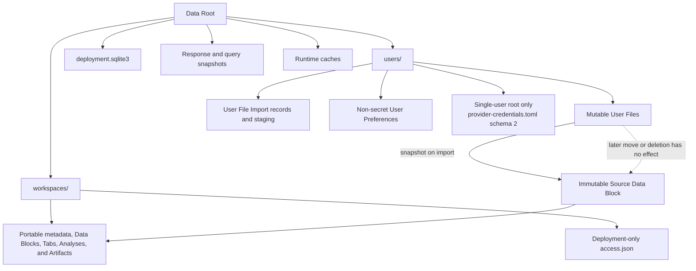

# Files And Storage

## Storage Areas

The Data Root owns `deployment.sqlite3`, one global Workspace catalogue,
per-user file/import areas, execution-private staging, response snapshots, and
runtime caches. Analysis lifecycle and Artifacts live inside their Workspace;
User File Import history lives inside its user's import area. Host paths are
private and never appear in public resources.

A User File is mutable import material. Adding one to a Workspace snapshots it
into an immutable Workspace-owned source, so later moves or deletion in the
user file area cannot rewrite an existing Source Data Block.

Every user area may contain non-secret User Preferences. Only the canonical
single-user `root` area may contain the separate write-only
`provider-credentials.toml` schema 2, containing named Annotation Provider
Configurations and the independent Data Portal token. Multi-user personal
configurations and Provider Credentials are browser-owned and never part of the
backend storage model.

## Safety Invariants

- User-controlled paths cannot be absolute, traverse parents, use Windows
  drive/UNC syntax, pass through links/reparse points, or escape their owner.
- Uploads and archive imports are bounded independently of `Content-Length`.
- Files publish through same-filesystem temporary files and atomic replacement.
- Existing destinations are not overwritten implicitly.
- User File collection reads return one complete tree, directories before
  files at every level, ordered by Unicode case-folded name and exact relative
  path. A configured serialized-response byte bound fails the whole read rather
  than introducing pagination or truncation.
- Downloads stream response-owned snapshots so concurrent source mutation
  cannot truncate an accepted response.
- Workspace archives are inspected and extracted into staging before
  publication. The remaining crash window around final publication and plan
  rebasing is tracked in the
  [persistence-integrity reference](../reference/persistence-integrity.md).
- Workspace discovery is a fresh scan of the global catalogue; exact
  `access.json` ownership is checked before portable content is exposed.
- Archive exports omit deployment ownership, and imports reject embedded
  ownership before generating a new sidecar for the importer.
- Portable Workspace archive format 10 contains materialized Data Blocks,
  terminal Analysis forests, declared Artifacts, and materialized immutable
  query inputs. It contains no serialized executable plans. Import assigns a
  fresh Workspace identity, rebuilds and rebases the private lazy plans, and
  rejects earlier archive versions rather than guessing at missing lifecycle
  content.
- One `QuotaService` owns total allocated-byte policy and usage snapshots for
  every principal. `StorageAdmissionService` applies that policy to Workspace,
  User File, import, Analysis, and response-snapshot writes. User Preferences
  and single-user Provider Credential writes do not yet use that admission
  boundary.
- A finite policy is read from SQLite for every status or admitted-write check;
  `NULL` is unlimited and performs no quota scan or accounting probe.
- Finite quota accounting requires host filesystem allocation metrics. A
  multi-user runtime fails readiness when the host cannot provide them, while
  the unlimited single-user desktop profile never requests that capability.
- Finite usage is a fresh filesystem-allocation scan of the principal's user
  area plus live and trashed Workspaces attributed by `access.json`. It uses
  allocated blocks with a one-allocation-unit floor for every regular file and
  directory, and persists no usage counter or ledger.
- In-process reservations prevent admitted concurrent writes from
  overcommitting a finite limit. Their staged output is measured and the
  current SQLite policy is checked again before atomic publication.
- Quota admission precedes the separate Data Root free-space reserve. Quota
  failures return `storage_quota_exceeded` with the four allocation values;
  shared capacity failures return `storage_capacity_exceeded` without host
  details. Reads, deletion, and zero-growth changes remain available while a
  principal is over quota.
