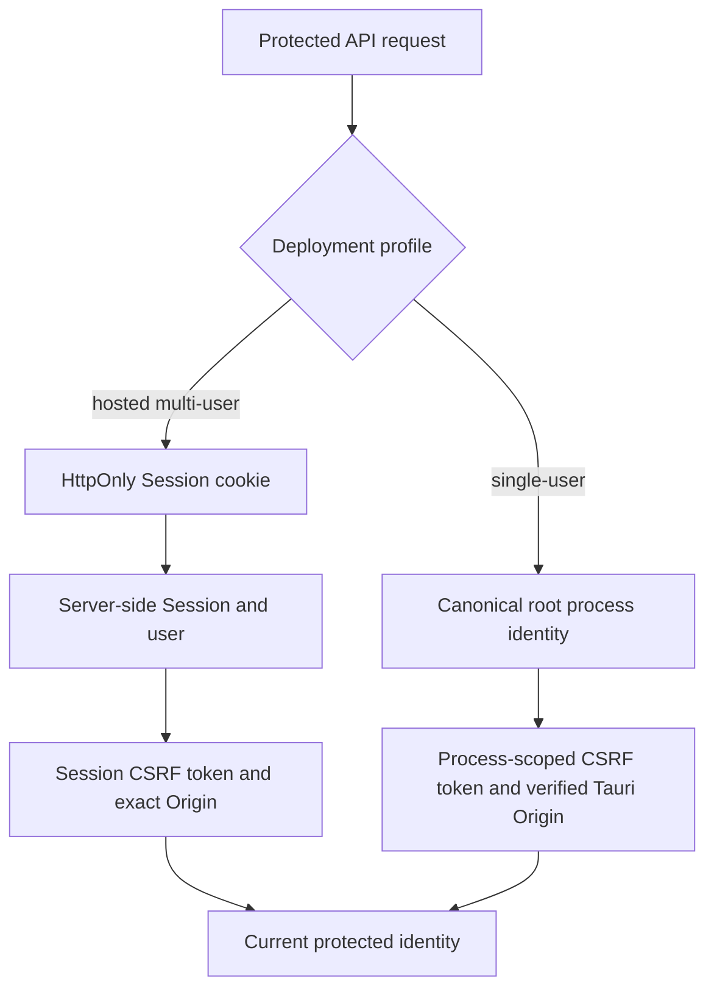

# Identity And Sessions

Hosted and desktop deployments share protected API dependencies but establish
identity and unsafe-request proof differently.

## Hosted Mode

Hosted multi-user Wordflow is a same-site browser deployment. A successful
identity-provider callback creates an independent server-side Session and an
HttpOnly cookie. Multiple Sessions may exist for one user; logout revokes only
the presented Session.

Unsafe requests require the Session's CSRF proof and an exact allowed Origin.
OAuth state, PKCE, nonce, and redirect validation protect provider callbacks.
Provider credentials and raw Session tokens are not public resources.

## Single-user Mode

Local and packaged desktop Wordflow are single-user and bind the backend to
loopback. Startup provisions exactly `root` / `Root User` / `root@localhost`;
there is no alternate local identity setting or selector. This mode uses the
process identity and process-scoped CSRF rather than a browser Session or
bearer-token exception. The Tauri supervisor additionally supplies the one
verified desktop Origin and native directory picker; the backend owns Data
Root selection and Runtime transitions.

Root's Provider Credentials are independent write-only user resources. Hosted
multi-user identities instead own personal credentials in each browser and
supply them transiently for provider operations. Neither form is Session data.

Cross-site multi-user desktop authentication is outside the supported product
model. It would require a same-origin bridge and dedicated packaged-WebView
security tests rather than a hidden alternate token transport.
