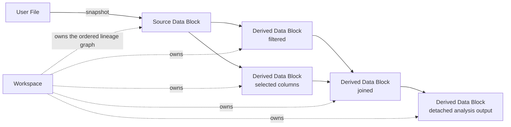

# Workspaces And Data Blocks

## Workspace Identity

A Workspace is a user-owned resource addressed by UUID. Its portable content
lives in `workspaces/<workspace-id>/`; the adjacent deployment-only
`access.json` identifies exactly one owner. Workspace existence and ownership
come from that folder, not SQLite or a per-user catalogue. Client selection
does not change identity. Runtime state is backend-owned but process-local: a
user has at most one `open` Workspace, while any number may be `closed` or
`closing`. Opening a target validates it before closing open siblings. A busy
sibling may continue closing while the target becomes the sole open Workspace.
The frontend derives this state from Workspace resources and does not restore a
last Workspace from device storage.

Every persisted Workspace has a monotonically increasing Revision. A mutating
command runs against the sole open aggregate under its Workspace gate, and the
next complete snapshot advances that Revision. Clients observe the resulting
server order and do not submit an expected Revision. The persistence adapter
still rejects an unexpected on-disk Revision so an out-of-boundary writer
cannot silently overwrite the aggregate.

## Data Block Graph

A Workspace owns an ordered directed acyclic graph of Data Blocks. Each Data
Block has stable identity, a name, a lazy tabular plan, independent optional
Document Column and Tokenizer Preferences, a schema containing physical and
optional semantic extension types, and zero or more parents. Roots are Source
Data Blocks; other blocks preserve the lineage of the transformation that
created them.

Backend domain code calls this object a `Node`, matching the public API. Product
and domain documentation uses Data Block. A live backend `Node` may reference
only resolved parent objects; persisted parent IDs are reconstruction data and
must not leak into the live aggregate unresolved.

The aggregate owns graph invariants only. Snapshot encoding, plan relocation,
durable publication, and reconstruction belong to the infrastructure
Workspace store, while residency and mutation coordination belong to
`WorkspaceService`.

Arrow extension identity is part of the plan schema rather than parallel Data
Block metadata. Parquet, serialized plans, Polars expressions, Workspace SQL,
and Arrow IPC therefore carry the same extension name, physical storage type,
and extension metadata. The backend retains unregistered foreign extensions as
generic extensions instead of loading only their storage type. A producer must
write the extension itself; Wordflow does not infer semantic identity from a
column name or a coincidentally matching nested shape.

## Workspace SQL

A Workspace SQL command declares one or more existing Data Blocks and executes
against a temporary lazy SQL context containing only those plans. Each plan is
bound under its canonical UUID. There is no persistent SQL session, implicit
Workspace-wide catalogue, or alternate table-name namespace.

Query mode returns one independently computed Arrow page. Pagination and
one-row lookahead wrap the submitted SQL, so fetching a later page may
recompute the query. Create mode adds a Derived Data Block; every declared
input becomes a parent in request order and the exact SQL is retained as
creation provenance. The resulting plan is serialized independently of the
temporary context before the mutation commits.

SQL creation starts with empty session history and never edits an existing
Data Block. Typed creation and edit commands remain separate domain operations.

## Data Block Edits And Session History

Provenance and graph edges describe creation lineage. A Data Block Edit
replaces only the selected Data Block's lazy plan. Its stable identity,
parents, children, order, edges, and provenance remain unchanged, and every
descendant retains the independent plan captured when that descendant was
created.

Column cast, rename, and delete are always edits. Filter, Find, Create, and
Expression may either create a Derived Data Block or update the selected
Data Block. Slice, random sample, shuffle, Join, and Stack always create
Derived Data Blocks.

Manual Annotation uses the same edit boundary. `set_cell` targets an existing
string column and absolute row index with a string or null value. Each accepted
cell change is one checkpoint; assigning the existing value is a no-op.
`annotation_classes` replaces the submitted class and description rows in one
checkpoint, validates at most 200 rows, and preserves every unselected column
positionally by truncating or null-padding it to the submitted row count.

Each resident Data Block owns independent Undo and Redo stacks containing at
most 50 lazy plans. Assigning a successful new plan checkpoints the previous
plan and clears Redo; Undo and Redo move plans without recursively creating
checkpoints. Construction, loading, failed validation, and explicit no-ops
create no history.

This history lasts only while the Workspace remains open in the backend
process. Snapshots, archives, clones, and imports contain the current plan but
no stacks, so close/reopen and process restart preserve current data while
resetting Undo and Redo. Rename retargets the Document Column Preference where
possible, and every edit or history command clears that preference when its
column is absent from the resulting schema. The Tokenizer Preference is not
column-bound and is never changed by a column edit. These metadata adjustments
are not part of plan history.

Document Column and Tokenizer Preferences are convenience metadata for fresh
analysis selectors, not execution parameters. Either may exist without the
other, and functions persist only controls they expose. Workspace save/reopen
and archive export/import preserve the preferences already owned by each Data
Block. Creation of a Derived Data Block may carry a Document Column Preference
when its operation defines that behavior, but never inherits a Tokenizer
Preference from a source, clone, or detached Analysis output.

## Persistence Invariants

- Successful mutations publish a complete new snapshot and Revision before
  returning.
- A failed publication leaves the previous snapshot loadable.
- A rejected edit or failed publication restores the pre-existing resident
  plan stacks as well as the committed plan.
- Ordinary loads are read-only and never relocate serialized plans.
- Archive import validates and stages the whole graph before making it
  discoverable.
- Creation and import publish from `workspaces/.staging/` through one atomic
  rename; import always creates a fresh Workspace identity and owner sidecar.
- Collection scans omit one corrupt owned Workspace without blocking healthy
  siblings, while direct owned access reports `workspace_corrupt`.
- Workspace deletion cannot race active Analysis execution or completion.
- Removing a Data Block preserves graph validity and cannot orphan descendants.
- Idempotent completion may reuse an existing Data Block only when its complete
  persisted identity matches; an ID collision with different metadata fails.
