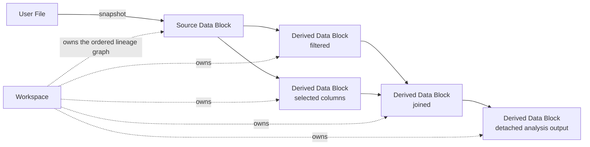

# Workspaces And Data Blocks

## Workspace Identity

A Workspace is a user-owned resource addressed by UUID. Its portable content
lives in `workspaces/<workspace-id>/`; the adjacent deployment-only
`access.json` identifies exactly one owner. Workspace existence and ownership
come from that folder, not SQLite or a per-user catalogue. Client selection
does not change identity and is not persisted by the backend. A backend
resident Workspace is only runtime state and never a discovery source.

Every persisted Workspace has a monotonically increasing Revision. A mutating
command runs against the sole open aggregate under its Workspace gate, and the
next complete snapshot advances that Revision. Clients observe the resulting
server order and do not submit an expected Revision. The persistence adapter
still rejects an unexpected on-disk Revision so an out-of-boundary writer
cannot silently overwrite the aggregate.

## Data Block Graph

A Workspace owns an ordered directed acyclic graph of Data Blocks. Each Data
Block has stable identity, a name, a lazy tabular plan, optional document and
tokenization metadata, and zero or more parents. Roots are Source Data Blocks;
other blocks preserve the lineage of the transformation that created them.

Backend domain code calls this object a `Node`, matching the public API. Product
and domain documentation uses Data Block. A live backend `Node` may reference
only resolved parent objects; persisted parent IDs are reconstruction data and
must not leak into the live aggregate unresolved.

The aggregate owns graph invariants only. Snapshot encoding, plan relocation,
durable publication, and reconstruction belong to the infrastructure
Workspace store, while residency and mutation coordination belong to
`WorkspaceService`.

## Persistence Invariants

- Successful mutations publish a complete new snapshot and Revision before
  returning.
- A failed publication leaves the previous snapshot loadable.
- Ordinary loads are read-only and never relocate serialized plans.
- Archive import validates and stages the whole graph before making it
  discoverable.
- Creation and import publish from `workspaces/.staging/` through one atomic
  rename; import always creates a fresh Workspace identity and owner sidecar.
- Collection scans omit one corrupt owned Workspace without blocking healthy
  siblings, while direct owned access reports `workspace_corrupt`.
- Workspace deletion cannot race active Analysis execution or completion.
- Removing a Data Block preserves graph validity and cannot orphan descendants.
- Idempotent completion may reuse an existing Data Block only when its complete
  persisted identity matches; an ID collision with different metadata fails.
