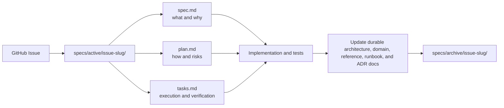

# Change Specifications

Specifications are checked-in change records for substantial work that changes
observable behavior, spans project boundaries, changes APIs or persistence, or
requires explicit acceptance criteria. Small fixes and local refactors use a
GitHub issue and tests without creating paperwork.

## Active Structure

Create `specs/active/<issue>-<slug>/` containing:

- `spec.md`: problem, desired behavior, acceptance criteria, and non-goals;
- `plan.md`: implementation approach, affected boundaries, risks, and
  verification;
- `tasks.md`: executable steps and validation status.

Link the GitHub issue from `spec.md`. The issue coordinates ownership and
discussion; the files record the accepted change contract.

Use Mermaid inside a change specification only when it clarifies that change's
relationships, sequence, states, or data flow. Keep the diagram at the change
level: refer to durable architecture pages for system-wide context instead of
copying their diagrams into the specification.

## Completion

Before archiving, make code/tests pass and update current architecture, domain,
reference, runbook, and ADR documents. Then mark the specification completed
and move the entire folder, unchanged except for completion metadata, to
`specs/archive/`.

Archived specifications describe historical intent. They never override code,
tests, current documentation, or a later superseding specification.
