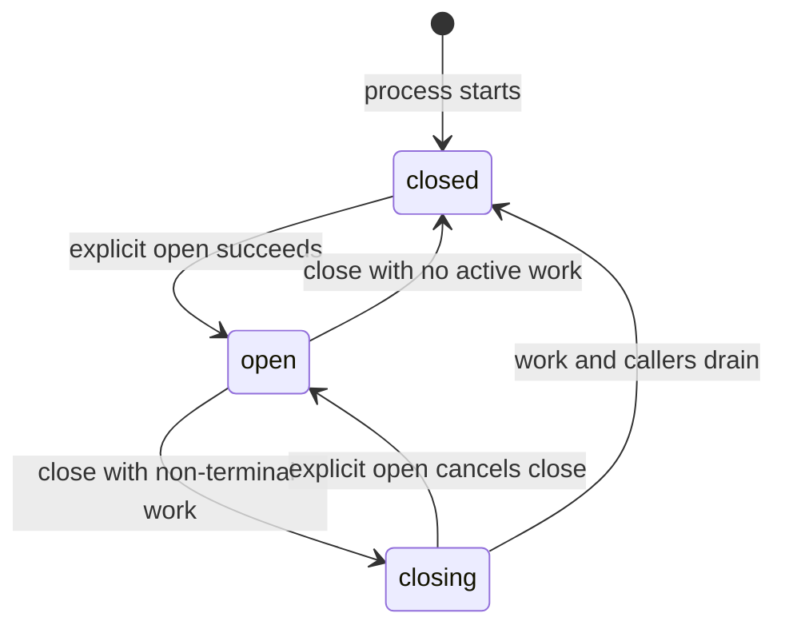
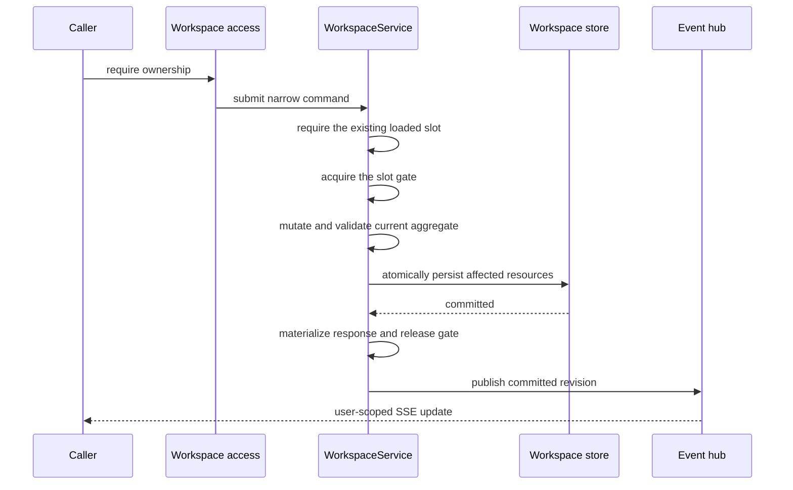
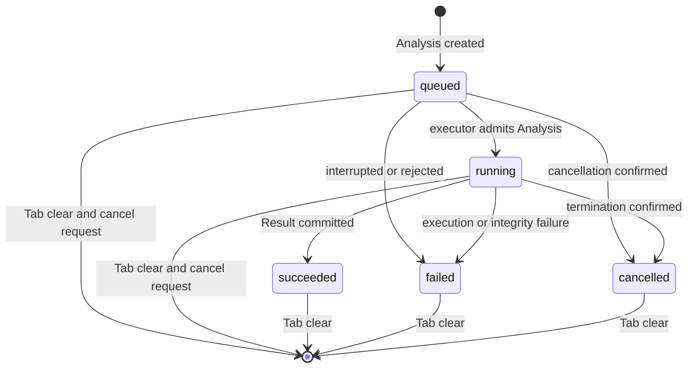
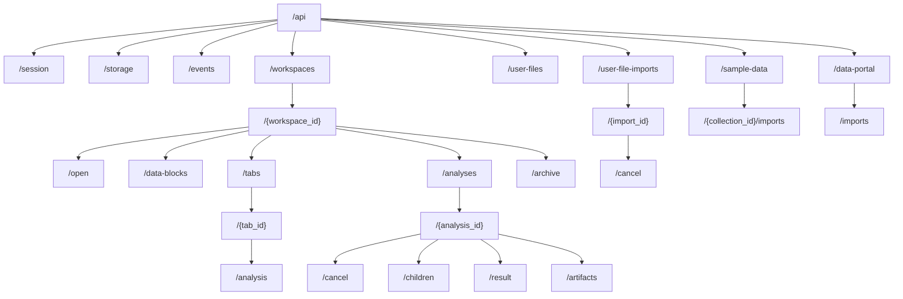

# Backend Architecture Straightening

Status: completed
Completed: 2026-07-16
Scope: backend and backend-owned runtime integration only
GitHub issue: [#8](https://github.com/Australian-Text-Analytics-Platform/ldaca-wordflow/issues/8)
Last updated: 2026-07-16

## Problem

The backend currently exposes a resource-oriented HTTP API while Workspace
residency, persistent tabs, analysis execution, generic Tasks, and ownership
are represented by overlapping mechanisms. That creates coordination code,
duplicated lifecycle state, broad mutation gates, persistence that is not
fully contained by the owning resource, and compatibility branches that make
the intended model difficult to state precisely.

This change establishes one direct model for the FastAPI backend. Analysis
algorithms remain unchanged. The React client is intentionally excluded and
will be adapted after the backend contract is complete.

## Design Principles

- The public resource model and the persistence ownership model must agree.
- A Workspace folder contains all portable analytical content.
- Deployment identity and ownership are not portable Workspace content.
- Every mutable resource has one lifecycle owner and one mutation boundary.
- The backend is authoritative; clients submit narrow commands rather than
  replacing whole aggregates.
- Every mutable resource contained by one Workspace shares that Workspace's
  single gate. Independent Workspaces remain concurrent.
- Failures are contained to the affected user, Workspace, Analysis, import, or
  Artifact whenever possible.
- Prefer a complete explicit retry over checkpointing, partial resume, or
  minimum-work recomputation when both approaches produce the same correct
  outcome. Simple ownership and recovery semantics take precedence over
  avoiding repeated computation.
- Do not add caches, memoized partial results, shared execution plans, or
  incremental repair solely to avoid affordable recalculation. This preference
  never relaxes authorization, serialization, atomic publication, or other
  correctness and process-safety boundaries.
- Runtime code implements only the current schema and API. It contains no
  compatibility aliases, legacy readers, guessed migrations, or fallback
  models.

## Desired Domain Model

### Workspace and ownership

A Workspace is a portable analysis folder with exactly one owner in the
current product. Collaboration, memberships, roles, invitations, presence,
and live sharing are not supported.

The Data Root has this ownership layout:

```text
data_root/
├── workspaces/
│   ├── .staging/
│   ├── .trash/
│   └── <workspace-id>/
│       ├── access.json
│       ├── workspace.json
│       ├── data/
│       ├── plans/
│       ├── tabs/
│       └── analyses/
├── users/
│   └── <user-id>/
│       ├── files/
│       └── imports/
└── deployment.sqlite3
```

`deployment.sqlite3` owns users, each user's storage policy, external
identities, Sessions, OAuth state, and no Workspace catalogue, ownership row,
lifecycle row, or cleanup tombstone. The filesystem is the sole durable source
of truth for Workspace existence and ownership.

Every live Workspace directory contains a strict deployment-only `access.json`
with exactly one `owner_id`. It contains no grants, roles, sharing fields, or
portable analytical state. Hosted mode stores the authenticated owner's opaque
user ID; single-user mode uses its one fixed local principal. The sidecar moves
with the folder during internal staging and cleanup, is excluded from archive
export, and is freshly generated for the importing user. Archive import rejects
an archive-supplied `access.json` as a reserved path.

A Workspace is live exactly when its complete UUID-named directory is a direct
child of `workspaces/` and its strict identity and access checks succeed.
Every `GET /api/workspaces` performs a fresh directory scan through the
runtime-owned bounded I/O capacity, reads each live folder's metadata and
`access.json`, and filters by the authenticated principal. Direct lookup
addresses the UUID-named folder and validates its sidecar. `.staging/` and
`.trash/` are never live catalogue entries. There is no durable or
SQLite-backed Workspace index, in-memory catalogue cache, filesystem watcher,
TTL, invalidation protocol, per-user ownership list, or shared-Workspace
pointer under `users/`. The transient Workspace-slot table owns runtime
coordination and open aggregates only and is never a discovery or listing
source.

Collection scanning isolates corruption per directory. Non-UUID entries,
links, and folders with missing or invalid `access.json` are never followed or
exposed and are logged as unattributable storage corruption. When a valid
sidecar identifies the current user but portable Workspace metadata is invalid,
the collection logs `workspace_corrupt`, omits only that Workspace, and still
returns `200` with every other valid owned Workspace. It does not invent a
placeholder, partial-success wrapper, warning model, fallback parser, automatic
repair, or quarantine move.

Direct metadata access or open for that known ID fails with HTTP `500` and
stable code `workspace_corrupt`, exposing only the Workspace ID and request ID.
Deletion remains authorized from the valid `access.json` and does not parse or
open the corrupt aggregate. Other users never validate the corrupt portable
content. A valid owner sidecar also keeps all of the corrupt folder's bytes in
that owner's hosted quota calculation.

All authorization passes through one backend access boundary. Routes do not
derive Workspace paths from user IDs, compare owner IDs directly, or accept an
authoritative user ID from a client. The boundary validates `access.json`
against the authenticated principal, and an inaccessible Workspace is reported
as not found.

Archive export and import are the only supported way to move an individual
Workspace between Data Roots or deployments. Import validates and stages the
complete archive, creates a new Workspace ID, and registers the current user as
owner by generating its new `access.json`. Immediately before atomic
publication, import assigns one aware UTC instant to both `created_at` and
`modified_at`. Archived timestamps are validated as part of the input schema
but are not retained as timestamps of the newly created Workspace. Raw
Workspace directories are backend-owned implementation storage:
direct copying is unsupported, and the scanner never repairs an incomplete
folder, infers an owner, merges duplicate content, or treats a folder as an
archive. Only a complete folder satisfying the strict path, identity, schema,
and access-sidecar contract is a live Workspace.

Creation and import build the complete folder beneath `.staging/`, validate and
flush its content, and atomically rename it to `workspaces/<workspace-id>/` on
the same filesystem. That rename is the sole publication point. Failure before
the rename leaves no live Workspace; startup removes abandoned staging folders
instead of guessing that an interrupted creation completed.

`POST /api/workspaces` and successful archive import each create a durable
closed Workspace and return `201` with the direct `Workspace` resource,
`runtime_state="closed"`, and a relative `Location`. Neither operation
implicitly opens the new Workspace or accepts an `open` flag. A caller uses the
one explicit `PUT /api/workspaces/{workspace_id}/open` transition afterward.

### Workspace open state and mutation

A persisted Workspace is closed, open, or closing in the current backend
process. This runtime state is explicitly controlled by Workspace open and
close operations and is not persisted into the portable Workspace folder.
Every Workspace starts closed after process startup. The frontend may choose
which open Workspace to display, but the backend does not store a selected or
current Workspace.



`WorkspaceService` maintains a private table of short-lived `WorkspaceSlot`
entries keyed by Workspace ID. A slot contains the per-Workspace gate, an
optional sole in-memory `Workspace` aggregate, persisted Revision when loaded,
closing state, and caller/waiter count. It is created when the first operation
for an ID begins, retained while the Workspace is open or closing, and removed
after it is closed with no caller or waiter. A slot contains no catalogue
metadata and is never a listing source; there is no separate resident flag.
Multiple Workspaces belonging to one user may be open concurrently, and
independent Workspaces have independent gates.

The explicit open operation is the only user-request path that reconstructs a
closed Workspace's complete aggregate. It obtains the ID's slot and holds that
one gate while loading through bounded I/O. A concurrent open waits, then
returns the already-loaded direct `200 Workspace`; no message wrapper, shared
load future, or public `opening` state exists. If a load fails, the Workspace
remains closed and a later waiter may perform the same complete load again.
Ordinary Workspace graph, Analysis, and mutation
requests for a closed Workspace fail with stable code `workspace_not_open`.
`GET /api/workspaces` and `GET /api/workspaces/{workspace_id}` are the only
closed-Workspace content exceptions: they return a lightweight metadata
projection without registering or retaining the aggregate.

Both endpoints use the same direct `Workspace` representation containing
identity, name, description, timestamps, graph counts, persisted Revision, and
derived runtime state. The collection returns these resources rather than a
second summary model. Complete graph topology, Tabs, and Analyses remain child
resources and require the Workspace to be open. There is no
`WorkspaceSummary`, graph-bearing `WorkspaceDetail`, or nullable graph field.

`created_at` and `modified_at` are required aware UTC domain timestamps in
`workspace.json`; neither is derived from filesystem metadata. Every committed
user-visible Workspace change updates `modified_at` in the same persistence
boundary as that change. This includes metadata and Data Block changes, Tab
creation, rename, deletion, and Analysis association changes, plus root or
child Analysis creation, lifecycle, Result, and deletion changes.
Progress-only updates, reads, archive export, process-local
open/close transitions, and event delivery do not change it. Direct creation
and archive import initialize both timestamps to their respective atomic
publication instant because each operation creates a new Workspace resource.

`GET /api/workspaces` sorts by `modified_at` descending and then Workspace ID
ascending. The immutable ID tie-breaker makes equal timestamps deterministic;
filesystem iteration order and directory mtimes never affect the result.

The complete closed-Workspace command boundary is narrow. Collection and
individual metadata reads and Workspace deletion are allowed while closed.
Collection-level archive import does not target an existing aggregate and
creates a new closed Workspace. Metadata updates, archive export, graph access,
Data Block commands, Tabs, and root or child Analyses all require an open
Workspace and fail with `workspace_not_open` when closed. No command performs a
temporary detached aggregate load to bypass this boundary.

Open state is the singleton subresource
`/api/workspaces/{workspace_id}/open`. `PUT` idempotently opens the Workspace
and returns `200` with its direct `Workspace`; repeating it while open returns
the current resource. `DELETE` requests closure. It returns an empty
`204` when closure is immediate or already complete, and returns `202` with the
direct Workspace resource and `runtime_state="closing"` when admitted work must
drain. Repeating `DELETE` while closing remains `202`. There are no separate
load, unload, save, or selected/current-Workspace endpoints.

The `Workspace` resource exposes derived
`runtime_state: "closed" | "open" | "closing"`. `WorkspaceService` computes it
from whether the transient slot contains an aggregate and its closing flag; an
empty in-flight slot still projects as closed. Runtime state is never written
to `workspace.json`, counted as portable state, or included in an exported
archive. Startup therefore reports every persisted Workspace as closed until
it is explicitly opened.

Opening a closing Workspace cancels its deferred close and returns the existing
slot to open. The Workspace gate serializes this against terminal completion.
If final cleanup already removed the aggregate, the same request performs a
normal closed-to-open load; if reopening wins first, completion observes open
state and leaves the aggregate present.

An open aggregate remains in its slot until explicit close, Workspace deletion,
or process shutdown. There is no automatic load, idle timeout, LRU,
resident-object count limit, or automatic eviction.

Explicit close is accepted at any time. It serializes behind already-admitted
short service calls and prevents new work or content changes. With no queued or
running Workspace-owned work, close persists the aggregate and removes the
entry immediately. Otherwise it marks the entry closing and returns
`202 Accepted` while all already-queued or running root and child Analyses
continue normally. Immediate closure returns
`204 No Content`.

While closing, the backend admits only actions that observe or shorten the
drain: metadata and child-resource reads or downloads, SSE observation,
cancellation or deletion of an existing root or child Analysis,
explicit reopen, repeated close, and Workspace deletion. It rejects new
root or child Analyses, Result queries, export, metadata updates, Data Block
mutations, and any other new work with HTTP `409` and stable code
`workspace_closing`. An admitted read is materialized before its short lease is
released. After final removal, child-resource access returns
`workspace_not_open`.

Scheduler dispatch of an Analysis that was already queued before close,
Progress, and terminal completion remain admitted internal commands while an
entry is closing. The handler that makes the final non-terminal resource
terminal releases finished executor handles and temporary staging, then, if
the entry is still closing, persists the Workspace and removes it after all
short callers drain. No polling loop, close Task, timer, or automatic
cancellation is introduced.
Persistent Analysis history, Results, and committed Artifacts remain in the
Workspace folder. A process restart makes the Workspace closed and applies the
ordinary fail-interrupted reconciliation contract to work that lost its
execution handle.

The `Workspace` aggregate itself remains a synchronous domain object containing
the Data Block graph and its invariants. AnyIO locks, persistence Revisions,
and active-use counts remain in the private slot rather than becoming
portable Workspace state. The mutable aggregate never escapes
`WorkspaceService`.

HTTP handlers and completion handlers submit narrow domain commands such as
renaming or deleting a Data Block, creating an Analysis, or applying an
Analysis completion.

Here, *command* means one explicit mutation intent entering a typed
`WorkspaceService` method. It is ordinary application-service vocabulary, not
a shell command and not a required Python `Command` object. Routes pass typed
parameters or a focused domain input model directly to methods such as
`rename_workspace`, `delete_data_block`, or `cancel_analysis`. The target has
no generic command base class, command union, command bus, dispatcher, CQRS
framework, or event-sourced command log.

A command runs as:



Remote calls, worker execution, response streaming, and SSE publication do not
run while the Workspace gate is held. Immutable execution inputs are prepared
under the appropriate gate, then execution runs outside it. Completion returns
to `WorkspaceService` as another narrow command.

After input preparation, an executor retains only the immutable execution
snapshot and resource identifiers. It never retains a `Workspace`, a private
slot, or its gate. Each progress or completion update re-enters
`WorkspaceService` by Workspace ID and holds only a short command lease on the
existing open or closing slot. A process restart instead follows the
fail-interrupted reconciliation contract; background work never silently
reopens a Workspace.

The same gate protects `workspace.json`, Data Block graph changes, Tab creation
and mutation, Analysis creation and deletion, `analysis.json` lifecycle and
live progress updates, child-Analysis records, completion publication, and
Workspace export or deletion preparation. There are no per-Tab or
per-Analysis locks and no cross-resource lock ordering within
a Workspace. Long-running computation never holds the gate.

A monotonically increasing internal Workspace Revision remains part of the
persisted format. It orders commits and events, supports cache validation, and
supports strict recovery checks. Clients do not provide expected Revisions,
`If-Match`, active-editor identity, or any other mutation precondition. Broad
full-Workspace replacement is not part of the API.

### Client instances and concurrent commands

A browser window, Tauri window, or other open application surface is a client
instance. It is not a persistent Workspace-owned Tab. The backend does not
track which client instance has focus and does not implement an active-window
registry, editing lease, heartbeat, takeover, or fencing-token protocol.

Backend correctness never depends on client-side activity coordination. Every
authenticated command is authorized, validated against the current aggregate,
and serialized by the Workspace gate even when requests arrive concurrently or
out of network order. A future frontend may make all but one local client
instance read-only and refresh authoritative state before transferring editing
control, but that behavior is a non-authoritative user-interface courtesy and
is outside this backend change.

Every Workspace mutation has the same concurrency contract: execute in the
order admitted by the gate, validate the command against the current aggregate,
and commit it when valid. The backend does not classify mutations into
different stale-write policies and does not attempt to infer which client
intent should win. A later valid command may supersede an earlier value. A
command whose target is absent or whose requested transition violates current
domain invariants fails normally without changing committed state.

### Data Blocks and derivation

A Data Block is still represented as a backend/API `Node`, but its provenance
is strict structured data rather than a human-authored operation string.
Derivation variants identify the operation, ordered inputs, input roles, and
typed parameters. Human descriptions are generated from this structure.

Deleting a Data Block remains supported when it has descendants. For each
surviving descendant, the backend composes the removed block's derivation into
the descendant's derivation, preserves ordered input roles for joins and
concatenation, rewires the surviving parent relation, validates the resulting
graph, and commits it atomically. Before committing, the command rejects the
deletion with `409 data_block_in_use` if the removed block or any descendant
whose provenance would change has an active Analysis input reservation. There
is no parser or compatibility field for the old operation string.

Source Data Blocks remain snapshots inside the Workspace. Serialized plan
sources may resolve only to declared relative source bindings within the
Workspace. Archive import rebases those bindings explicitly rather than
guessing paths from filenames.

### Analysis owns execution

An Analysis is one unique submitted typed computation. It owns its request,
execution lifecycle, progress, cancellation request, safe terminal error,
Result metadata, Artifacts, integrity state, and any child Analyses.

A root Analysis has null `parent_analysis_id` and is the only kind that a Tab
may reference through `Tab.analysis_id`. A child Analysis has the root's ID as
its non-null `parent_analysis_id`, is never referenced by a Tab, and uses the
same Analysis model and lifecycle. One root may own zero or many children.
Children cannot own children: there is no current domain use case for deeper
nesting, and allowing it would add recursive cycle, cancellation, cleanup, and
depth rules. An Analysis run against a Data Block published by a child is a new
root Analysis in another Tab.

The lifecycle is embedded directly in `analyses/<analysis-id>/analysis.json`:



There is no public or durable generic Task resource, Task database, global
Task repository, or `/api/tasks` API. Execution handles belong only to private
executors as private execution and cancellation handles.

Each admitted Analysis runs in one fresh child process created with the
`spawn` start method. There is no reusable process pool, Analysis worker-thread
mode, or executor fallback. A lifespan-owned private Analysis scheduler owns
the bounded execution capacity and runtime-only queues. The private Analysis
executor owns only each selected private launch entry, its eventual
child-process handle, and its validated inter-process progress and completion
messages. Neither component is a public resource, durable workflow store, or
generic Task service.

The gate's positive finite capacity is the immutable deployment setting
`analysis_execution_capacity`. It limits only how many Analyses the executor
may admit simultaneously, including the brief child-process launch period. The
setting has no hard-coded schema ceiling and no `unlimited` value;
changing it requires the ordinary backend restart used for immutable settings.
The same global capacity applies in every deployment profile, and there is no
per-user execution allocation or concurrency quota. When the setting is
absent, every profile uses the same default of two. Hosted operators may
replace that default with any positive finite value according to the machine's
measured memory and throughput.

The backend does not derive execution capacity from CPU count, partition or
lend CPU cores between Analyses, or impose one cross-library native-thread
budget. Each child process leaves Polars, the embedding runtime, and other
supported native libraries under their ordinary library-level threading
policy, so one Analysis may use the complete CPU set visible to its process.
The operating system schedules concurrently running children. There is no
`analysis_native_threads` setting, per-kind CPU weight, dynamic resizing, or
backend-injected `POLARS_MAX_THREADS` value.

Analysis creation persists the new resource in `queued` state before it waits
for execution capacity. When every slot is occupied, the Analysis remains
queued and observable through REST and the shared SSE stream until a slot is
available. Saturation does not reject creation, return a quota or capacity
error, or create an additional queue resource. There is no separate limit on
the number of Analysis resources or queued Analyses; ordinary storage admission
and other existing resource-safety boundaries still apply to creation and
persistence.

The scheduler is work-conserving and fair by authenticated user. It never
leaves a slot idle while any eligible Analysis is queued. If only one user has
queued work, that user may occupy every slot. When multiple users have work,
the scheduler rotates one dispatch turn per user; a newly active user receives
a turn before the most recently dispatched user repeats. Within one user's
turn, it selects that user's oldest queued Analysis by `created_at` ascending
and Analysis ID ascending. Root and child Analyses have equal scheduling
priority.

Running work is never preempted when another user arrives. Fairness affects
only the next free slot. There are no weights, priorities, reserved execution
slots, per-user concurrency limits, or per-kind scheduling branches. Queue
entries contain only runtime scheduling identity plus Workspace and Analysis
IDs; no user identity or queue position is written into portable Analysis data.
In single-user mode the same scheduler reduces naturally to FIFO. Because
queued Analyses follow the ordinary interrupted-restart rule, rotation state is
not persisted or reconstructed after process loss.

After capacity and a valid execution snapshot are reserved, dispatch installs
one private executor launch entry before the Workspace gate is released and
atomically transitions the Analysis from `queued` to `running` with
`started_at`. Public `running` means the executor owns the Analysis and its
capacity slot; it includes child-process startup and does not assert that
computation code has already executed. There is no public or durable
`starting` state.

The private launch entry serializes process start and cancellation without
introducing another domain lock. Cancellation that reaches the entry before
launch prevents process creation and confirms ordinary cancellation. If launch
wins, later cancellation terminates the unique process through the existing
running contract. A process-creation failure transitions only that Analysis to
`failed` with stable code `analysis_start_failed`, removes its private snapshot,
releases capacity, and allows scheduling to continue. There is no automatic
retry, alternate executor, or fallback mode. Competing launch failure,
cancellation, and completion outcomes still obey the first durable terminal
transition rule.

The child receives only the immutable execution snapshot, resource IDs, and
execution-private staging or Artifact paths prepared before execution. It never
receives a mutable `Workspace`, slot, gate, service, database connection, or
request object. A child crash therefore fails only its owning Analysis, and a
cancellation request can stop that unique process without terminating sibling
Analyses. The application event loop consumes validated child messages and
re-enters `WorkspaceService` for every progress or terminal update. It never
runs Analysis computation or a blocking process wait inline. Process exit is
the executor-level confirmation required by the lifecycle contract below.

Cancellation is a lifecycle request, not resource deletion.
`POST /api/workspaces/{workspace_id}/analyses/{analysis_id}/cancel` handles a
queued Analysis synchronously because it has no child process to terminate. The
command competes with scheduler dispatch only through the Workspace gate. If
cancellation wins, it removes or invalidates the runtime queue entry and
atomically transitions `queued` to `cancelled`, using one aware UTC instant for
both `cancellation_requested_at` and `finished_at`. `started_at` remains null,
Progress retains its queued value, one durable Revision and Workspace
`modified_at` change commits, one terminal SSE event publishes, and the endpoint
returns the direct Analysis with `200`. No process starts and no pending
cancellation or cleanup job exists.

If scheduler dispatch commits `queued` to `running` first, cancellation follows
the running contract. The first request records one aware UTC
`cancellation_requested_at`, signals the private executor, publishes that
durable non-terminal change, and returns `202` with the direct Analysis while
termination remains unconfirmed. Repeating the request while it is pending
returns the same `202 Analysis` without changing the timestamp, Revision,
Workspace metadata, or SSE stream. The Analysis remains attached to its Tab and
observable throughout cancellation.

Only confirmed executor termination transitions a running Analysis to
`cancelled`. Once queued cancellation has committed or running termination is
confirmed, the same cancellation request returns the current Analysis with
`200` and no side effect. A succeeded or failed Analysis returns
`409 analysis_not_cancellable`; a missing or cross-user Analysis remains the
ordinary concealed `404`. Cancellation does not clear Results or remove the
Analysis. The separate Tab clear operation may still detach it immediately and
request cancellation as internal cleanup.

Running cancellation is best-effort until that confirmation. Successful
completion and executor-termination confirmation each re-enter
`WorkspaceService` and attempt a terminal transition under the same Workspace
gate. The first valid terminal transition committed there wins permanently. If
success commits first, the Analysis is `succeeded` and a later cancellation
confirmation is ignored. If termination confirmation commits first, the
Analysis is `cancelled` and every later Result or completion callback is
discarded. The original `cancellation_requested_at` remains on either terminal
representation as an accurate record of the request. There is no cancellation
priority, grace period, terminal-state rewrite, Result rollback, or second lock.

### Tabs are first-class Workspace resources

A Tab is a substantial portable resource owned by its Workspace. Clicking the
client's add-tab action creates it immediately through
`POST /api/workspaces/{workspace_id}/tabs`, even when no Analysis has been
submitted. The backend returns `201 Tab` with a relative `Location`; a client
does not invent a durable Tab locally and synchronize it later.

Each Tab has its own UUID, immutable analysis kind, bounded non-empty
`name`, nullable `analysis_id`, aware UTC timestamps, and Revision. Its strict
record lives beneath `tabs/<tab-id>/`; it is included in Workspace export and
import. The name belongs only to the Tab—Analysis records have no label, title,
or name. Creating, renaming, clearing, or deleting a Tab is a Workspace
mutation and updates the Workspace Revision and `modified_at`.

The frontend function area already determines the analysis kind before the
user creates a Tab. `POST /api/workspaces/{workspace_id}/tabs` records that
kind at creation; later Tab representations return it so the frontend can
reconstruct and group the right function-specific Tabs after a Workspace is
reopened or imported. Kind is not a later user choice, and the backend exposes
no kind-change operation.

The strict `TabCreate` body contains exactly required `kind` and required
`name`; unknown fields and missing values use the sanitized `422` contract. The
backend generates the UUID, initializes `analysis_id` to null, assigns one
aware UTC instant to both timestamps, and starts Revision at 1. It atomically
persists the new Tab under the Workspace gate, advances the Workspace Revision
and `modified_at`, publishes the committed creation, and returns `201 Tab` with
its relative `Location`. The backend generates no default label and stores no
per-kind naming counter; any suggested or numbered label is frontend behavior.

The Tab UUID is its sole identity. `name` is a non-unique display label, so two
Tabs in one Workspace may have identical names and name equality never selects,
addresses, or associates a resource. Create and rename validate only the name's
own shape; they perform no exact, case-folded, or Unicode-normalized uniqueness
check and return no name-conflict error. Export/import preserves duplicate
labels unchanged.

One strict `TabName` type is used by create, rename, persisted records, and
archive validation. At admission it strips leading and trailing Unicode
whitespace, then requires 1–500 Unicode code points and rejects characters in
the Unicode `Cc` control category. It preserves every remaining code point,
including internal whitespace, punctuation, path separators, and non-ASCII
text, and performs no Unicode normalization. The post-trim value is the value
persisted and returned. Invalid archive labels fail staged import atomically
rather than being repaired.

Rename compares the validated post-trim value with the stored name under the
Workspace gate. If they are equal, `PATCH` returns `200` with the current `Tab`
and performs no Tab or Workspace write, timestamp or Revision advance, or SSE
publication. If they differ, the backend atomically persists the new name,
advances the Tab and Workspace Revisions and `modified_at` timestamps, and
publishes the committed Tab change. No-op detection therefore follows the same
normalization used by persistence.

The Tab collection is complete and unpaginated. It sorts by immutable
`created_at` ascending and then Tab ID ascending, so newly created Tabs appear
after older Tabs and ties remain deterministic. A rename, Analysis transition,
or clear does not reorder a Tab. There is no persisted position, reorder
endpoint, or backend-selected active Tab; which Tab is currently visible is
frontend state.

The strict public `Tab` representation contains exactly `id`, `kind`, `name`,
nullable `analysis_id`, `created_at`, `modified_at`, and non-negative
`revision`. The containing Workspace is identified by the resource URL rather
than repeated in every Tab. Creation initializes the two aware UTC timestamps
to one instant. Rename, Analysis assignment, and clear advance `modified_at`
and Revision; Analysis progress or terminal transitions do not mutate the Tab
because its association is unchanged.

Every supported Tab write serializes a fully validated record before publishing
it under the Workspace gate through same-filesystem temporary write, file and
directory `fsync`, and atomic replace. Archive import validates every Tab while
the Workspace is still staged. The public API therefore has no `CorruptTab`
variant, partial-success Tab collection, compatibility reader, or automatic
repair path for storage that cannot satisfy the strict record contract.

If a persisted Tab nevertheless fails strict validation because storage was
modified outside the supported API or the storage medium failed, Workspace
open or a Tab operation that encounters it returns `500 tab_corrupt`. The
complete `GET .../tabs` contract fails as a whole rather than omitting the Tab
or fabricating a placeholder. The safe error identifies the affected Tab when
its UUID is recoverable and includes the request ID, but never includes a host
path, invalid bytes, parser details, or internal exception text. The backend
preserves the invalid bytes for diagnosis and does not create a special
per-Tab repair or deletion bypass. The failure disables only the affected
Workspace's open child-resource access; its closed metadata and authorized
Workspace deletion remain available, and other Workspaces, users, and process
readiness remain healthy.

An unsubmitted analysis draft is frontend-local state, not a backend resource
or part of the Tab record. Editing parameters sends no request to the backend
and does not advance Tab or Workspace Revisions, update `modified_at`, or emit
SSE events. The backend exposes no draft create, read, autosave, update, or
recovery endpoint, and Workspace export/import contains no unsubmitted draft.
Any frontend-local recovery of an unfinished form is outside the backend
contract.

`Tab.analysis_id` is the sole durable Tab-to-root-Analysis association. It is
null for a newly created or cleared Tab and otherwise references exactly one
strict Analysis directory under `analyses/<analysis-id>/`. Analysis records do
not copy `tab_id`, and two Tabs may not reference the same root Analysis. The
paginated Analysis collection contains roots reached from live Tab references
and their valid direct children reached through `parent_analysis_id`. A root
with no Tab reference, a child with no live root, or a child whose named parent
is itself a child is private cleanup state rather than a live resource; startup
removes it instead of guessing or repairing an association.

Clicking Run sends one complete, strict, kind-discriminated Analysis request as
the body of
`POST /api/workspaces/{workspace_id}/tabs/{tab_id}/analysis`. Submission
requires an empty Tab. Under the Workspace gate, the backend validates the
complete request and its current Data Block references, copies that request
unchanged into a new immutable Analysis record, durably stages the unique
Analysis, and atomically commits that ID into the Tab. There is no field-level
parameter mutation or partial-submission protocol. A Tab that already
references any queued, running, terminal, or corrupt Analysis returns
`409 tab_analysis_exists`; replacement is never implicit.

The request discriminator must equal the Tab's immutable analysis kind. A
structurally valid request for another kind returns
`409 analysis_kind_mismatch` before input validation, Analysis staging, or
execution. It leaves the Tab empty, advances no Revision or timestamp, writes
nothing, and emits no event. Correct frontend navigation prevents this in
ordinary use, but backend integrity never depends on that navigation state.

If a structurally valid request references a Data Block that is absent when the
Workspace-gated submission is validated, the command returns
`409 analysis_input_missing` with the missing requested IDs in safe error
details. It creates no Analysis resource or persistent directory, leaves
`Tab.analysis_id` null, advances no Revision or timestamp, and emits no event.
The frontend may keep and correct its local draft before retrying. This is a
rejected submission, not a failed Analysis; the integrity rules below apply
only after a valid Analysis has been created.

Tab resources are open-Workspace children and use narrow collection, detail,
create, rename, and delete operations through `WorkspaceService`. There is no
full-state `PUT`, free-form settings map, backend-selected active Tab, or legacy
`tabs.json` sidecar. Temporary presentation preferences remain frontend state.

Analyses do not store a creator, owner, or other user-identity field. Workspace
authorization governs every Analysis action, and deployment logs may record
the authenticated actor without placing deployment identity into portable
Workspace content.

Analysis listings sort by immutable `created_at` descending and then Analysis
ID ascending, producing stable one-based pagination without a stored position
or reorder endpoint.

Every valid Analysis uses one complete public representation. Creation,
`GET .../tabs/{tab_id}/analysis`, direct `GET .../analyses/{analysis_id}`, and
valid items in the paginated Analysis collection all return the same strict
`Analysis` model. It includes the immutable submitted request and lifecycle
metadata needed to reconstruct the submitted operation. It never embeds Result
rows, preview rows, Artifact bytes, presentation state, or other potentially
large computed data; those remain separate typed resources. There is no
`AnalysisSummary`, `AnalysisDetail`, compact-list projection, or follow-up
hydration contract.

That representation has exactly these fields:

```text
Analysis {
  id
  parent_analysis_id
  request
  state
  progress
  cancellation_requested_at
  error
  integrity
  created_at
  started_at
  finished_at
  revision
}
```

`parent_analysis_id` is null exactly for a root Analysis and names the root for
a child Analysis. `request` is the immutable discriminated Analysis request and
its discriminator is the sole Analysis-kind value; the resource does not repeat
a top-level `kind`. `cancellation_requested_at`, `error`, `started_at`, and
`finished_at` are explicit nullable fields. `error` is non-null only for
`failed` and contains one shared strict `Failure` with exactly stable lowercase
machine-readable `code` and safe public `message` bounded to 500 Unicode code
points.
`started_at` is null until executor admission commits and is the admission
instant rather than proof that child computation code executed; it remains
null for cancellation while queued. `finished_at` is non-null exactly for
`succeeded`, `failed`, or `cancelled`. A cancellation request may remain
non-null on any later terminal state because successful completion can win its
race. All timestamps are aware UTC, and Revision is non-negative.

`integrity` is always the strict valid-or-invalid integrity projection defined
below, and `progress` uses the shared typed background-resource progress model.
Model validation rejects every impossible state/nullable-field combination.
The Analysis has no repeated Workspace ID, Tab ID, name, creator, owner,
`modified_at`, result-availability flag, status URL, or links collection. Its
Workspace comes from the resource path. A root's owning Tab is the one that
points to its ID, while a child is owned by its named root. Result and Artifact
resources are reached through their canonical child endpoints.

Analysis and UserFileImport use that same `Failure` model. Expected domain
failures preserve their specific stable code and safe message.
Unexpected exceptions map to a resource-specific generic code and message,
such as `analysis_execution_failed`, while structured logs retain the original
exception and resource/user correlation. Failure is not HTTP `ApiError`: it is
the durable terminal state of background work and has no request ID. It never
persists or exposes a traceback, Python exception name, filesystem path,
provider response, request body, arbitrary details, retryable flag, or raw
internal exception text.

The shared progress model has exactly nullable `fraction` and nullable
`message`. A non-null fraction is a finite number from 0.0 through 1.0; null
means the work has no honest determinate fraction, such as a remote transfer
without a known total. A non-null message is safe backend-authored public text
of at most 500 Unicode code points. Analysis and UserFileImport use this same
model in their REST representations and SSE events. Queued work starts with
fraction 0.0 and message `Queued`; successful
work finishes at 1.0. Failed or cancelled work retains its last meaningful
progress because lifecycle state and the safe failure already express the
outcome. There are no current/total/unit fields, phase hierarchy, substeps, or
kind-specific progress variants.

Intermediate progress is explicitly process-local runtime state. A valid
report re-enters the owning service, updates the in-memory resource under its
ordinary gate, and publishes the same Progress object over SSE. It does not
write the owning JSON record, advance durable resource or Workspace Revision,
or change Workspace `modified_at`. REST reads while the resource is live return
that latest in-memory value. Progress-only SSE events therefore have
`occurred_at` but no durable resource Revision.

Creation persists the initial queued Progress. A terminal transition persists
the final Progress atomically with the terminal lifecycle state and advances
the durable resource Revision. If the process crashes first, intermediate
progress is lost; startup applies the ordinary interrupted failure transition
to the last durable record because no computation can be resumed. There is no
progress throttle, coalescing timer, journal, separate progress file, periodic
persistence job, or crash-recovery approximation.

The service boundary validates each live report strictly before applying it.
It accepts only the exact Progress shape, a null or finite in-range fraction,
and a null or safe message within the 500-code-point bound. It never clamps a
fraction, truncates a message, coerces another shape, or silently drops a
malformed live report. A violation transitions only that owning Analysis or
UserFileImport to `failed` with stable public code
`progress_invalid`, requests termination of its private executor, and logs safe
internal diagnostics. The ordinary resource gate orders that failure against
other terminal callbacks, so an already-terminal resource is never rewritten.
Reports from a resource that is already terminal, detached, cleared, or deleted
are stale callbacks and are ignored rather than reclassified as malformed.

Accepted Progress is ordered. A queued resource begins at fraction 0.0. Its
first running report may replace that initial zero with null when the work has
no determinate total, and null may later become a numeric fraction if a total
becomes known. After a positive numeric fraction has been accepted, later
numeric fractions may be equal or greater but never smaller, and the fraction
may not return to null. Equal fractions may carry a changed message.

Fraction 1.0 is reserved for the service's durable `succeeded` transition after
the Result and owned Artifacts have committed. Non-terminal worker reports must
remain below 1.0; returning from the worker is not itself success. The service
sets final Progress to 1.0 in the same persistence boundary as `succeeded`.
Failed and cancelled resources retain their last accepted value. Regression,
an invalid null transition, or a premature 1.0 follows the same
`progress_invalid` failure contract. Existing worker-level 1.0 “completed”
reports and the later 0.99 completion rewind are removed as lifecycle wiring,
without changing analysis computation.

The paginated Analysis collection is a strict discriminated union of valid
`Analysis` and minimal `CorruptAnalysis` items. When a referenced Analysis
directory has a valid UUID identity but its `analysis.json` cannot be validated,
the collection returns only that ID, its Tab ID, a corrupt-record discriminator,
and stable code
`analysis_corrupt`; it never exposes invalid content or fabricates lifecycle
state. Valid Analyses retain their normal ordering, and corrupt items follow
them in Analysis-ID order. One corrupt item never fails or hides valid
Analyses or Tabs.
Direct reads of the corrupt ID return HTTP `500 analysis_corrupt`.

An explicit user-requested, independently observable follow-up computation is
a child Analysis, not a second lifecycle resource. Detaching selected
Concordance or Quotation output, including a dispersion-based detachment,
creates a child whose immutable discriminated request identifies the specific
computation. It otherwise uses the same Analysis state, Progress, Failure,
cancellation, persistence, direct-read, Result, Artifact, and SSE contracts as
its root. Child failure or cancellation leaves the root unchanged.

`POST /api/workspaces/{workspace_id}/analyses/{analysis_id}/children` accepts a
complete strict child-Analysis request only when `{analysis_id}` names a root
whose kind supports that child kind. It returns `201 Analysis` with a relative
Location under the ordinary Analysis collection. A child cannot be used as the
parent of another child. Direct read, cancellation, Result, and Artifact access
continue through the ordinary Analysis endpoints; the paginated Analysis
collection and `parent_analysis_id` provide the complete relationship without
a second operation collection or model.

When a child successfully publishes a new Data Block, ownership transfers to
the Workspace graph in the terminal commit. That Data Block is thereafter an
independent Workspace resource and survives later clearing of the root.
Clearing or deleting the root cancels and removes its still-owned child records
and private Artifacts, but never follows the published Data Block back out of
the graph.

Synchronous Result queries and projections are ordinary reads, not child
Analyses. Automatic cache preparation, reusable materialization work, shared
partial results, and materialization references are removed under the complete-
recomputation rule. A detachment recomputes the complete required output when
necessary rather than depending on prior cache work. The target therefore has
no `AnalysisOperation` type or endpoint family, generic Task child endpoint,
`materialization_task_id`, materialized-analysis cache, or cache fast path.

The backend stores no presentation preferences and exposes no preferences
mutation endpoint. Pagination, sorting, context length, display limits, and
other server-side Result projections are explicit typed query parameters with
schema defaults; reading or querying a Result does not mutate the Analysis.
Chart type, hidden or visible series, and similar temporary display choices are
frontend state. Any value that changes computation belongs instead to the
immutable Analysis request.

### Restart and explicit retry

An unclean restart loses every private execution handle. On startup, any root
or child `Analysis` or any `UserFileImport` still recorded as `queued` or
`running` transitions to `failed` with a resource-specific stable
interruption code. The backend removes uncommitted staging files and preserves
the failed resource and its safe diagnostic state.

The backend never automatically resumes, requeues, or reconstructs the minimum
remaining computation. A user retry explicitly clears the failed Analysis from
its Tab and submits a new unique resource that executes the whole operation
from the beginning. A terminal state remains visible until that clear.

### Graceful shutdown

Graceful application shutdown is infrastructure interruption, not implicit user
cancellation. The immutable positive finite `shutdown_grace_seconds` setting
defaults to 10 seconds, accepts a positive finite operator override, and has no
`unlimited` value. It bounds executor termination and cleanup rather than
allowing computations to run naturally until completion.

Shutdown first makes readiness report stopping, rejects every new submission,
and stops Analysis and UserFileImport dispatch so no queued resource begins
execution. Each queued Analysis or import transitions directly to `failed`
with its resource-specific interruption code. That commit releases Analysis
input reservations, cleans private import staging, records terminal state, and
does not set `cancellation_requested_at`.

The runtime then requests termination of all running Analysis and import
executors concurrently. A success already committed under the owning gate
remains `succeeded`. If the user had already requested cancellation, confirmed
termination follows the ordinary `cancelled` path and preserves that request
timestamp. Otherwise confirmed shutdown termination fails the resource with
`analysis_interrupted` or `user_file_import_interrupted` and leaves
`cancellation_requested_at` null. First durable terminal transition still wins.

At the shared deadline the runtime force-kills remaining child processes and
cancels remaining async scopes. Confirmed termination releases capacity and
input reservations and removes private staging. Any record whose terminal
state cannot be durably committed before process exit remains queued or running
on disk and follows the same deterministic interrupted-failure reconciliation
at next startup; it is never resumed or partially continued.

Only after executor shutdown does lifespan flush and close Workspace slots,
close event subscribers and provider clients, and finally close SQLite and
logging resources. Partial startup and shutdown unwind through the same
reverse-order ownership boundaries, so one user's failed executor or cleanup
never blocks reconciliation of other users' durable resources.

### Analysis input reservations and integrity

An Analysis stores the IDs of its input Data Blocks but does not retain a
permanent duplicate of those inputs. The Workspace-gated submission validates
that every referenced Data Block exists and atomically persists the immutable
request in `queued` state. Every `queued` or `running` Analysis thereby holds a
shared input reservation on each referenced Data Block. Multiple Analyses may
reserve and read the same Data Block concurrently.

An input reservation is a domain invariant derived from non-terminal Analysis
records, including an unreferenced record retained while clear or Tab deletion
finishes cancellation. It is not a separately persisted lock, counter, sidecar,
or SQLite row, and it never holds the Workspace gate across computation.
Workspace close does not release reservations. A reservation ends only when
the Analysis durably becomes `succeeded`, `failed`, or `cancelled`; recording a
cancellation request or detaching the Analysis from its Tab is insufficient.

Before a Data Block command commits, `WorkspaceService` determines every Data
Block the command would change. If that set intersects an active input
reservation, the command returns `409 data_block_in_use` without changing any
state. This protects data, provenance, tokenization metadata, name, document,
color, and deletion. It also rejects deletion of an ancestor when provenance
composition would rewrite a reserved descendant. Reads, Workspace ordering,
additional Analyses, and transformations that only read a reserved Data Block
and publish a new one remain allowed. Whole-Workspace deletion follows its
aggregate cancellation-and-removal contract rather than an individual Data
Block reservation.

Submission creates no queued input snapshot. When the fair scheduler selects
an Analysis and reserves execution capacity, `WorkspaceService` re-enters the
Workspace gate, verifies the reserved inputs, and creates one
execution-private immutable snapshot. A missing or unreadable reserved input
is storage-integrity failure rather than an ordinary API race: the command
transitions the owning Analysis directly from `queued` to `failed` with stable
code `analysis_input_missing`, retains null `started_at` and queued Progress,
sets `finished_at`, publishes the terminal change, and releases capacity
without starting a child process. Healthy execution commits `running` with the
valid snapshot and then releases the gate. Success, cancellation, failure,
clear, or startup reconciliation removes uncommitted snapshot staging; no
queued or completed Analysis retains a permanent input copy.

Because input reservations prevent supported mutations throughout active
execution, completion has no ordinary missing-input race. It asserts the same
reservation invariant once under the Workspace gate before publication; an
unexpectedly absent input discards unpublished output and fails only the owning
Analysis with `analysis_input_missing`. Otherwise the terminal commit publishes
output and releases the reservations atomically. A later Data Block mutation
may then make a completed Analysis unusable.

Reading an Analysis computes its integrity projection without mutating the
resource, requesting cancellation, publishing an event, or advancing any
Revision. Polling and browser refreshes never drive lifecycle behavior:

- A healthy active Analysis reports valid integrity because its inputs remain
  reserved.
- An active Analysis whose reserved input is unexpectedly absent reports
  invalid integrity with stable code `analysis_input_missing`; dispatch or the
  owning execution callback, rather than the read, fails the resource.
- A completed Analysis whose required Data Block was later deleted remains
  historically `succeeded`, but reports invalid integrity with the same stable
  code and the missing IDs.
- Reading the Analysis resource still succeeds so its history is visible.
- Accessing its Result, Artifact-dependent operations, or new follow-up work
  returns `410 analysis_input_missing` when the absent input makes that resource
  unusable.
- A missing input invalidates only the affected Analysis and is not by itself
  whole-Workspace corruption.

### Clearing and deletion

“Clear results” is the idempotent
`DELETE /api/workspaces/{workspace_id}/tabs/{tab_id}/analysis` operation. Under
the Workspace gate it atomically sets `Tab.analysis_id` to null, advances the
Tab and Workspace Revisions, updates Workspace `modified_at`, publishes the Tab
change and `analysis_removed`, and returns empty `204`. An already empty Tab
also returns `204`. The detached Analysis immediately disappears from direct
reads and the Analysis collection, so the Tab may accept a new Analysis on the
next request without waiting for physical deletion.

If the Analysis is queued, the same gated clear command removes its scheduler
entry, terminally cancels the private record, releases its input reservations,
and detaches it without starting a process. If it is running, clear requests
cancellation but does not claim that termination has completed. Its unique
executor may finish stopping in the background, and the unreferenced
non-terminal record keeps its input reservations until cancellation is
confirmed. Every late progress or completion callback must re-enter
`WorkspaceService`, observe that the Tab no longer references its Analysis ID,
discard unpublished output, perform no Tab mutation, and release reservations
only through its terminal transition.

After executor termination is confirmed and the terminal transition releases
input reservations, physical removal of the detached Analysis directory and
Artifacts is bounded internal maintenance. It does not create a public Task,
deletion state, or SSE progress resource because the Analysis is already absent
from the API. Cleanup failure leaves unreferenced bytes for retry during the
current process and at startup. Those allocated bytes continue to count toward
hosted quota and shared disk capacity until removed; immediate resubmission
remains subject to ordinary quota and capacity admission.

The same clear operation handles `CorruptAnalysis` without parsing
`analysis.json`, following links, or inspecting untrusted Artifact paths. Tab
deletion first makes its current Analysis unreferenced through the same rule,
requests cancellation when needed, and then removes the Tab. Workspace deletion
still cascades over all Tabs, referenced Analyses, and unreferenced cleanup
state.

`DELETE /api/workspaces/{workspace_id}/tabs/{tab_id}` deletes one existing Tab
through that single Workspace-gated mutation and returns empty `204`. If the
Tab does not exist, including a repeated delete after a successful deletion,
the endpoint returns `404 tab_not_found` and changes nothing. This differs
intentionally from clearing Analysis results: clear is an idempotent instruction
to ensure that an existing Tab is empty, whereas Tab deletion addresses the Tab
resource itself and reports a stale or invalid resource identity honestly.

Workspace deletion is an immediate logical removal. After authorization and
short callers are serialized, `WorkspaceService` atomically renames
`workspaces/<workspace-id>/` into the same-filesystem `.trash/` area and
flushes the affected directories. That rename is the sole removal point. Once
it succeeds, `DELETE /api/workspaces/{workspace_id}` returns an empty `204`,
normal scans and lookups return `404`, and there is no public `deleting` state,
deletion Task, status resource, SQLite tombstone, or polling endpoint.

A closed Workspace moves directly to trash and is never opened merely to
delete it. For an open or closing Workspace, deletion rejects further access,
requests cancellation of queued or running root and child Analyses, lets
admitted short callers drain, removes the runtime aggregate and idle slot, and
performs the same rename. Later progress or completion finds no live Workspace
and discards unpublished output. Physical removal from `.trash/` continues as
internal bounded maintenance.

The trashed folder retains its `access.json` until cleanup removes all bytes,
so those bytes remain attributable to the owner for hosted quota accounting.
Cleanup failure leaves the complete folder in `.trash/` for startup retry and
never makes it live again. This lifecycle belongs to `WorkspaceService` and is
not a user-visible background resource.

### User files and imports

`UserFileStore` owns user-scoped paths, safe uploads, moves, deletion, and
downloads. Workspace archive import/export remains a separate service because
it owns complete Workspace validation and staging.

`GET /api/user-files` returns one complete, unpaginated flat collection of
every visible file and directory under the authenticated user's public file
root. Each item carries its relative path, so the client can construct the
whole navigation tree—including empty directories—from one response without
recursive requests. The scan runs under that user's file gate, does not follow
links, and excludes private staging and import records. The flat response is a
deterministic depth-first traversal: within each directory, directories precede
files, names sort by Unicode `casefold()`, and the exact relative path is the
final tie-breaker. A directory is emitted before its descendants. The endpoint
never returns a page or silently truncates the tree. If the complete typed
response exceeds a mode-independent response-safety bound, the request fails
atomically with stable code `user_file_tree_too_large`; this is process
protection, not a file-count quota.

Export requires the target Workspace to be open. It captures a consistent
archive input through `WorkspaceService` and the Workspace gate, then performs
bounded archive I/O without retaining the gate. Import is a collection-level
operation that stages and validates an archive before registering a new closed
Workspace; it never opens an existing Workspace or merges into one.

Remote sample and Data Portal downloads are `UserFileImport` resources. Each
import has a strict per-resource JSON lifecycle record under the user's import
area, stages bytes atomically into `UserFileStore`, and never persists provider
tokens. Terminal import records remain until the user explicitly deletes them;
temporary and partial files are removed immediately after failure,
cancellation, or successful publication.

`UserFileImportService` owns each import lifecycle, one runtime-only queue, and
one global execution capacity independent of Analysis execution. The immutable
positive finite `user_file_import_capacity` setting defaults to two in every
deployment profile, accepts any positive finite operator override, and has no
hard-coded upper ceiling or `unlimited` value. It counts complete imports,
whether a kind executes through asynchronous I/O or a private child process.
An import is durably `queued` before capacity waiting, and saturation leaves it
queued and observable rather than rejecting submission.

Import scheduling is work-conserving and fair by authenticated user under the
same rule as Analysis scheduling: one user may use every free import slot while
alone, multiple active users rotate one dispatch turn at a time, and each
user's imports are selected by `created_at` then ID. The two services share only
a small private fair-queue selector; they do not share lifecycle state,
persistence, executors, capacity slots, or a generic Task service. User identity
and queue position remain runtime-only scheduling data.

Each import kind has one private execution mechanism owned by the import
service. Sample download/copy work uses an AnyIO cancellation scope and bounded
thread offloading for blocking file operations. Data Portal download and
tabulation uses one fresh child process and one private handle; it never consumes
an Analysis capacity slot. Cancellation becomes terminal only after the async
scope or process has stopped and private staging has been removed. Unclean
restart fails every queued or running import with
`user_file_import_interrupted`; no import is reconstructed or resumed. Both
kinds use the same `UserFileImport` REST lifecycle, Progress and Failure models,
and `/api/events` stream.

Every valid import has one complete strict representation:

```text
UserFileImport {
  id
  request
  state
  progress
  cancellation_requested_at
  error
  result
  created_at
  started_at
  finished_at
  revision
}
```

`request` is a secret-free discriminated sample or Data Portal request.
`result` is a small discriminated publication summary containing only safe
destination-relative paths and counts or byte totals; it is non-null exactly
for `succeeded`. `error` is the shared Failure and is non-null exactly for
`failed`. Timestamp and Progress invariants match Analysis, with `started_at`
set when the import executor admits the resource. No user ID, provider token,
private staging path, executor kind, status URL, or links collection is stored
or returned.

Sample- and Data-Portal-specific submission endpoints each return
`202 UserFileImport` with a relative `Location` naming the canonical
`/api/user-file-imports/{import_id}` resource. `GET /api/user-file-imports`
returns one-based pagination ordered by `created_at` descending then ID
ascending; detail returns the identical model. Queued cancellation is a
synchronous `200` terminal transition with null `started_at`. Running
cancellation returns `202` until execution and staging cleanup are confirmed,
then `200`; repeated requests are idempotent, while succeeded or failed imports
return `409 user_file_import_not_cancellable`. `DELETE` removes a terminal
record with empty `204`, rejects non-terminal state with
`409 user_file_import_not_terminal`, and reports missing or cross-user IDs as
the concealed `404`. Deletion never removes the successfully published User
Files.

Import capacity is mode-independent backend protection, not a per-user quota.
There is no generic async-Task or process-Task capacity setting, reusable Task
executor, or compatibility alias for the removed Task service.

### Quotas and safety capacity

Quota has one narrow meaning in this backend: a user's optional limit on total
durable allocated bytes across every owned Workspace, User File, Analysis
Result and Artifact, retained import, and in-flight reservation that will
become durable. Exceeding a finite limit rejects the admitting write before
publication and never leaves a partial committed resource.

Every authenticated principal, including the fixed single-user principal, has
one row in `deployment.sqlite3.users`. The nullable
`storage_quota_bytes INTEGER` column has database default `32212254720` (30
GiB) and a constraint requiring either `NULL` or a positive value. `NULL`
always means unlimited, independent of deployment profile. Hosted user creation
uses the database default. Single-user startup provisions or updates the same
normal user row while explicitly storing `NULL`.

Runtime constructs the same `QuotaService` and invokes the same storage
admission path for both deployment profiles. The service reads the current
user-row value rather than branching on deployment mode: `NULL` returns an
unlimited policy and performs no per-user quota scan or reservation; a positive
value enables the finite quota workflow. Mode-independent free-space and
process-safety admission still applies to unlimited users. There are no
separate user quotas for Workspace, Data Block, file, directory, Analysis,
operation, import, active-work, or resident-object counts.

Finite quota usage is derived from storage rather than copied into a durable
ledger. `QuotaService` serializes admissions per user, scans the durable bytes
under `users/<user-id>/` plus every `workspaces/<workspace-id>/` folder owned
by that user according to its `access.json`, plus that owner's complete folders
under `.trash/`, and adds that user's process-local write reservations. The
scan never follows links and runs through the runtime-owned bounded I/O
capacity. Deployment databases, shared logs and caches, and temporary staging
are not attributed to a user; staged writes are represented by reservations
until publication instead of being counted twice.

For quota accounting, “bytes” means filesystem allocation rather than logical
file length. For every regular file and directory, the finite-policy scanner charges
the greater of its reported allocated data blocks and one filesystem
allocation unit. On supported POSIX filesystems, those inputs are derived from
`st_blocks * 512` and the Data Root's allocation unit. The one-unit floor
conservatively accounts for inode and directory-entry overhead and prevents
empty or tiny resources from escaping the sole byte quota; it is not a second
entry-count quota. Sparse and compressed resources otherwise follow their
reported allocation rather than logical `st_size`.

Hosted multi-user startup verifies that the Data Root exposes both reliable
allocation reporting and an allocation unit because every newly created hosted
user receives a finite default. It fails readiness when either is unavailable
and never silently falls back to logical-size accounting. The single-user
principal's unlimited policy uses the same service but requires no allocation
probe or usage scan.

Under a finite policy, every size-increasing write obtains or grows a
reservation in allocated-byte units before writing and rechecks the latest
SQLite limit plus actual staged allocation under the same per-user quota gate
immediately before atomic publication. Replacement writes charge only their
positive allocated-size delta. Publication releases the reservation after the
new durable state is visible; cancellation or failure releases it after
temporary cleanup.

If the process stops, reservations disappear, incomplete staging is reconciled
at startup, and the next admission derives usage afresh from durable storage.
There is no quota counter, usage table, reconciliation job, or second source of
truth.

Authenticated clients read the current principal's storage policy through the
singleton `GET /api/storage` resource. Its strict response is discriminated by
`policy`:

- A positive `storage_quota_bytes` returns `policy="quota"`, `limit_bytes`,
  `used_bytes`, `reserved_bytes`, and `available_bytes`. `used_bytes` is the
  fresh durable allocated-byte scan, `reserved_bytes` is that user's current
  process-local reservation total, and `available_bytes` is the non-negative
  remainder after both are applied to the limit.
- A `NULL` value returns only `policy="unlimited"`. The same `QuotaService`
  handles the request but does not scan usage or invent an artificial limit.

The finite representation is captured under the same per-user quota gate as
write admission, so its fields describe one point in time. It is returned with
`Cache-Control: no-store`, is never persisted, and is informational: every
size-increasing write repeats the authoritative admission and publication
checks rather than trusting a previously read value.

No quota-administration endpoint is part of this change. A later admin API may
update `users.storage_quota_bytes`; until then, an operator may update it with a
normal committed SQLite transaction. Because the value is not cached, the next
status or admission observes the committed value. Lowering a limit below
current usage preserves all existing data and permits reads and deletion, but
rejects further positive growth. A final publication check also observes a
limit changed while work was running and discards staged output if the new
limit would be exceeded.

Storage admission exposes two distinct HTTP `507` domain failures:

- `storage_quota_exceeded` means the current user's finite allocated-byte limit
  would be exceeded. The user can delete owned data or an operator can change
  that user's stored limit. Its `ApiError.details` contains exactly four
  non-negative integer fields: `limit_bytes`, `used_bytes`, `reserved_bytes`,
  and `requested_growth_bytes`. They come from the failing admission snapshot;
  `reserved_bytes` includes reservations already held by this user, while
  `requested_growth_bytes` is the additional allocation sought by that check
  and may be zero when a newly lowered limit invalidates an existing
  reservation.
- `storage_capacity_exceeded` means the shared Data Root cannot preserve its
  physical free-space safety reserve. Its public message reveals no host path,
  free-byte count, or other user's activity, and it omits `ApiError.details`
  entirely. Operator intervention or a later retry is required.

For a finite policy, admission evaluates user quota before shared physical
capacity. If both would fail, the request returns `storage_quota_exceeded` and
does not disclose global storage pressure. An unlimited policy can only fail
the shared capacity check. The current catch-all `StorageCapacityError` is
replaced by these two meanings; no compatibility alias or fallback remains.
The separate in-memory/open-Workspace admission failure remains HTTP `503`
with code `backend_capacity_exceeded`.

Hosted mode also has one global open-Workspace capacity measured as the total
validated serialized snapshot bytes represented by loaded aggregates in the
`WorkspaceService` slot table. This is backend process admission, not a user
quota: it has no per-user share, does not affect durable disk accounting, and
never triggers eviction. A short runtime-wide capacity guard provisionally
reserves a closed Workspace's bounded on-disk snapshot size before loading and
releases it if validation or loading fails. An open-Workspace mutation reserves
only a positive serialized-size delta before commit. Close, deletion, or
shutdown releases that entry's reservation.

If an open or size-increasing mutation cannot obtain hosted process capacity,
it fails with HTTP `503` and stable code `backend_capacity_exceeded`, leaving
the Workspace and slot state unchanged. Existing open Workspaces and admitted
work continue. Single-user desktop and notebook modes have no aggregate
open-Workspace capacity; their per-resource validation and execution-safety
bounds still apply.

Mode-independent validation and shared process protection are not quotas.
Path and archive validation, per-request and per-resource safety bounds,
physical free-disk reservation, and bounded process, thread, I/O, and response
capacity remain active in both profiles. They protect the Data Root and backend
process rather than allocating an entitlement to a user.

### Events

One authenticated user-scoped `GET /api/events` SSE stream reports committed
changes and progress for that user's Workspaces, Tabs, root and child Analyses,
and `UserFileImport` resources. There is no separate Task stream.

Opening, deferred closing, reopening, and final closure publish Workspace
runtime-state events so another client instance can refresh its controls. The
event carries the derived state and occurrence time but does not advance the
persisted Workspace Revision or persist the runtime transition into portable
Workspace data.

Moving a Workspace into `.trash/` publishes `workspace_removed` after the
logical removal is durable. Clients remove that Workspace regardless of its
last observed Revision. Physical cleanup has no user-visible progress or
completion event because it cannot restore or further change the already
removed API resource.

Every event uses a typed envelope containing the resource type, resource ID,
Workspace ID when applicable, lifecycle/progress data, resource Revision, and
occurrence time. Resource Revision is present for durable resource changes and
absent for process-local runtime-state events. The owning JSON record is
canonical for durable state; the event hub is an in-memory delivery mechanism,
not a read model or durable history.

On every connection, the event hub atomically registers the bounded subscriber
queue and enqueues `stream_ready` as its first event. The client then refreshes
authoritative state through ordinary resource list and detail endpoints while
newer events remain queued. REST representations and events carry resource
Revisions for durable state so an older refresh response cannot overwrite a
newer durable event. Runtime-state events are applied in stream order after the
initial refresh instead of inventing a second persisted Revision.

SSE never sends an initial resource snapshot and does not support historical
or `Last-Event-ID` replay. On queue overflow, the hub discards the incomplete
event sequence, emits `resync_required`, and closes the subscriber. Reconnection
repeats the subscribe-then-refresh sequence. Event publication failure is
logged but never changes the committed resource outcome because a later
authoritative refresh repairs the client's view.

### Runtime and security

Immutable settings are validated before `create_app`. Stateful services are
constructed only inside FastAPI lifespan and are exposed through typed request
state. Startup and shutdown use explicit reverse-order ownership so partial
startup unwinds cleanly and no task outlives a resource it uses.

The backend remains one ASGI process. Split Uvicorn/Vite development, bundled
production serving, Tauri supervision, and BinderHub/JupyterHub notebook
startup share the same application factory and lifespan. BinderHub root-path
support and `start_async_server()` remain intentional supported contracts.

Hosted multi-user authentication uses same-site opaque HttpOnly Sessions,
server-side token hashes, exact Origin validation, and session-bound CSRF.
Packaged desktop remains single-user with process identity and process-scoped
CSRF. Browser bearer tokens, query-string SSE tokens, and permissive
credentialed CORS are absent.

Errors use one safe `ApiError` contract with a stable code and request ID.
Validation errors never echo request input, credentials, provider tokens, or
internal exception text.

### Failure isolation

- Invalid Workspace core state is omitted from collection results and disables
  only direct access to that Workspace; valid siblings and other users continue
  normally, while owner-authorized deletion remains available.
- An invalid persisted Tab has no public fallback representation. Opening or
  accessing child resources of the affected Workspace returns
  `500 tab_corrupt`, the complete Tab collection never becomes partial, the
  original bytes are preserved, and closed metadata, authorized Workspace
  deletion, valid sibling Workspaces, and other users remain available.
- Invalid Analysis JSON produces only a minimal typed `CorruptAnalysis` list
  item; valid sibling tabs remain available, direct access fails safely, and
  the owner can delete the complete corrupt Analysis through its normal
  endpoint without parsing the invalid record.
- Missing successful Artifacts return `410 artifact_gone`.
- A failed runner is caught at its Analysis boundary and cannot cancel sibling
  Analyses or another user's work.
- Invalid global identity or deployment storage may prevent readiness because
  safe user isolation cannot be established.
- Original invalid bytes are preserved for diagnosis; the backend does not
  silently repair or reinterpret them.

## HTTP Shape

The canonical resource hierarchy is:



Exact analysis-kind request and Result unions are discriminated and typed.
The API returns direct resources with conventional `200`, `201`, `202`, `204`,
`409`, `410`, sanitized `422`, and storage-specific `507` semantics.
Addressable creation supplies a relative `Location`. A `204` response has no
body.

Result query operations accept complete typed projection parameters and never
read or write persisted presentation defaults. There is no Analysis
preferences resource or preferences mutation endpoint.

Pagination remains one-based and endpoint-specific for row-oriented or
potentially large tabular resources, including the Analysis collection,
Analysis Result/query rows, Data Block rows, User File previews, and external
catalogue searches. Each endpoint has a strict typed page model; there is no
generic response wrapper or universal pagination abstraction. The complete
User File collection is intentionally not paginated because it is the
authoritative input for a navigation tree rather than a table. The complete Tab
collection is likewise unpaginated and uses its deterministic creation order;
it has no position or reorder contract.

`GET /api/workspaces/{workspace_id}/tabs` returns a direct JSON `list[Tab]`, not
an object wrapper. A Workspace with no Tabs returns `[]`. The endpoint accepts
no page, position, or kind-filter parameters and has no kind-specific collection
aliases; the frontend groups the complete result by each Tab's `kind`.

Every valid Analysis occurrence in the API uses the same complete `Analysis`
model, including its immutable request. The paginated collection bounds the
number returned, while Result rows and Artifact content remain separate. There
is no summary/detail split or hydration endpoint.

The exact model fields are `id`, nullable `parent_analysis_id`, `request`,
`state`, `progress`, nullable `cancellation_requested_at`, nullable `error`,
`integrity`, `created_at`, nullable `started_at`, nullable `finished_at`, and
`revision`. Analysis kind is available only as the immutable request
discriminator; Workspace/Tab context, links, availability flags, and redundant
timestamps are not repeated.

Every background resource's nullable `error` uses exactly
`Failure {code, message}` and is non-null only for `failed`. It is distinct from
request-scoped `ApiError` and never carries internal diagnostics or arbitrary
metadata.

Every background resource exposes `progress` as exactly nullable `fraction`
from 0.0 through 1.0 plus a nullable bounded safe `message`. The same object is
used in REST and SSE; no resource-specific progress response exists.

`GET /api/workspaces` and `GET /api/workspaces/{workspace_id}` return the same
lightweight `Workspace` representation in every runtime state without opening
the aggregate. Graph, Tab, and Analysis child resources require it to be open.

`POST /api/workspaces/{workspace_id}/tabs` creates and persists a named Tab
with its function-determined analysis kind immediately and returns `201 Tab`
with a relative `Location`, whether or not an Analysis exists yet. Tab rename is
a narrow `PATCH`; kind is immutable, and there is no whole-tab-state replacement
endpoint. `GET` on the Tab collection returns every Tab ordered by `created_at`
ascending and Tab ID ascending. All Tab operations address the UUID, and
duplicate names never produce a conflict response. Create and rename use the
same strict `TabName` validation and return the ordinary sanitized `422` error
contract when it fails. A same-name rename after validation is an idempotent
`200 Tab` readback with no durable or event-visible side effect. `DELETE` on an
existing Tab returns empty `204` after detaching its Analysis; a missing or
repeatedly deleted Tab returns `404 tab_not_found`.

The create request is exactly `{kind, name}`. It has no client-supplied ID,
Analysis association, timestamp, Revision, default-name flag, or numbering
hint; those resource fields are either generated by the backend or initialized
by the creation invariant.

`POST /api/workspaces/{workspace_id}/tabs/{tab_id}/analysis` accepts one
complete strict Analysis request only when the user runs the frontend-local
draft. It creates the one current Analysis and returns `201 Analysis` in
`queued` state with a relative Location under the paginated `/analyses`
collection. The backend has no draft endpoint. `GET` on the same singleton
returns the current Analysis. `DELETE` performs idempotent clear-results
semantics and returns empty `204` as soon as the Tab no longer references it.
A request whose discriminator differs from the Tab kind returns
`409 analysis_kind_mismatch` without creating or mutating a resource.
A structurally valid submission whose requested Data Block is no longer present
returns `409 analysis_input_missing` without creating or mutating a resource.

`POST /api/workspaces/{workspace_id}/analyses/{analysis_id}/cancel` returns
`200 Analysis` after atomically cancelling a queued Analysis, `202 Analysis`
for a newly requested or still-pending running cancellation, `200 Analysis`
after running cancellation is confirmed, and
`409 analysis_not_cancellable` for succeeded or failed Analyses. A repeated
pending or confirmed request is idempotent and never rewrites its original
request timestamp.

If successful completion races cancellation confirmation, both transitions use
the Workspace gate and the first committed terminal transition wins. Success
may therefore win after a cancellation request but before confirmed
termination; the request timestamp remains visible, and the losing callback is
ignored without rewriting the terminal state.

`POST /api/workspaces/{workspace_id}/analyses/{analysis_id}/children` creates
one direct child of a root Analysis from a complete supported child request and
returns `201 Analysis` with a relative `Location`. A child cannot be a parent,
and all later access uses the ordinary Analysis detail, cancellation, Result,
and Artifact endpoints. No `AnalysisOperation` route or representation exists.

`POST /api/workspaces` and collection-level archive import return
`201 Workspace` with `runtime_state="closed"` and a relative `Location`.

`PUT /api/workspaces/{workspace_id}/open` returns `200 Workspace`.
`DELETE` on the same subresource returns `202` while deferred close drains or
an empty `204` after immediate or previously completed close.

`DELETE /api/workspaces/{workspace_id}` returns an empty `204` once logical
removal is durable. It never returns a deleting representation or creates a
status resource for physical cleanup.

## Compatibility Policy

The resulting runtime reads and writes only the new schemas and exposes only
the new endpoints. Old Task stores, full-replacement `tabs.json` sidecars,
operation strings, response wrappers, endpoint aliases, migration branches,
and compatibility adapters are removed. If development data must be retained,
conversion is an explicit offline operation outside the steady-state backend;
it does not remain as a runtime fallback.

## Acceptance Criteria

- Two app instances with different settings and Data Roots have no service,
  Workspace, Analysis, import, event, preview, or override leakage.
- Multiple users can execute independent work concurrently, and a failure in
  one user's resource does not cancel or corrupt another user's resources.
- Every principal is backed by one SQLite user row and the same
  `QuotaService`. A positive `storage_quota_bytes` enforces the sole per-user
  durable allocated-byte quota; `NULL` means unlimited, including for the
  fixed single-user principal, while process-safety bounds remain separate.
- The schema defaults hosted users to 30 GiB and explicitly stores `NULL` for
  the startup-provisioned single-user row. It permits no zero or negative
  limit.
- Finite quota usage equals current user-owned allocated filesystem bytes plus
  process-local reservations under one per-user admission gate; no durable
  usage ledger or counter exists, and publication reloads the SQLite limit and
  rechecks the actual positive allocation delta.
- Every regular file and directory costs at least one filesystem allocation
  unit; larger, sparse, and compressed resources use reported allocation
  rather than logical length. Hosted startup fails explicitly when the Data
  Root cannot report both required metrics and has no `st_size` fallback;
  single-user startup performs no quota allocation probe.
- `GET /api/storage` always returns one strict current-principal resource. A
  positive stored limit reports a fresh, internally consistent quota snapshot
  with no caching or persisted counter; `NULL` returns only
  `policy="unlimited"` through the same service.
- A storage snapshot is advisory and cannot authorize a later write; admission
  always rechecks current durable allocation and reservations.
- A committed quota update is visible without restart or cache invalidation.
  Lowering a limit below usage preserves data and read/delete access but blocks
  positive growth, including publication of now-over-limit staged work.
- Per-user quota and shared physical exhaustion both use HTTP `507` but have
  distinct stable codes, `storage_quota_exceeded` and
  `storage_capacity_exceeded`. Finite admission checks quota first, public
  capacity errors reveal no deployment details, and the old conflated error is
  absent.
- Quota-error details contain exactly the current user's limit, durable usage,
  existing reservations, and requested growth in allocated bytes. Capacity
  errors omit details, and neither response exposes paths or another user's
  state.
- Hosted mode admits open Workspaces against one global serialized-snapshot
  byte capacity and returns `503 backend_capacity_exceeded` without eviction or
  partial mutation; single-user modes have no aggregate open-Workspace cap.
- Every visible Workspace is exactly one valid direct child of `workspaces/`
  with one strict `access.json` owner; SQLite contains no Workspace catalogue,
  ownership mapping, lifecycle state, or cleanup tombstone.
- Every Workspace collection request derives its answer from a fresh bounded
  filesystem scan; no open-registry projection, catalogue cache, watcher, TTL,
  or persisted index can become a second source of truth.
- A corrupt directory is logged and omitted independently; valid Workspace
  siblings remain listable and openable, direct access to a known corrupt ID
  returns `500 workspace_corrupt`, and a valid access sidecar still permits
  deletion and owner quota attribution.
- Workspace export produces a complete portable archive, and import validates
  it before creating a new Workspace ID and fresh deployment-only
  `access.json` for the importer. Exported archives never contain that sidecar.
  Import replaces archived timestamps with one publication instant for both
  `created_at` and `modified_at` on the new Workspace.
- New and imported Workspaces are durably created closed with `201` and
  `Location`; only the explicit open subresource may add them to the runtime
  slot table.
- Workspace collection order is `modified_at` descending and ID ascending.
  Required domain timestamps come from `workspace.json`, every committed
  user-visible change updates `modified_at`, and progress-only or runtime/read
  activity does not.
- All mutations of one Workspace pass through its one private loaded slot in
  `WorkspaceService`; independent Workspaces are not serialized together.
- Concurrent opens of one ID serialize through its transient slot, perform at
  most one successful load, and return the same direct Workspace; a failed load
  may be retried from the beginning without a shared future or opening state.
- Workspace-contained Tab and root or child Analysis writes use the same
  Workspace gate, with no secondary lock hierarchy.
- Data Block deletion composes typed derivations without orphaning surviving
  descendants, but rejects any mutation whose complete affected set intersects
  a shared input reservation held by a queued or running Analysis.
- Root and child Analysis lifecycle, Results, Artifacts, and integrity survive
  explicit Workspace close and process restart without a Task database under
  the defined close and fail-interrupted contracts.
- Open and close are explicit, process-local Workspace lifecycle operations;
  ordinary closed-Workspace operations fail and no cache eviction policy or
  backend-selected current Workspace exists.
- The collection, individual Workspace resource, and SSE changes expose derived
  `closed | open | closing` runtime state without persisting it into the
  Workspace folder or archive.
- Closed Workspace collection and individual reads return one lightweight
  `Workspace` model without loading the aggregate; graph, Tab, and Analysis child
  reads fail with `workspace_not_open`, and no summary/detail model split or
  nullable graph exists.
- Closed Workspaces permit only metadata reads and deletion. Metadata updates,
  export, graph access, Data Block commands, Tabs, and every Analysis resource
  are open-only; archive import creates a separate closed Workspace and no
  detached aggregate path exists.
- The singleton `/workspaces/{workspace_id}/open` subresource has idempotent
  `PUT` and `DELETE` semantics with exact `200`, deferred `202`, and empty
  immediate/already-closed `204` responses.
- Closing a busy Workspace accepts deferred closure without cancelling work;
  queued and running resources finish, observation and stop/delete actions
  remain available, new work and content changes fail with
  `workspace_closing`, and the final terminal handler removes the aggregate and
  idle slot while preserving committed Analysis history.
- Workspace deletion atomically moves the complete folder into `.trash/`
  before returning empty `204`; cancellation and physical cleanup continue
  internally, hidden bytes remain owner-attributed through `access.json`, and
  startup retries incomplete cleanup without a public deleting state, Task, or
  SQLite tombstone.
- Opening a closing Workspace cancels deferred closure; an open racing final
  cleanup deterministically reuses the entry or reloads it after cleanup.
- Concurrent client instances cannot bypass Workspace authorization,
  validation, or serialization, and no active-client lease is required for
  backend correctness.
- Every valid Workspace mutation follows one server-ordered command contract;
  no mutation requires an expected Revision or receives a separate stale-write
  policy.
- Clicking add Tab creates one durable Workspace-owned backend Tab immediately,
  even before Analysis submission. Its bounded name belongs to the Tab, and
  Analysis records contain no label, title, or name.
- The current frontend function determines the Tab's analysis kind at creation.
  The backend persists and returns that immutable kind for reconstruction and
  grouping and exposes no kind-change operation.
- `TabCreate` requires exactly `kind` and `name`. The backend generates the UUID,
  initializes `analysis_id=null`, both timestamps, and Revision 1, and contains
  no default-name generation or per-kind naming counter.
- A Run request whose discriminator differs from the Tab kind returns
  `409 analysis_kind_mismatch` before Analysis creation, input validation, or
  any durable or event-visible side effect.
- Tab names are non-unique display labels. UUIDs are the sole resource identity,
  duplicate names survive export/import, and create or rename performs no
  exact, case-folded, or Unicode-normalized uniqueness check.
- `TabName` trims outer Unicode whitespace, then requires 1–500 code points and
  rejects Unicode `Cc` controls. It otherwise preserves the label exactly,
  including internal whitespace, punctuation, path separators, and Unicode,
  and the same validation governs create, rename, persistence, and import.
- Renaming to the same post-trim name returns `200 Tab` without changing the Tab
  or Workspace record, timestamp, Revision, or SSE stream. Only a genuinely
  changed name commits and publishes a mutation.
- The unpaginated Tab collection is ordered by immutable `created_at` ascending
  and Tab ID ascending. No persisted position, reorder endpoint, or backend
  active-Tab state exists, and non-creation changes never reorder a Tab.
- `GET /api/workspaces/{workspace_id}/tabs` returns a raw `list[Tab]` with exact
  fields `id`, `kind`, `name`, `analysis_id`, `created_at`, `modified_at`, and
  `revision`; an empty collection is `[]`, and no wrapper, pagination, kind
  filter, or kind-specific alias exists.
- Supported Tab writes and staged imports publish only fully validated records
  through crash-safe atomic replacement. An invalid persisted Tab produces
  `500 tab_corrupt` for the affected Workspace instead of a `CorruptTab`,
  omitted item, automatic repair, or partial collection; its bytes are
  preserved and other Workspaces and users remain available.
- Editing analysis parameters changes frontend-local state only and produces no
  backend request, persisted draft, Revision or timestamp change, or SSE event.
  Clicking Run sends one complete strict request, which the accepted Analysis
  stores immutably; the backend exposes no draft or partial-update API.
- A Run request that names a missing Data Block returns
  `409 analysis_input_missing` before Analysis creation. The Tab remains empty,
  no durable state or event changes, and the frontend can correct and resubmit
  its local draft.
- Each Tab durably references zero or one current root Analysis, no Analysis
  stores a reverse Tab pointer, and no root may be referenced by two Tabs.
  Submission to a non-empty Tab fails with `409 tab_analysis_exists` until
  explicit clear. A root may own zero or many direct child Analyses through
  their `parent_analysis_id`; a child cannot own another child.
- Each admitted Analysis uses one fresh `spawn` child process. The positive
  finite immutable `analysis_execution_capacity` setting bounds simultaneous
  processes globally without a hard-coded upper ceiling, unlimited value, or
  per-user allocation and defaults to two in every profile. Creation persists
  before capacity waiting; saturation leaves the Analysis queued and visible
  through REST and SSE instead of rejecting it, and no separate Analysis-count
  or queue-count limit exists. Capacity is not CPU-count-derived, and the
  backend neither partitions cores nor overrides supported native libraries'
  normal threading policy. A private work-conserving scheduler rotates dispatch
  turns fairly by user, preserves deterministic FIFO within each user, gives a
  newly active user a turn before the last user repeats, and uses no preemption,
  priority, weight, reserved execution slot, per-user concurrency limit,
  durable queue, or portable scheduling identity. Single-user scheduling is
  FIFO.
- `running` begins when the private executor admits an Analysis and owns its
  capacity slot, including child-process startup. The launch entry exists
  before the Workspace gate releases, `started_at` is that admission instant,
  cancellation can suppress an unstarted child, and isolated launch failure is
  terminal `analysis_start_failed`; no public `starting`, retry, or fallback
  path exists.
- Analysis cancellation uses a dedicated `POST .../{analysis_id}/cancel`
  lifecycle operation. Queued cancellation atomically removes scheduling,
  commits `cancelled` with equal request and finish timestamps, preserves null
  start time and queued Progress, publishes one terminal event, and returns
  `200 Analysis`. Running cancellation returns `202 Analysis` while termination
  is pending; repeated pending requests are side-effect-free, only confirmed
  process exit commits `cancelled`, and subsequent requests return `200`.
  Succeeded or failed Analyses return `409 analysis_not_cancellable`.
  Cancellation retains the Analysis on its Tab and is distinct from clear.
- Successful completion and cancellation confirmation race only through the
  Workspace gate. The first committed terminal transition wins, the losing
  callback cannot rewrite it, and `cancellation_requested_at` remains recorded
  even when success wins; no grace period, priority rule, or rollback exists.
- Clear results returns empty `204` after atomically nulling the Tab reference,
  immediately permits a new Analysis subject to normal quota/capacity checks,
  hides the old Analysis from every API read, and safely cancels and cleans it
  in the background without allowing late completion to mutate the Tab.
- Deleting an existing Tab returns empty `204`, detaches and cleans its current
  Analysis through the same internal rule, and removes the Tab. A missing or
  already-deleted Tab returns side-effect-free `404 tab_not_found`; unlike Tab
  deletion, clearing an already-empty existing Tab remains idempotent `204`.
- Analysis ordering is `created_at` descending and ID ascending and does not
  depend on mutable positions or an ordering sidecar.
- Creation, current-Tab reads, direct reads, and valid paginated collection
  items return one identical complete `Analysis` model containing its immutable
  request and lifecycle metadata. Large Result, preview, and Artifact data stay
  in child resources; no summary/detail models or hydration endpoint exist.
- That `Analysis` model has exactly ID, nullable parent Analysis ID, immutable
  discriminated request, state, shared progress, nullable cancellation request
  time, nullable safe failure, integrity, created/started/finished times, and
  Revision. State-dependent nullability is validated, request kind is not
  duplicated, and Workspace, Tab, name, identity, `modified_at`, availability,
  status, and links fields are absent. Only roots have a null parent and may be
  referenced by Tabs; children name a root and cannot own children.
- The nullable terminal Failure shared by Analysis and UserFileImport has
  exactly stable lowercase `code` and safe bounded `message`.
  It is non-null only for failed state, remains distinct from HTTP `ApiError`,
  maps unexpected exceptions to generic public failures, and exposes no
  traceback, exception type, path, provider response, input, details, request
  ID, retry hint, or raw internal text.
- Analysis and UserFileImport share one exact Progress model containing
  nullable bounded fraction and nullable bounded safe message. Null
  fraction is indeterminate, queued begins at 0.0, success finishes at 1.0,
  failure or cancellation retains the latest meaningful value, and no counts,
  units, phases, substeps, or kind-specific variants exist.
- Intermediate Progress is a live in-memory and SSE value with no durable write,
  Revision advance, or Workspace timestamp change. Creation stores queued
  Progress and terminal transition stores the final value with terminal state;
  a crash may lose intermediate percentages before interrupted reconciliation,
  and no throttle, timer, journal, or progress file exists.
- A malformed live Progress report is never clamped, truncated, coerced, or
  silently discarded. It fails only its owning background resource with
  `progress_invalid` and requests executor termination; sibling resources and
  users continue, while callbacks for resources already terminal or absent are
  harmlessly ignored as stale.
- Progress may declare indeterminate work only in its first running transition
  from queued zero, and may later become determinate. Positive numeric progress
  never decreases or returns to null, equal fractions may change message, and
  workers never report 1.0. Only the atomic `succeeded` commit writes 1.0;
  premature completion or regression fails through `progress_invalid`.
- Explicit user-requested, independently observable follow-up work such as
  detachment is a one-level child Analysis. A root may have zero or many
  children, a child may have none, and child failure is isolated from the root.
  A published Data Block becomes independent and survives root clear. Queries
  remain reads, while the `AnalysisOperation` type, cache/materialization tasks,
  shared partial results, generic Task children, materialization references,
  and fast paths are absent.
- A corrupt Analysis appears after valid Analyses as a minimal typed item, never
  blocks healthy Tabs, exposes no invalid bytes, and remains clearable through
  its owning Tab without parsing the invalid record.
- Analyses contain no creator, owner, or user-identity field; they inherit the
  Workspace access boundary as portable resources.
- Analysis persistence contains no presentation-preference payload or version,
  and the API exposes no preferences endpoint. Result queries are explicit and
  side-effect free; frontend display state does not change Workspace
  `modified_at`.
- Queued and running Analyses derive shared input reservations from their
  immutable requests. Reserved Data Blocks may be read by concurrent Analyses
  but cannot be modified or deleted; clear retains reservations until confirmed
  termination, every terminal transition releases them, and no separate lock
  record or long-held Workspace gate exists.
- After those reservations are released, deleting a completed Analysis input
  preserves the Analysis history and produces the defined invalid-integrity
  behavior.
- One SSE stream reports all supported background resource progress, begins
  with `stream_ready`, and recovers from overflow through
  subscribe-then-refresh resynchronization.
- Analysis collections and tabular/result queries retain one-based typed
  pagination, while `GET /api/user-files` returns every visible file and
  directory in one stable flat collection from which a complete tree can be
  built. The User File response is never partial: it either succeeds in full
  or fails with `user_file_tree_too_large` at the shared response-safety
  boundary.
- User File traversal is depth-first and deterministic, emitting directories
  before files at each level and sorting names by Unicode case-folded value
  with exact relative path as the final tie-breaker.
- UserFileImports persist queued before waiting on the independent positive
  finite `user_file_import_capacity`, which defaults to two in every profile.
  Their scheduler is work-conserving and fair by user, shares only the private
  fair-queue selector with Analysis scheduling, and never consumes Analysis
  capacity or recreates generic Task lifecycle ownership.
- Sample imports use cancellable asynchronous I/O while Data Portal imports use
  one fresh private child process. Cancellation becomes terminal only after
  execution stops and staging is removed; both publish the same Progress and
  Failure shapes through `/api/events`.
- After an unclean restart, every non-terminal root or child Analysis and every
  UserFileImport fails as interrupted; none is automatically resumed or
  requeued.
- Graceful shutdown uses one finite 10-second default deadline, rejects new
  work, stops dispatch, fails queued resources as interrupted, and terminates
  running executors concurrently. Success and previously requested user
  cancellation retain their ordinary first-terminal outcomes; every other
  confirmed shutdown stop is interrupted failure without a synthetic
  cancellation timestamp.
- Shutdown force-stops remaining execution at its deadline, leaves any
  uncommitted non-terminal record for startup interruption reconciliation, and
  closes executors before Workspace slots, events, providers, SQLite, and
  logging.
- Workspace deletion cannot race a writer. Analysis clear never reports a
  detached executor as cancelled; late callbacks are rejected by the Tab's
  current Analysis ID and cleanup remains internal until the old execution has
  stopped.
- Runtime schemas reject unknown fields and unsupported formats without
  fallback interpretation.
- No removed route, generic Task model, Task persistence, collaboration model,
  bearer-token path, or compatibility reader remains reachable or referenced.
- Backend tests, type checks, OpenAPI checks, package/runtime checks, Markdown
  links, and `git diff --check` pass.

## Non-goals

- React or generated-client migration
- Changes to text-analysis algorithms
- Multi-owner or collaborative Workspaces
- Presence, cursors, comments, WebSockets, CRDTs, or offline concurrent editing
- Multiple ASGI worker processes or distributed Workspace mutation ownership
- Generic durable workflow infrastructure
- Automatic restart resume, checkpoint recovery, or partial recomputation
- Quota-administration endpoints
- Runtime backward compatibility with old schemas or endpoints
